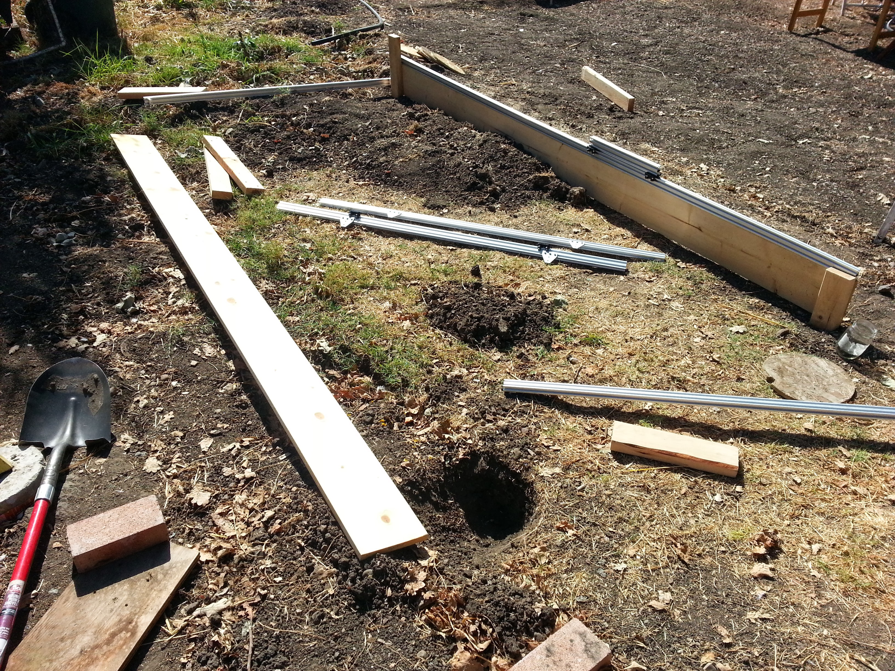
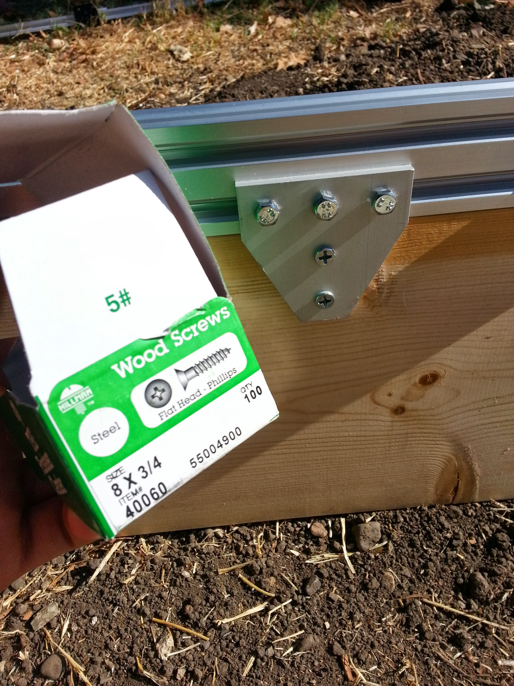
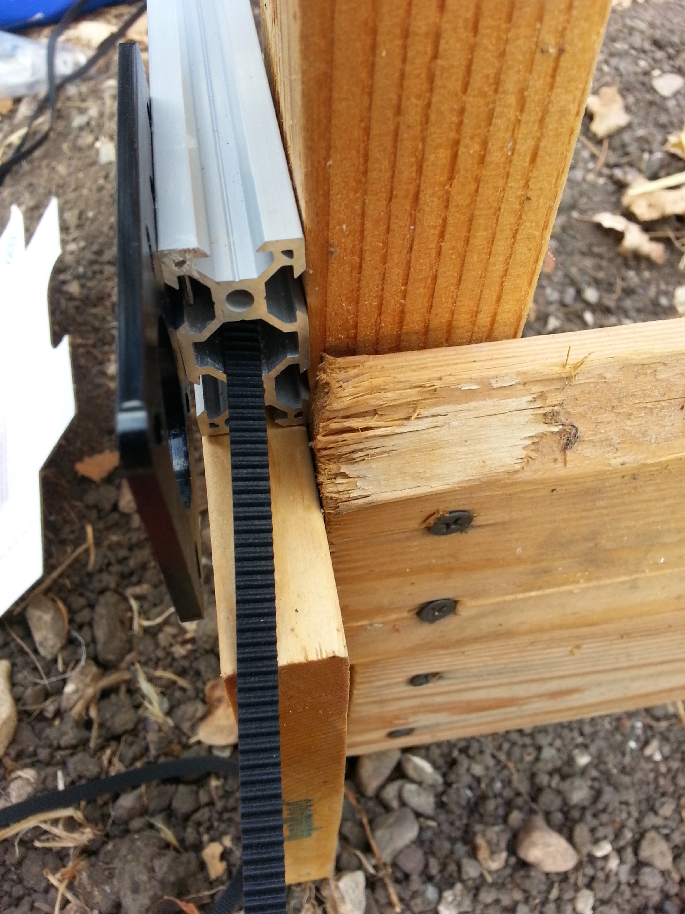

* toc
{:toc}

Genesis Tracks are built using V-Slot aluminum extrusions and hardware. They provide great strength and precision and are easy to construct. The V-Slot extrusions function as the linear guides for the Genesis Gantry to move across, and the design intention allows for easy scaling in the X direction. The tracks may be fixed to the ground by attaching them to concrete pilings, burying them in the ground, fastening them with large stakes, bolting them to a raised bed, or other methods. Once installed, it will be very cost effective to scale in the X-direction by simply adding more track sections. If scaling in the Y or Z direction is desired, it may require upgrading the main track beam to a larger size in order to reduce flex under the increased loads.

## Bill of Materials
  * 2X 20x40mm V-Slot Extrusions (1.5m length) from OpenBuilds – $19.50 each
  * 4X 5-Hole Tee Joining Plates from OpenBuilds – $4.65 each
  * 1 Pack of OpenBuilds Tee Nuts (need 12, comes in a 25 pack) – $4.50/pack
  * 12X M5-0.8x8mm Screws or bolts from Hardware Store – $3
  * 8X 3/4″ Wood Screws from Hardware Store – $1
  * 16X 1.5″ Wood Screws from Hardware Store – $2
  * 1X 3/4″x8″x10′ Wood Plank, cut in half from Hardware Store – $10
  * 1X 8′ 2×4, cut into four 2′ pieces from Hardware Store – $4
  * Total Price = $82

## Assembly Instructions
  * Dig two holes in the ground approximately 5 feet apart (or farther if you are making longer tracks) and place your 2x4s into the holes. You will want at least one 2×4 (if not both) to be deep enough in the ground such that the top of the 2×4 is below the top of the wood plank. This is so that you can later slip on the Mini-V plate linear guide assemblies. In addition, the deeper the wood is in the ground, the more stable it will be.
  * Take your plank of wood and screw it into each 2×4 with four (or more) 1.5″ wood screws.
  * Position your 2×4 and plank assembly upright and fill in the dirt, stamping it with your foot to compact the soil. Don’t worry about getting it perfectly vertical right now.
  * Take a 20x40mm V-Slot extrusion and slide in three Tee Nuts into one slot on the wider face. Use three M5-0.8x8mm screws or bolts to loosely attach a 5-Hole Tee Joining Plate to the extrusion. Slide the plate down about 1/4 the extrusion and tighten it down. Attach another plate 1/4 the way down the extrusion from the other end. Make sure both plates are on the same side and oriented correctly on the extrusion.
  * Using 3/4″ wood screws, fasten the extrusion/plates assembly to the wood plank, ensuring the bottom of the extrusion is flush against the top edge of the plank.
  * Ensuring that the tracks will be spaced properly for your desired gantry size to fit, repeat the same steps for the second track but do not fill in the dirt on one of the holes just yet!
  * Once both tracks are set up (with one hole yet to be filled) mount your gantry onto the tracks on the side with both holes filled.
  * Adjust the gantry to fit on the end with both holes filled. Once this is done, slowly move it down the tracks, adjusting the track end in the unfilled hole so that the gantry can continue to move without bending or binding. Once you are at the other end of the tracks, fill in the last hole with dirt and stamp the soil with your feet.
  * Run the gantry back and forth multiple times, making small adjustments to the wood plank/track assemblies until the gantry runs very smoothly through the entire length of the tracks.

## X-Direction Drive System
The Genesis X-Direction Drive System utilizes two NEMA 17 Stepper Motors with 20 tooth GT2 pulleys and timing belts to move the Gantry back and forth along the Tracks.

## Photos

