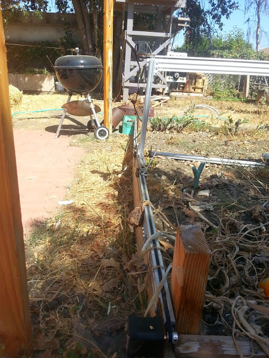

* toc
{:toc}

FarmBot Genesis V0.1 was assembled and left standing in a backyard in the Central Coast of California for 10 months, excluding a Summer/Fall portion of the year. The results of the weather damage are summarized and shown in the gallery below.

  * All screws from OpenBuilds (with the black finish) rusted significantly while the galvanized bolts from the hardware store showed no signs of corrosion
  * The tracks bowed out significantly as mentioned above, preventing the gantry from moving across
  * Black anodized plates from OpenBuilds changed from black to a bronze color on sides exposed to the sun
  * The tracks filled with dirt and dust, though it did not prevent the gantry from moving
  * The belts, pulleys, bearings, and wheels, remained in good working condition
  * The Z-axis and cross-slide became separated due to a lay-person grabbing the gantry and forcing it to move with the z-axis touching and dragging on the soil
  * Plant matter and spider webs covered many of the components, but did not seem to negatively impact it in any way
  * All extrusions and plates were in good condition

