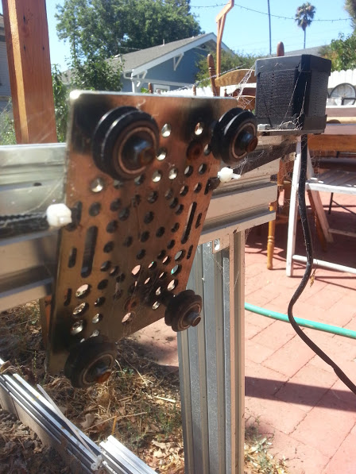

The Genesis Cross-Slide is constructed from the V-Slot Universal Plate, eight Dual V Wheel Kits, and two spacer blocks. The Genesis Cross-Slide moves across the Genesis Gantry via a belt system. The Genesis Y-Direction Drive System is a simple and scalable drive system used to move the Cross-Slide in the Y-Direction along the Gantry. It consists of one NEMA 17 Stepper Motor and a GT2 timing belt and pulley.



