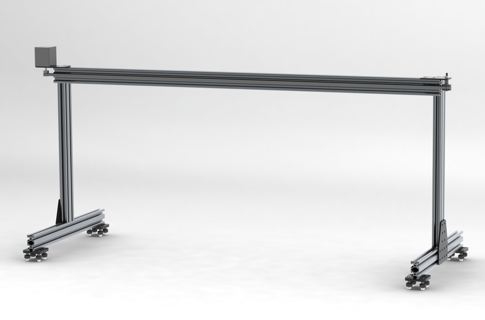
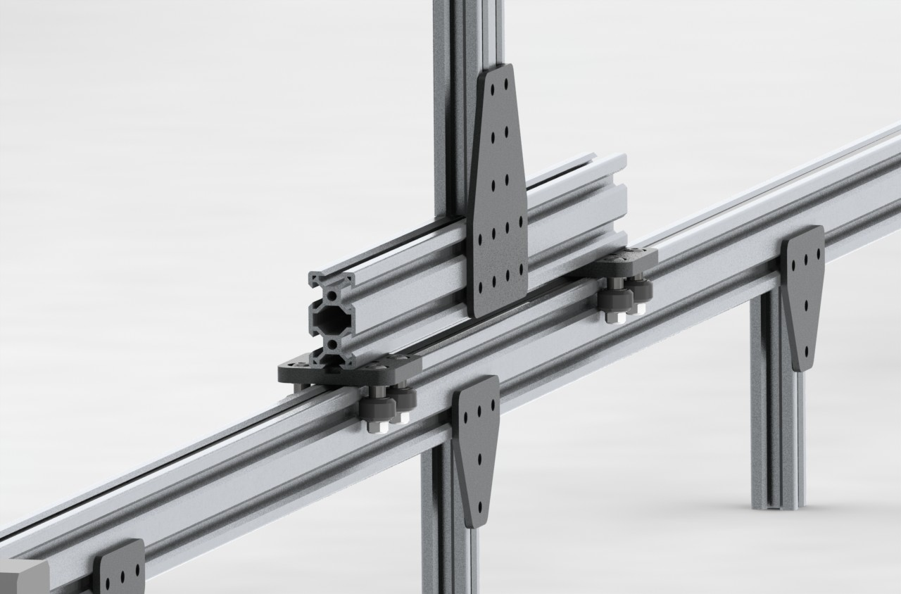
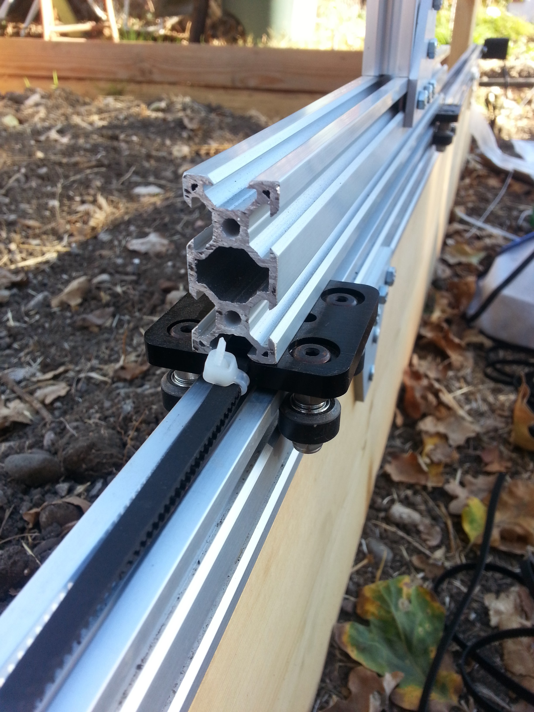
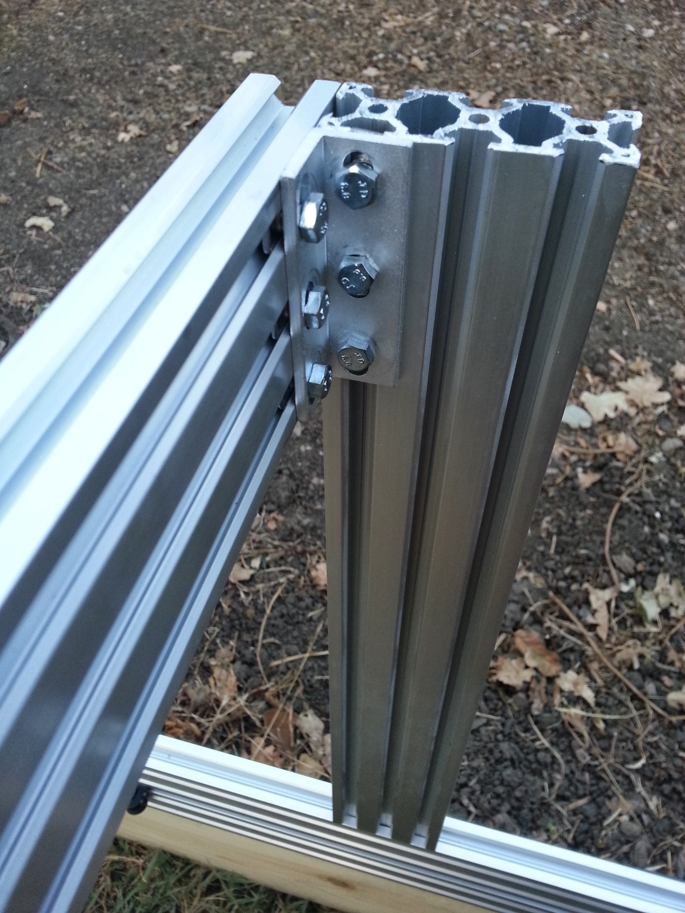
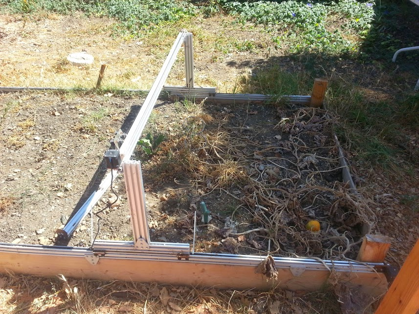

* toc
{:toc}

The Genesis Gantry is a simple and scalable Gantry that serves as the linear guide for the Genesis Cross-Slide and the base for the Genesis Y-Direction Drive System. It is constructed with V-Slot aluminum extrusions, mounting plates, and accessories. This Genesis Gantry mounts to the Genesis Tracks and is driven by the Genesis X-Direction Drive System. The Genesis Gantry is easily scaled to be wider or narrower with a longer belt and cross-beam. This would require the Tracks to be placed farther apart.

