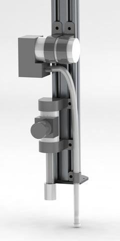
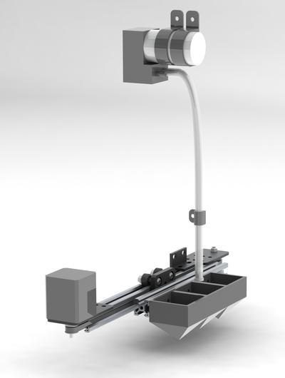

* toc
{:toc}

## Watering Nozzle
The Genesis Watering Nozzle shown to the left and below the seed injector, consists of a spray nozzle, a solenoid valve, and tubing. Not pictured is additional tubing that will need to run along the tool mount, gantry, and tracks in order to connect to a water source such as a garden hose. Future watering nozzles may feature flow meters, different spray nozzles, or even the addition of a peristaltic pump and tank that would allow for the precise addition of liquid fertilizer or pesticide to the water spray.

## Seed Injector
The Genesis Seed Injector consists of two main assemblies: a 12V vacuum pump and selector tip, and the seed bay. The vacuum pump and selector tip are attached to the tool mount and allow for the precise selection of seeds from the seed bay and placing them at a precise location and depth in the ground. This is completed by first dipping the selector tip into a seed bin while the vacuum is on, moving the suctioned seed or seeds to the desired location, driving them into the ground to the desired depth, releasing the vacuum, and repeating. The seed bay, attached to a vertical column of the gantry, moves in the X-direction such that different seed bins can be positioned for the selector tip to choose from. The Genesis seed injector uses two controlled components: the vacuum pump, and the stepper motor for the seed bay. This setup will allow any number of different seeds to be accessed and planted without the need for additional controllable components.



