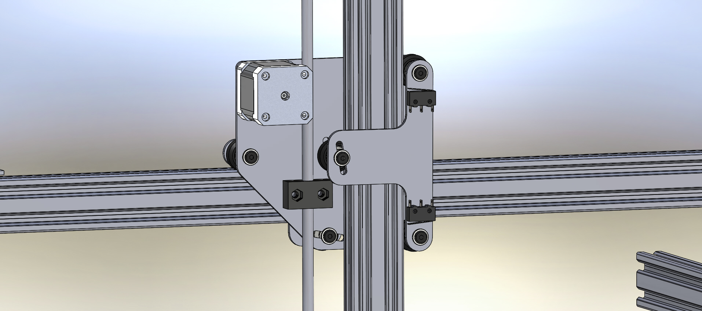
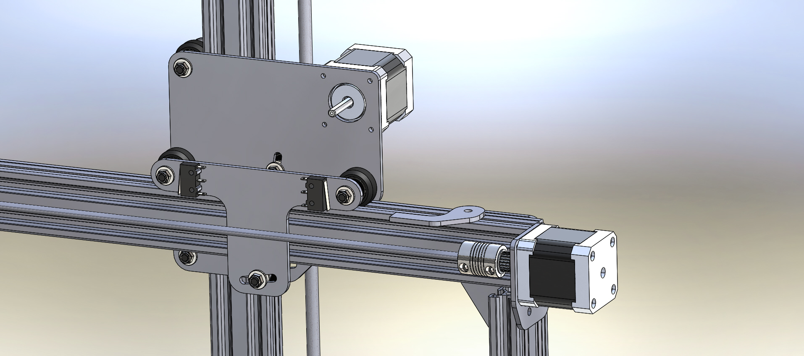

* toc
{:toc}

The Genesis V0.2 cross-slide saw a lot of improvement and change from V0.1. This version is constructed from three custom 3mm plates that have only the necessary holes to accommodate the needed hardware. The cross-slide moves along the gantry with a belt and pinion style drive system which saves on belt length, and is easier to install and tighten the belt. Endstops for the cross-slide and the z-axis are mounted onto the plates and are actuated by small plates that can be easily repositioned along the gantry for a different ending position. The leadscrew block for the z-axis is also mounted to one of the plates, which is hugely important because that block did not even exist in V0.1 hardware. The expensive eccentric spacers are replaced with angled slots for wheel adjustment and tightening. And the number of wheels for each axis of movement is reduced from four in V0.1 to three. Lastly, the Tee shaped plates are identical, making installation and manufacturing easier.

