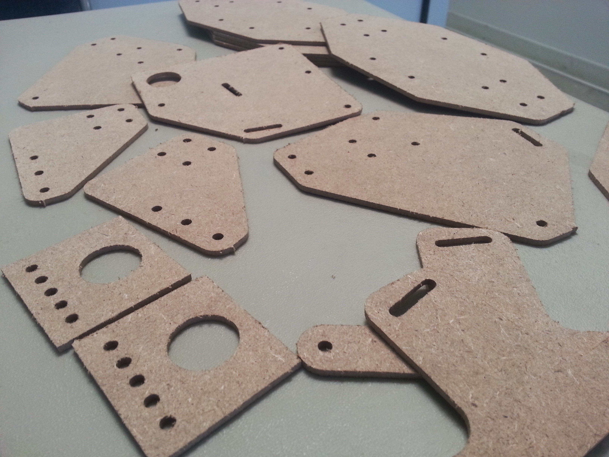
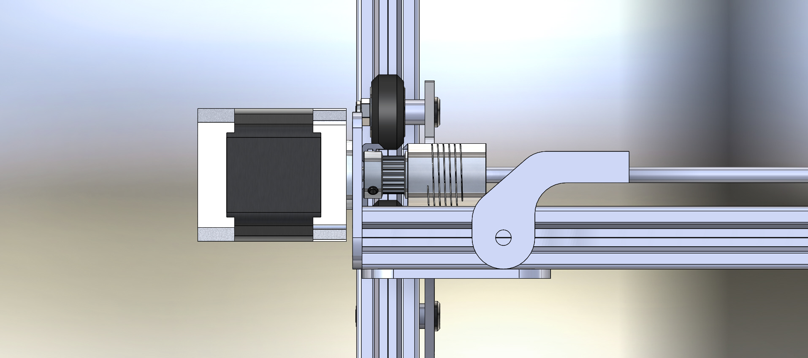

* toc
{:toc}

The Gantry has seen significant change in V0.2. The most notable is the switch from a looped belt drive system that ran the full length of each track to a belt and pinion style system. Feeding the belt through the extrusions in V0.1 was hard for 1.5m length tracks and nearly impossible for 3m length tracks. The belt and pinion system uses half of the belt length and greatly simplifies installations and tightening of the belt. It also eliminates the need for pulleys and mounting plates at the end of the tracks.

Genesis V0.2 prototype plates cut out of MDF with a CNC router
In addition, the belt and pinion system allows the drive motor to be positioned on the gantry, allowing it to move with the other electronics, thereby simplifying wiring as all electronics move together. Also, a single drive motor in combination with a driveshaft allows for synchronized movement between both sides of the gantry along each track.

The other major improvement is the use of custom brackets which greatly simplifies the construction while making the Gantry more rigid. In V0.2, 1 base bracket and 4 wheels at the track/gantry interface replaces the 1 extrusion, 3 brackets, and 8 wheels for this same interface in V0.1. The base plates also provide locations for the endstops to be mounted.



