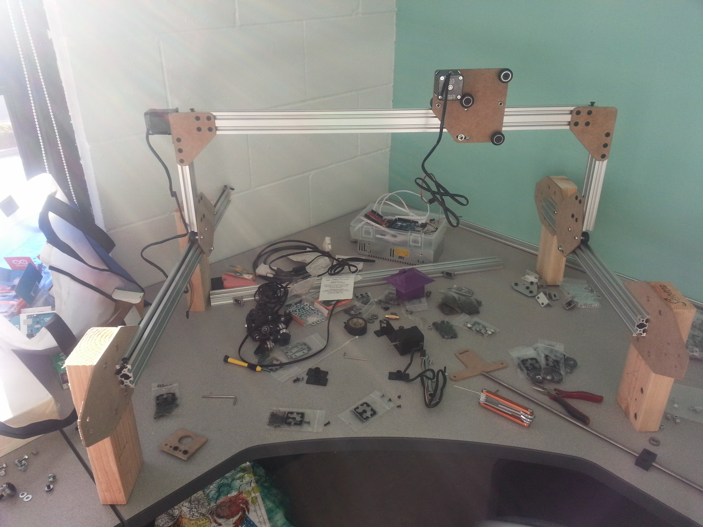
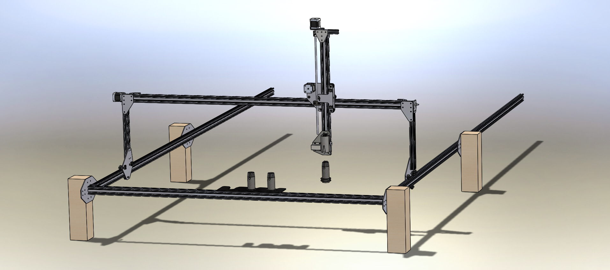

There are many design changes from Genesis V0.1 to V0.2 that make this version a huge improvement:

  * Design and implementation of custom brackets and plates for greater strength and a more optimized design. These could be produced at home with a drill and a printout, a CNC router, waterjetting, or laser cutter
  * Endstop integration to let the microcontroller know when FarmBot is at the end of itself
  * Changed from looped belts to belt and pinion style movement for both the X and Y directions, allowing for simpler installation, less belt usage, and keeping all electronic components moving together with the gantry (no motors attached to the tracks)
  * Features synchronized belt movement along the tracks via a shaft and a single motor to drive both sides of the gantry
  * Began Universal Tool Mount integration with a door locker solenoid rather than all tools attached to the bot at once
  * Angled slots for wheel adjustments rather than expensive eccentric spacers
  * Z-axis leadscrew is positioned closer to the gantry for less induced torque on the cross-slide and wheels
  * Minimization of number of parts and simplification of them providing easier and faster assembly, accessible screw locations, and greater affordability



