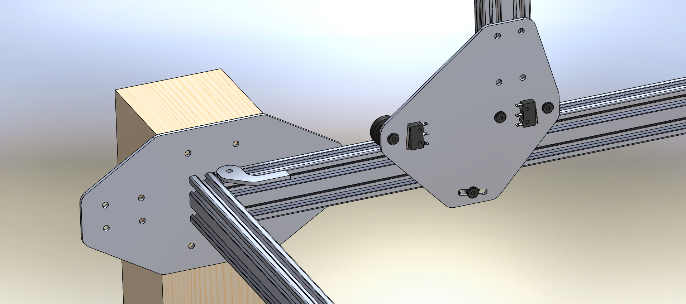

There were two major issues with V0.1 tracks:

  * Buckling and shifting at the track joints
  * Incompatibility with orienting gantry wheels on the top and bottom of the track

V0.2 tracks solve both of these issues by changing the orientation of the track pieces and the mounting bracket design. The brackets are larger and placed at the end of each track section so that one rigid bracket connects two extrusions. This keeps them from buckling or shifting, minimizes the number of brackets needed, allows for wheels to roll on the top and the bottom of the tracks, and allows for connection to a support post or another extrusion.

