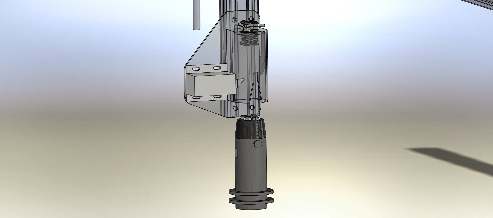
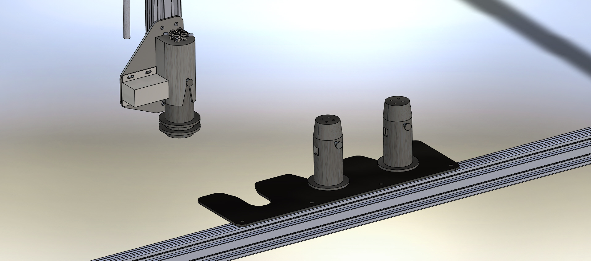

* toc
{:toc}

The Universal Tool Mount system was introduced in V0.2 hardware as a way to allow FarmBot to switch tools in an automated way so that it does not have to carry all of the tools at once. In addition, whichever tool is being used, generally has to be the “lowest” in Z-height so that it can reach the soil or plant. With all tools being mounted to the Z-Axis at the same time as in V0.1 hardware, all tools were competing to be the lowest. The Universal Tool Mount solves this issue.

The Universal Tool Mount system consists of five components:

  * A 3D printed tool mount
  * A 3D printed (or modified PVC pipe) tool “blank” that can be filled with electronics, motors, or anything else that defines the tool
  * A solenoid operated “door locker” that locks a tool into place when inserted into the tool mount
  * Four sets of spring loaded 5mm screws that allow power and data to be passed between the tool mount and the tool
  * A “tool bay” that is a 3mm plate for unused tools to be stored on
  * Using the FarmBot Web App, the user will define which tools are in which bays. FarmBot can then move to that position to pick up a tool, and load the necessary software “driver” to be properly use that tool. This system allows others to create new tools and drivers for any type of operation they can dream up, as long as it fits into the Tool Mount and incorporates the same four power and data screw configuration.



