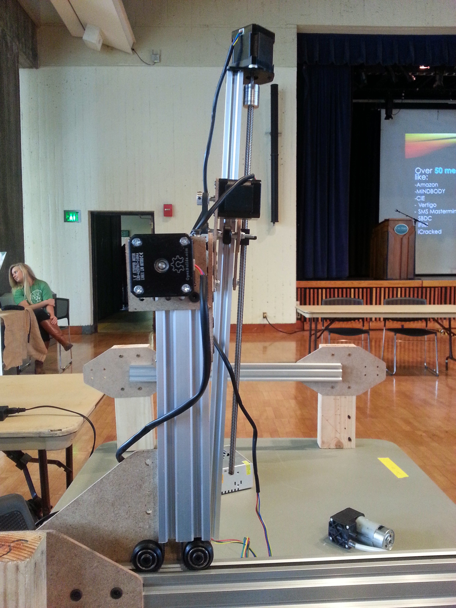

The Z-axis of Genesis V0.2 is not any different from V0.1 other than the fact that we actually assembled the leadscrew into a real prototype rather than just designing it in the computer. The leadscrew is an 8mm diameter ACME screw thread that connects to the cross-slide via a delrin block. The system is smooth and reliable and all components are available from [OpenBuilds](http://openbuildspartstore.com).

Not shown in the renderings on this page but in the photo to the left is the delrin block being originally located far from the main gantry beam, attached onto the Tee shaped plate. This configuration created a large moment force on the cross-slide, attempting to torque it off of the main gantry beam. This torque can be seen in the photo to the left as the Z-axis becoming significantly angled. This configuration was modified so that the block is on the plate closer to the main gantry beam in order to reduce the induced moment force acting on the cross-slide by reducing the length of the moment arm the weight of the leadscrew was acting on.

