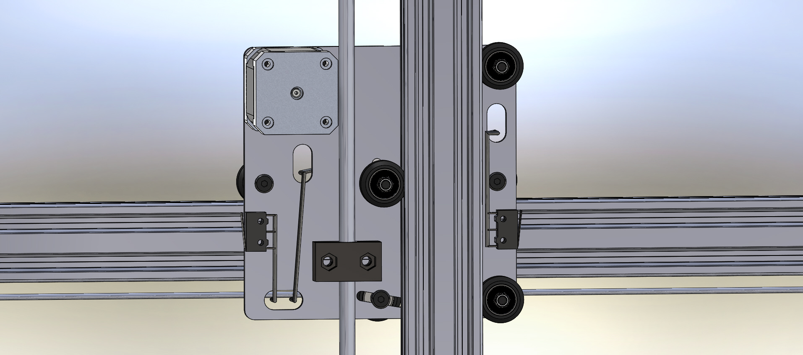

* toc
{:toc}

The Genesis V0.2 cross-slide was composed of three plates sandwiching all of the other components together. This was difficult to assemble and added little strength to the cross-slide. The V0.3 cross-slide has been simplified to a single plate with all components attached to it, making assembly much easier. There have also been extra slots added for cables to be cleanly routed through the plate and avoid all moving components.

## Issues and Proposed Solutions
  * There may be an issue with where the cables exit the cross-slide with the switch over to the cable carrier system from the wire and trolley system. This has yet to be determined in V0.4

