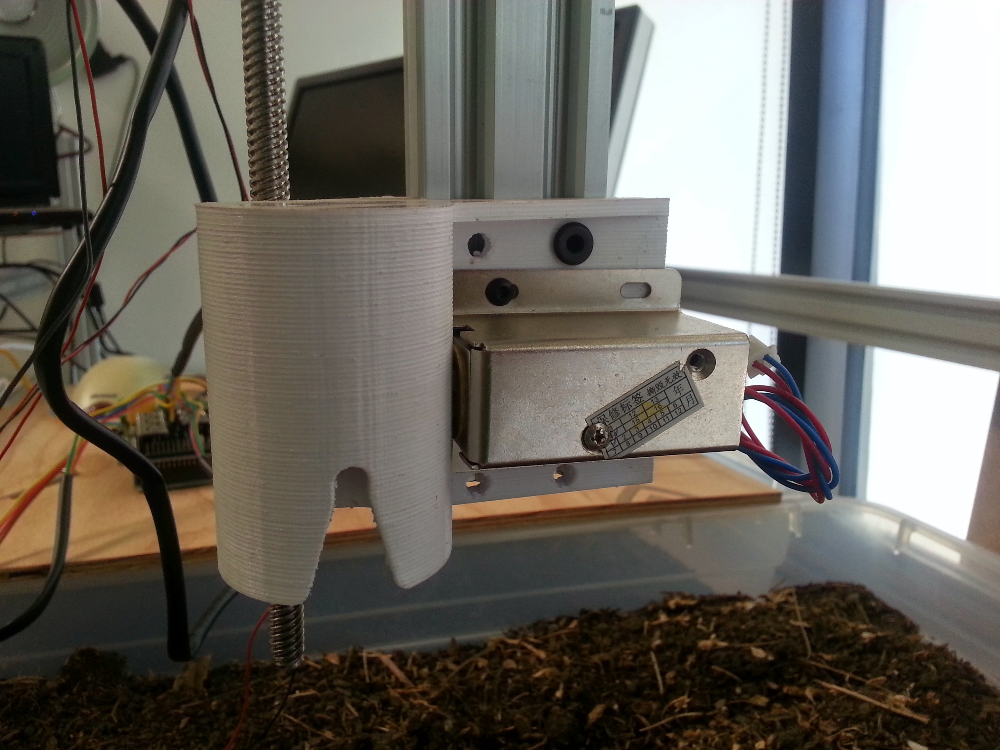

* toc
{:toc}

The V0.3 Universal Tool mount has been vertically flipped so that the solenoid locker is on the right side and the tool is inserted on the left side. This allows for the tool to be more aligned with the z-axis leadscrew so that there is minimized induced torque from the tool’s weight. The tool mount has also been optimized for printing with a 3D printer. It no longer has any overhanging edges, and no support materials is required. Lastly, the electrical contact screws have been decreased in size to 3mm to allow for more clearance between themselves.

## Issues and Proposed Solutions
  * The extra gusset on the back side is unnecessary. It adds to printing time and is difficult to get the screws to align with tee nuts once the main bracket is attached to the extrusion. This extra gusset will be removed in V0.4.
  * The slot for the solenoid locker to go through the plastic needs significantly more clearance to avoid friction. This slot will be increased in size in V0.4.
  * All screw holes need to be enlarged slightly to allow screws to easily pass through even with the slight manufacturing variations that are expected with the 3D printing process.
  * There may be significant difficulty inserting and removing tools and locking them in place due to friction forces, rough 3D printed surfaces, and tolerances. A more simple concept may be perform better.

