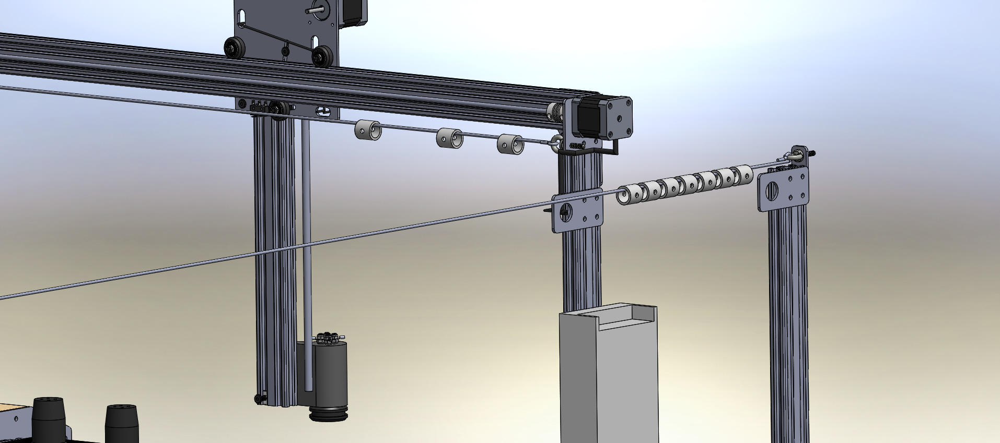

* toc
{:toc}

* The power supply used in Genesis V0.1 through V0.3 is very large in size. A smaller form factor supply might suit the project better.
  * Electronics enclosures or housings need to be added to weatherproof everything.

## Cable Management
The trolley and wire system is a good concept, but it is best suited to larger scale installations. It should not be used along the gantry though in any circumstances as the cables will get in the way of the plants when hanging. For smaller systems such as FarmBot Genesis, a cable carrier system will be more attractive and function better for both along the gantry and the tracks. This will likely add cost, but would likely increase reliability.

