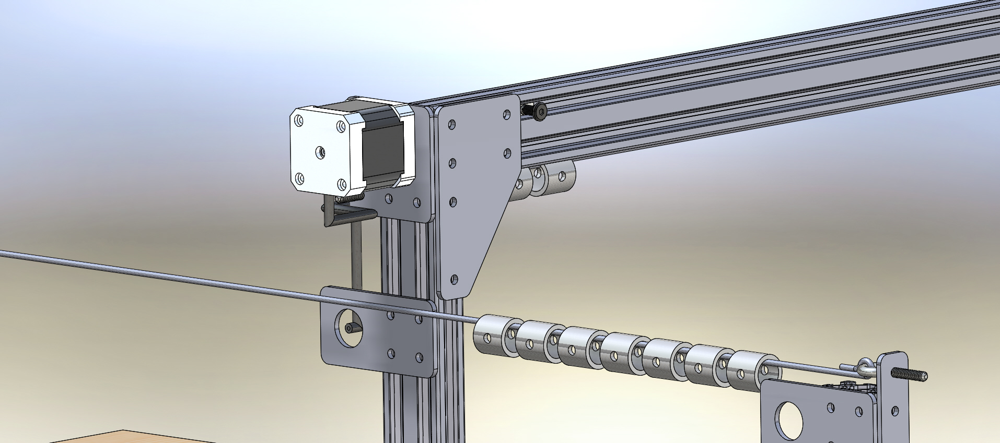
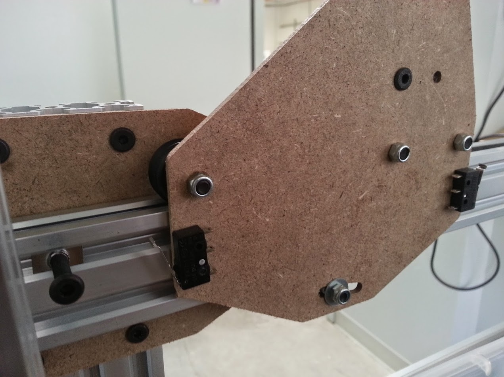

* toc
{:toc}

The Track/Gantry plates are slightly modified from V0.2 to re-position the endstops so that they can be clicked by screws and teenuts rather than small plates.

## Issues and Proposed Solutions:
  * It is difficult to adjust the width of the gantry once the main beam is cut. One must either re-cut the main extrusion to be shorter, or have limited ability to extend the gantry width before the brackets no longer attach to the extrusion. Positioning the main beam such that it is not obstructed in length by any brackets would solve this.
  * The wire and trolley cable management system across the gantry will not work because the wires will get caught on taller plants. A cable carrier system will be cleaner and work better.

