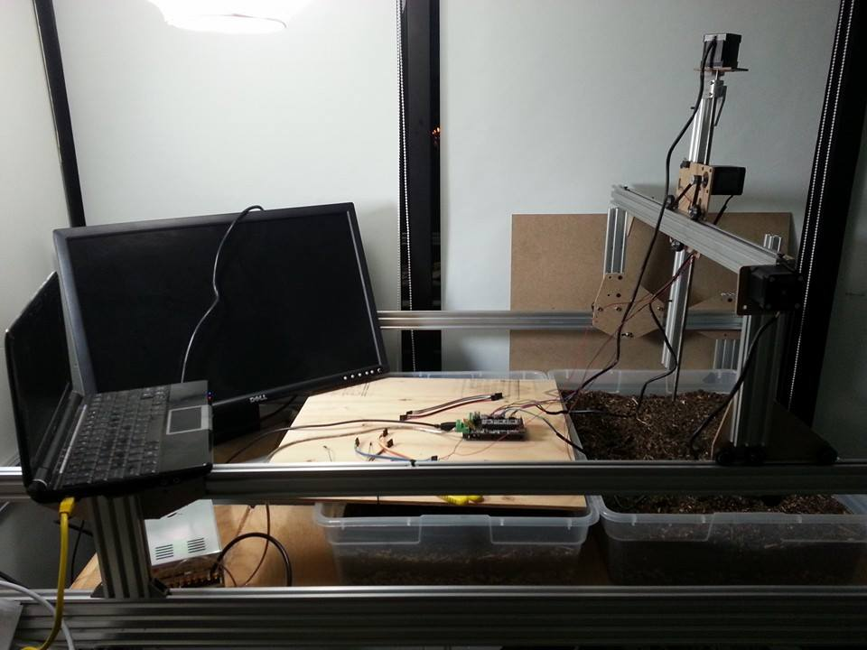
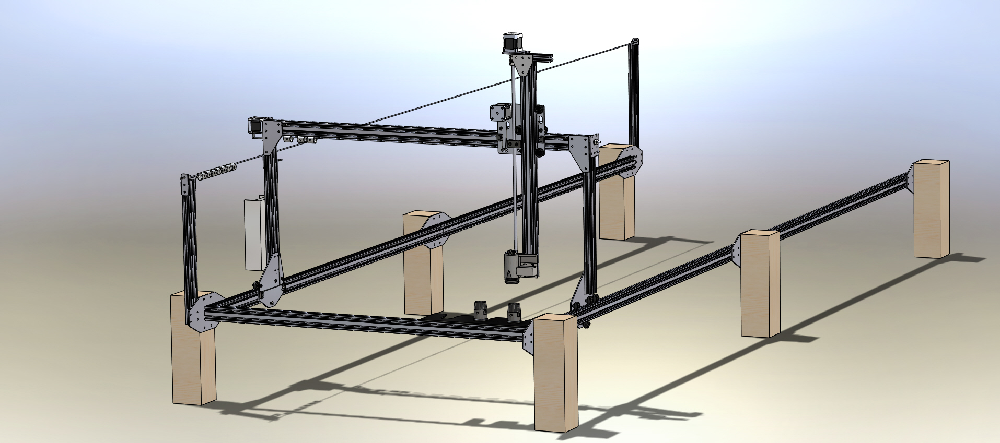
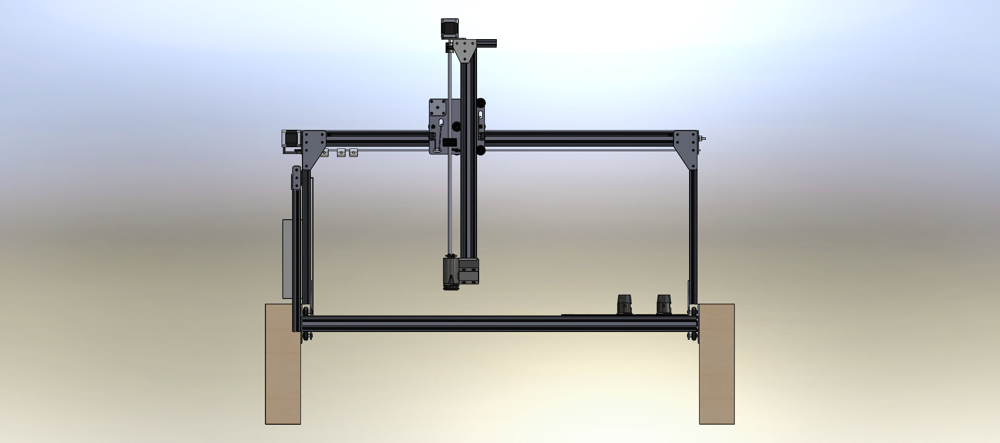
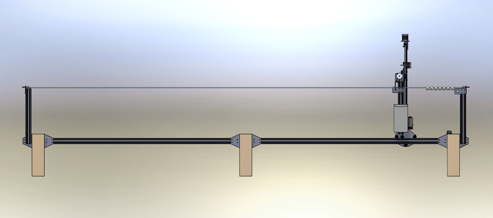

FarmBot Genesis V0.3 exhibits the following changes from Genesis V0.2:

  * Updated bracket design to minimize the number screws needed, making assembly easier and faster and decreasing the number of parts
  * Simplified cross-slide design combining 3 plates into one
  * Cable routing holes and extra hardware for a trolley style system to carry the cables across long distances
  * Universal tool mount simplification and manufacturability improvements
  * Universal tool mount configuration is vertically switched to bring the tool more in-line with the z-axis leadscrew for better force distribution
  * Fixed issue with gantry belts running into screws be rearranging components
  * Added simpler endstop integration onto plates, no longer uses extra plates to hit the buttons, just screws and teenuts



