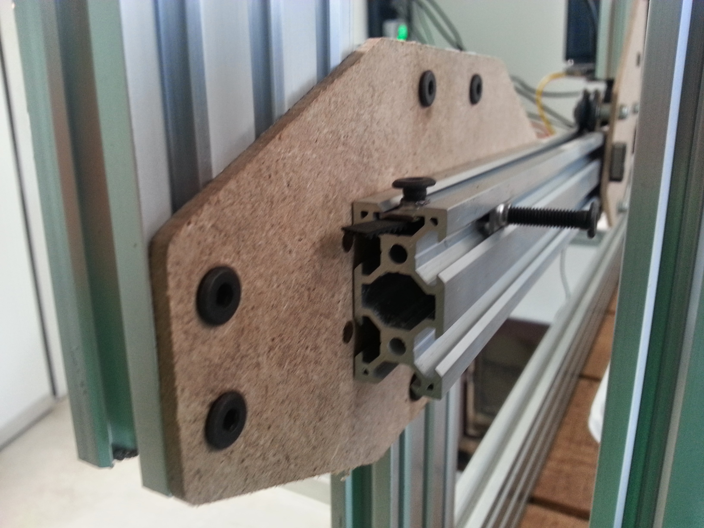

* toc
{:toc}

The tracks brackets of Genesis V0.3 are slightly smaller than those of V0.2. The are generally the same design though.

## Issues and Proposed Solutions:

  * Using 4 screws to attach each track piece to each bracket is unnecessary and increases assembly time significantly. Using 2 screws will simplify the process and the reduce the number of parts while still being adequately strong enough for the application.
  * The mounting holes for the bracket to the vertical post are spaced apart by 40mm rather than 20mm. This means they cannot be mounted to 20x40mm extrusions. Spacing these holes closer together will allow a single type of extrusion to be used throughout the design. Also, currently there are 4 screws attaching the bracket to the vertical column. This is unnecessary so the plate will effectively be cut in half in V0.4 and only two screws used.

