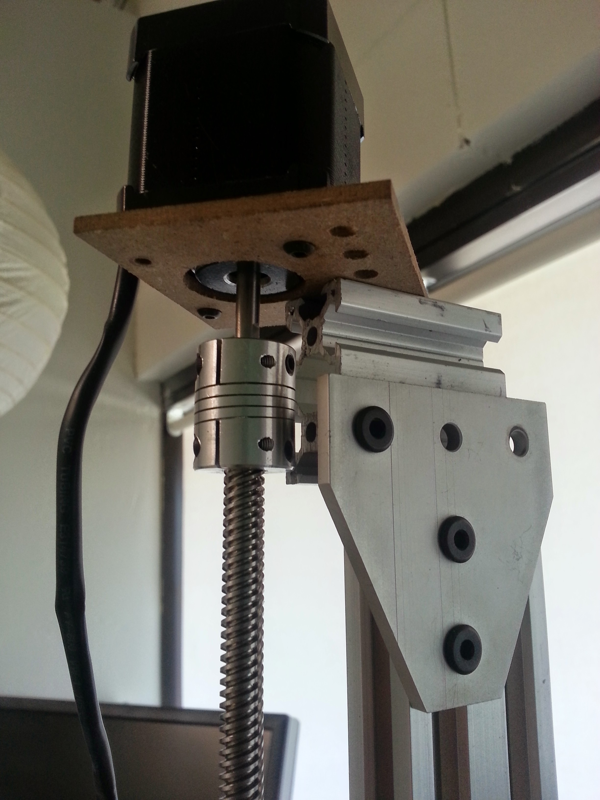

* toc
{:toc}

The Z-axis motor mount has remained the same since V0.2.

## Issues and Proposed Solutions
* It’s pretty ugly and bulky and I can’t figure out a way to make it better without a custom bent bracket. Likely a custom bracket or 3D printed part will be in V0.4.

