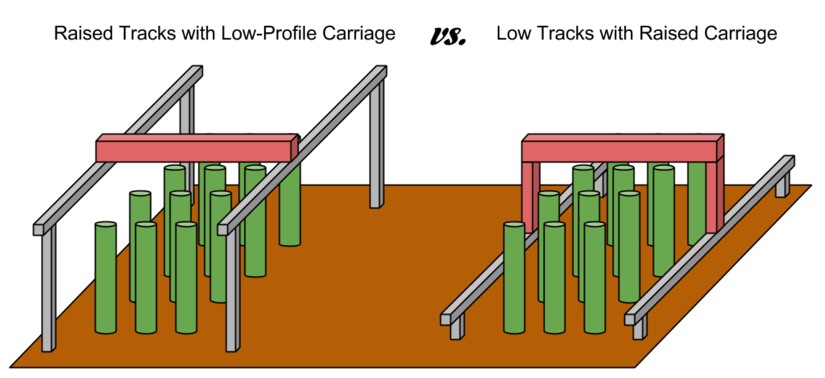

For FarmBots to properly grow taller plants, the Gantry, Cross-Slide, Z-Axis, and Tools must have adequate vertical clearance from the plants. This can generally be accomplished in two ways:

1. Using raised tracks and a low-profile gantry
2. Using low tracks with a tall gantry

In general, using low tracks with a tall gantry is the better design, especially for larger applications because it saves on material cost, is lest of an eyesore, blocks less sunlight, and would be easier to maintenance. However, in the case of a FarmBot being installed in a greenhouse or other structure, utilizing the existing walls to support the tracks higher may be a better solution.

