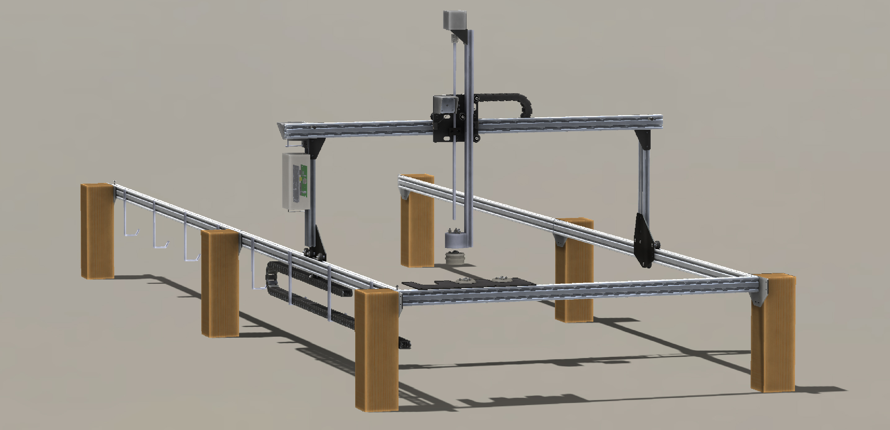
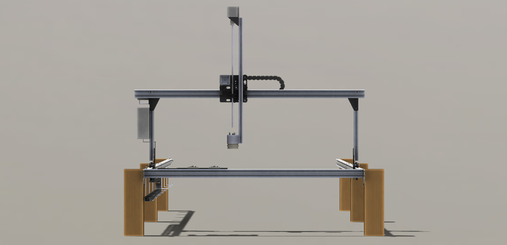
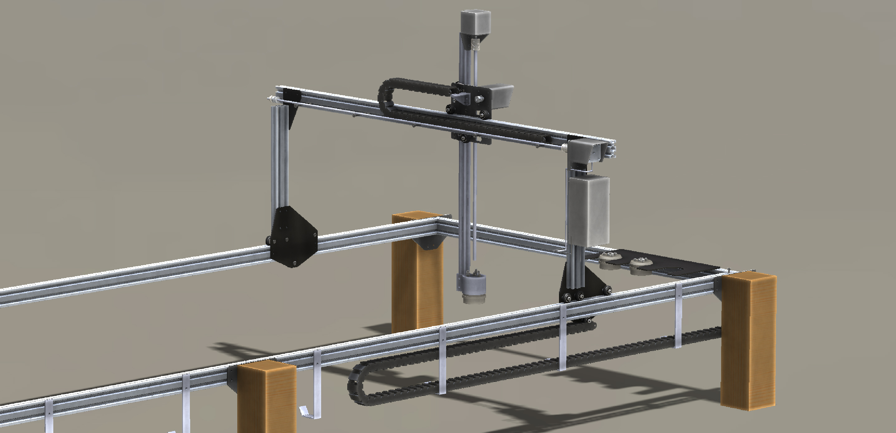

* toc
{:toc}

Genesis V0.4 exhibits the following changes from Genesis V0.3

  * Simplified track mounting brackets now have less screws for easier installation, less material use, and a cleaner look when attached to short wood posts or extrusions
  * Track mounting bracket screw holes are re-positioned to allow attaching to 20x40mm V-Slot extrusion posts rather than 20x60mm
  * A completely redesigned Universal Tool Mounting system utilizing magnets to secure tooling in place, a larger diameter while still being smaller in overall size, larger 5mm power and data screws, and optimization for 3D printing
  * Changed the wire and trolley cable management systems to cable carrier/drag chains to prevent drooping of cables into the plants and provide a cleaner aesthetic
  * Designed and integrated 3D printable electronics enclosures/housings for the motors
  * Gantry main beam positioned in front of corner bracket to allow for more complete movement of the cross-slide, ease of taking the cross-slide on and off the gantry, more complete movement of the cross-slide in the farmable area, fixed interference between motor mount screws, and ease of cutting the gantry main beam to the correct length and adjusting the overall width
  * Changed Z-axis to use a 20x20mm extrusion to save weight and space
  * Moved the main power supply from the gantry to the corner of the tracks at the end of the tacks cable carrier

