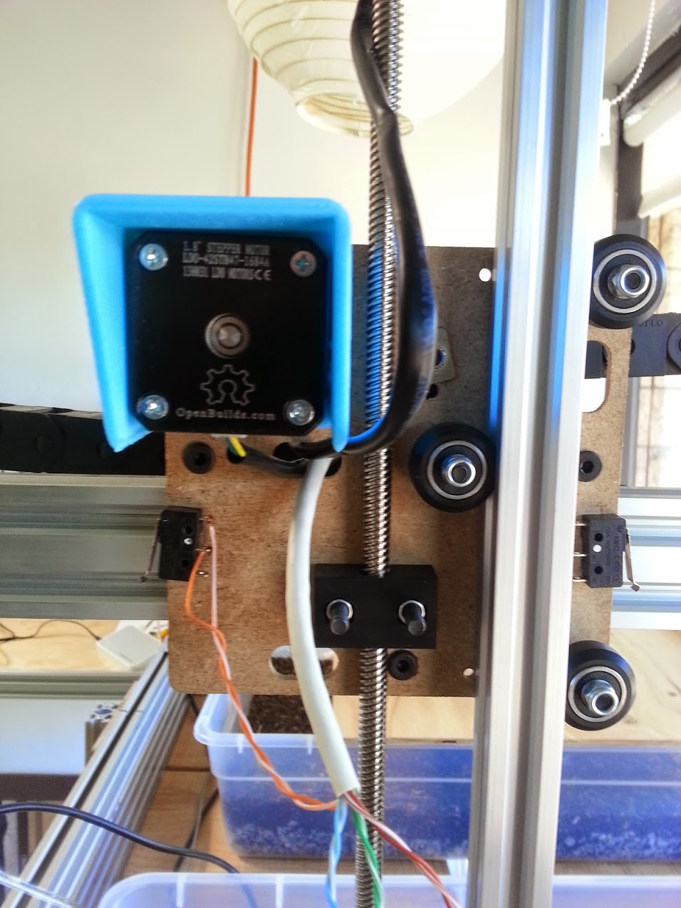
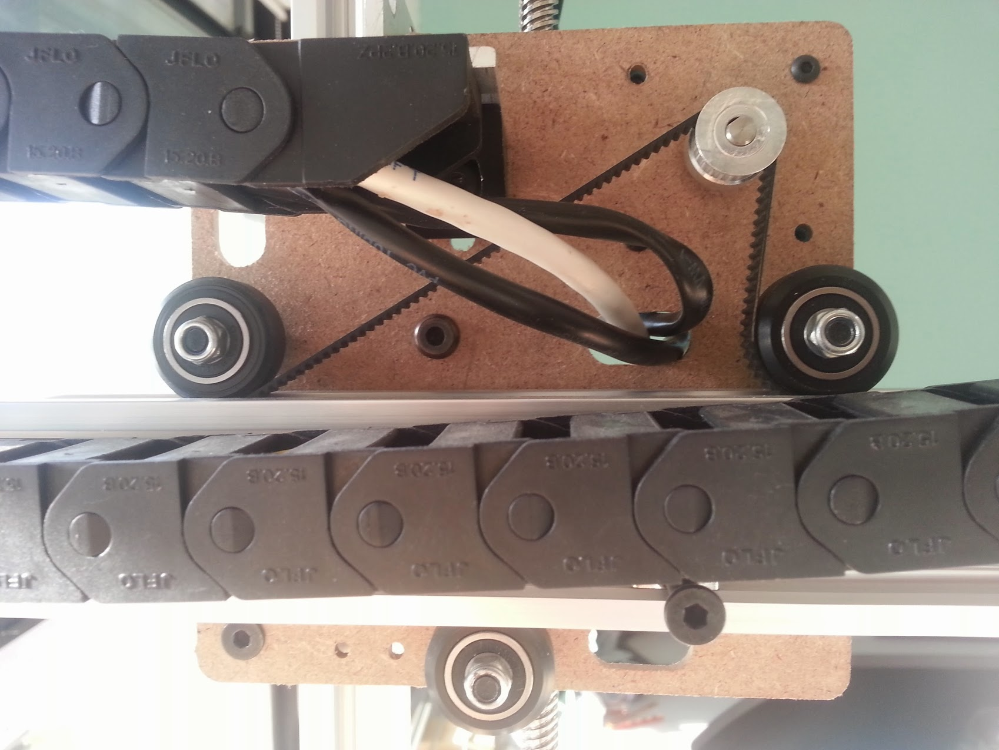
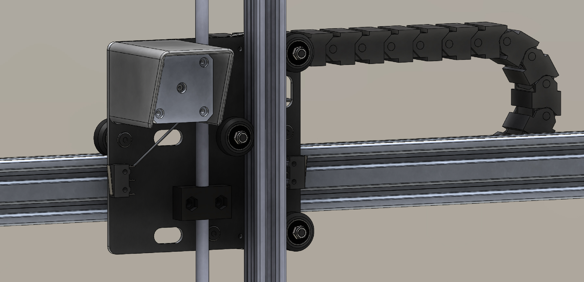

* toc
{:toc}

There are three changes to the V0.4 cross-slide from V0.3:

  * The motor is slightly re-positioned to support the 3D printed housing
  * The cross-slide plate is narrower to accommodate a 20x20mm Z-axis instead of the 20x40mm one in V0.3.
  * Extra holes have been added for a 3D printable bracket to support the cable carrier.

