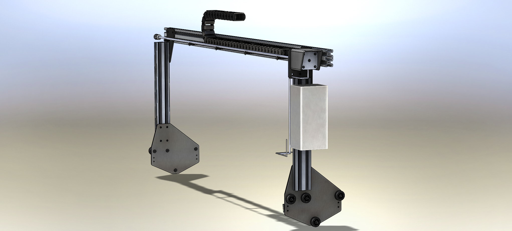
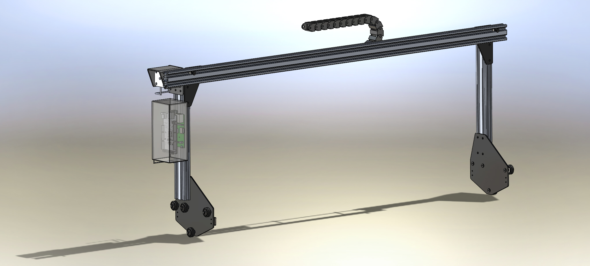
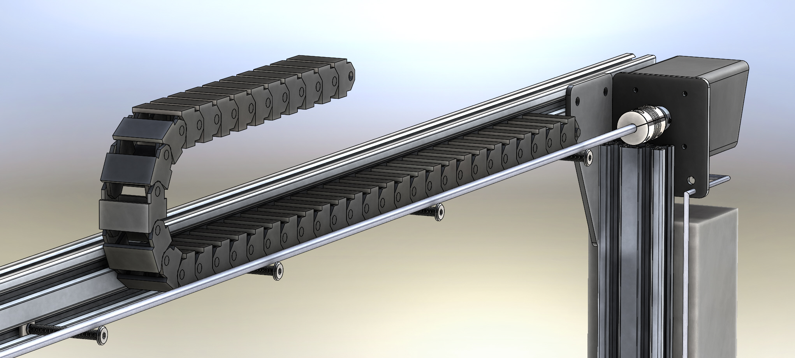
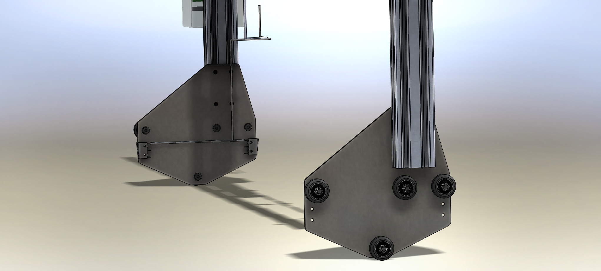
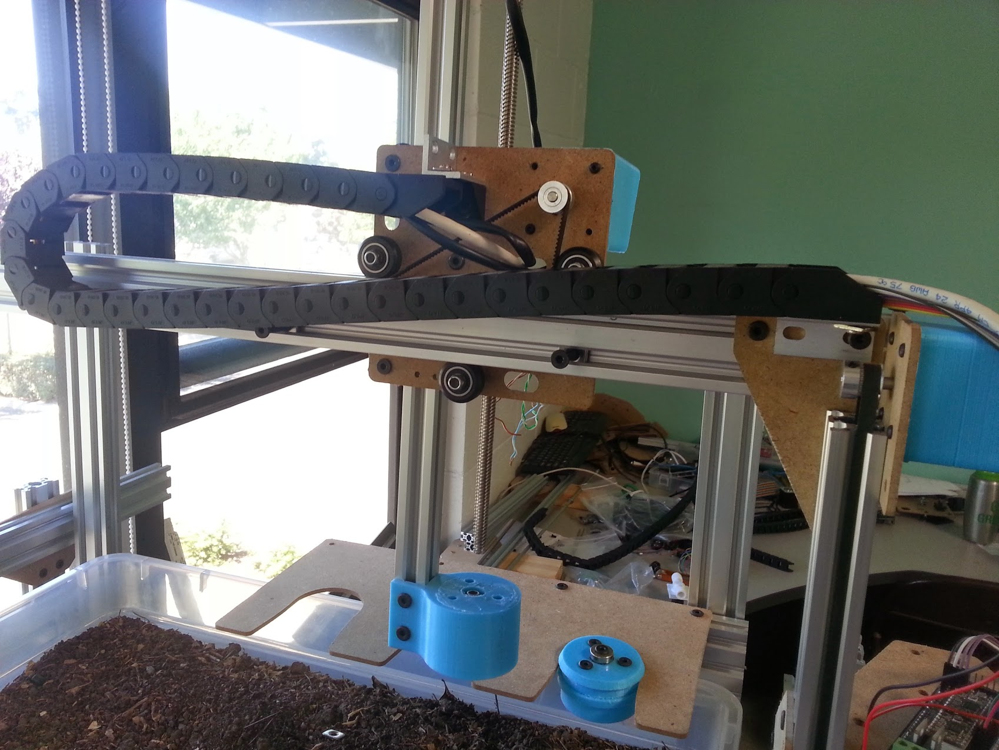
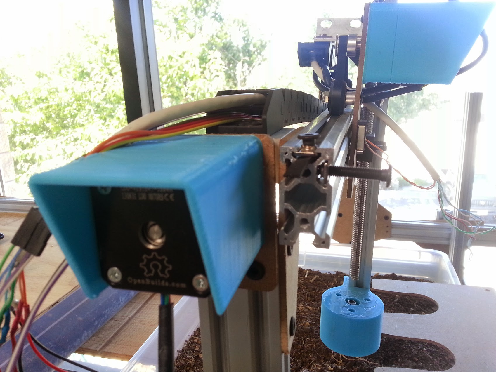
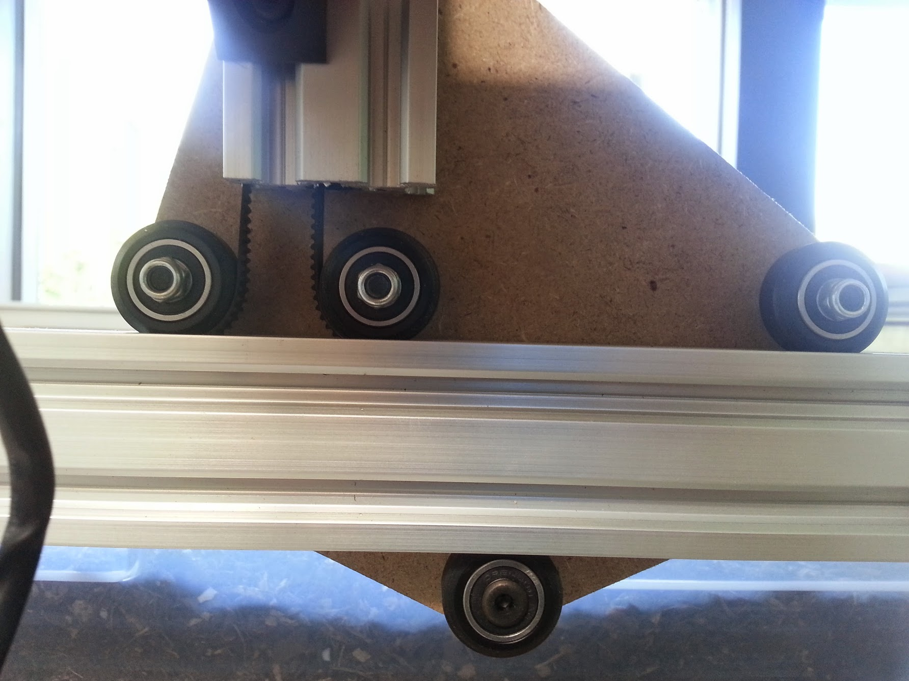

There are five changes to the V0.4 gantry from V0.3:

  * The main beam is now attached to the front of the corner brackets rather than behind them. This change was so simple and minor but it greatly improves the design. This allows the user to slide on and off the cross-slide without detaching the main beam from the corner brackets. This is hugely important from an ease of assembly and maintenance perspective. The change also allows the gantry width to be adjusted more easily because the extrusion can be longer than necessary and hang off the edges. Lastly, this change allows the cross-slide to more fully move within the farm-able area, rather than being stopped prematurely by the corner brackets. Looking forward, the new design allows for an extended gantry to be implemented that is two extrusions wide or more.
  * The addition of a 3D printable housing for the gantry drive motor. It’s fairly simple but should get the job done. There may be concerns with a 3D printed part being completely watertight, in which case a vaporized acetone process may be able to help, or an injection molded part may be used.
  * A cable carrier/drag chain is used for cable management instead of the wire and trolley system of V0.3. This is more aesthetically pleasing and prevents hanging wires and tubes from interfering with the plants.
  * The angled slots on the gantry/track plates have been reverted to plain holes and will use the eccentric spacers from OpenBuilds. The eccentric spacers were originally removed from the design because they were found to be so small that they would dig into the plates and wear them out. However, the OpenBuilds team has changed the design of them to be significantly larger, preventing this type of damage. They are still expensive at $2 per spacer, but they seem to provide a better experience for the user. Which design is better has yet to be determined but we figured we would try out the new spacers in this version.
  * The power supply has been removed from the gantry and placed at the end of the tracks in order to conserve space and weight on the gantry column.



