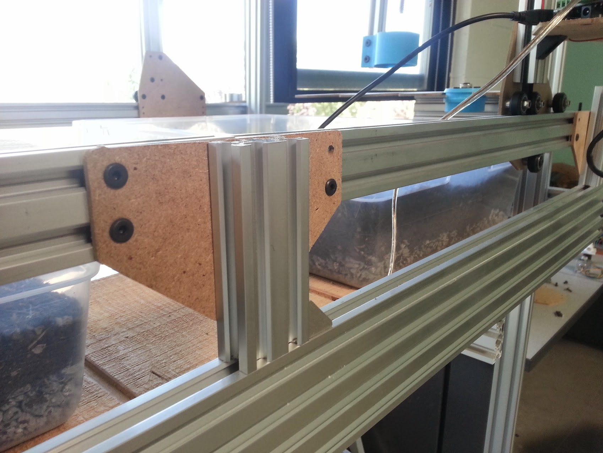
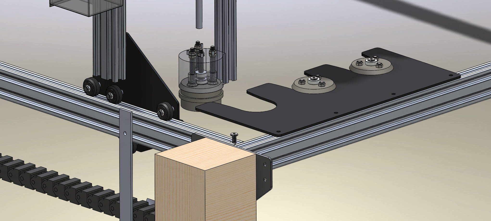
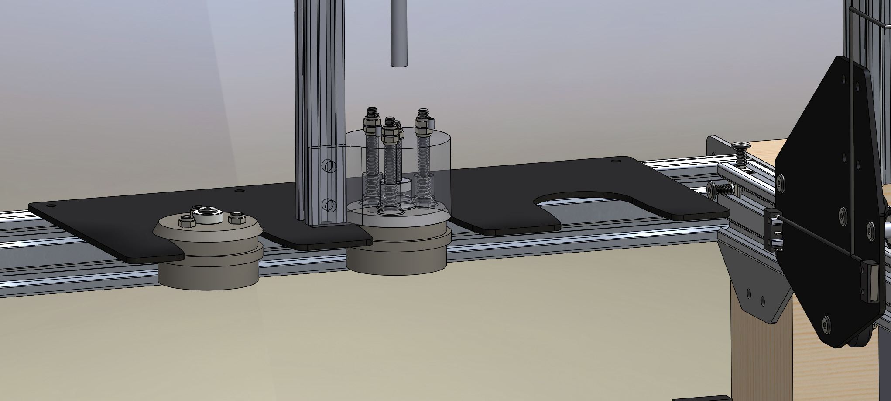
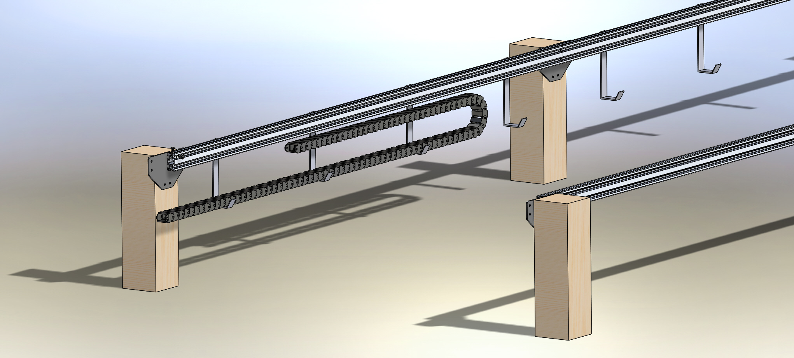

* toc
{:toc}

V0.4 tracks feature simplified connecting plates that are about half the size of V0.3 plates and use half the number of screws for each connection. This simplifiction reduces the number of components and assembly time significantly. Additionally the plates are flat on the top and flush with the track extrusions, creating a cleaner aesthetic for tracks mounted to short posts as seen in the renderings. Also different from V0.3 is that the mounting holes for attaching to the post are 20mm apart rather than 40mm, allowing the plates to attach to 20x40mm extrusion posts.

Also new in V0.4 tracks is the use of a cable carrier/drag chain for cable management along the tracks. This is less visually and spatially impactful than the wire and trolley system introduced in V0.3 hardware. Though it will be more expensive, it is more suited to smaller FarmBots such as Genesis. A series of light duty bent metal brackets are in place along the tracks to support the cable carrier.

Lastly, the tool holder has been modified to accommodate the new tool design.

## Tracks Issues and Proposed Solutions
  * The custom bent brackets should be replaced with something not custom made. Moving the cable carrier to alongside the tracks as seen with the gantry’s cable carrier would allow the elimination of the custom bent brackets in favor of using more affordable screws and teenuts for support. For this to work, the track connecting plates would need to be lower profile, allowing the top half of the track extrusions to accommodate screws and the cable carrier. This would not work in situations where the track supporting posts extended upwards as in the case of using fence posts or the studs of a greenhouse. However, the possibility of installing FarmBot is such a situation is unlikely without major modifications because of other components like the gantry motor being in the way of these posts anyways.
  * The new tool bay plate needs to have longer “fingers” holding the tools in place. In the current design, there is the possibility of a tool vibrating or sliding down the fingers a very small amount and falling through the plate.

