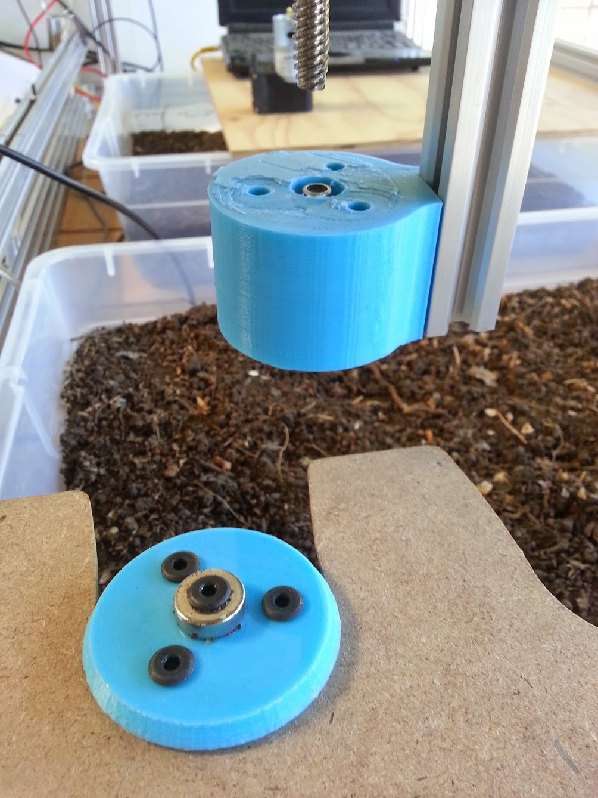
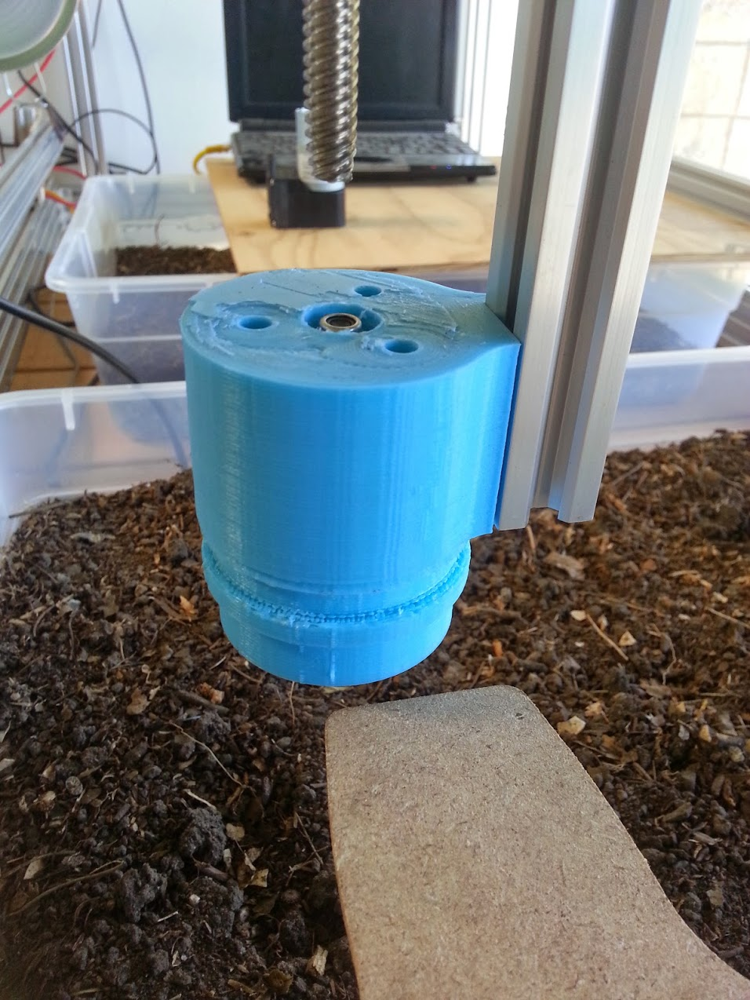
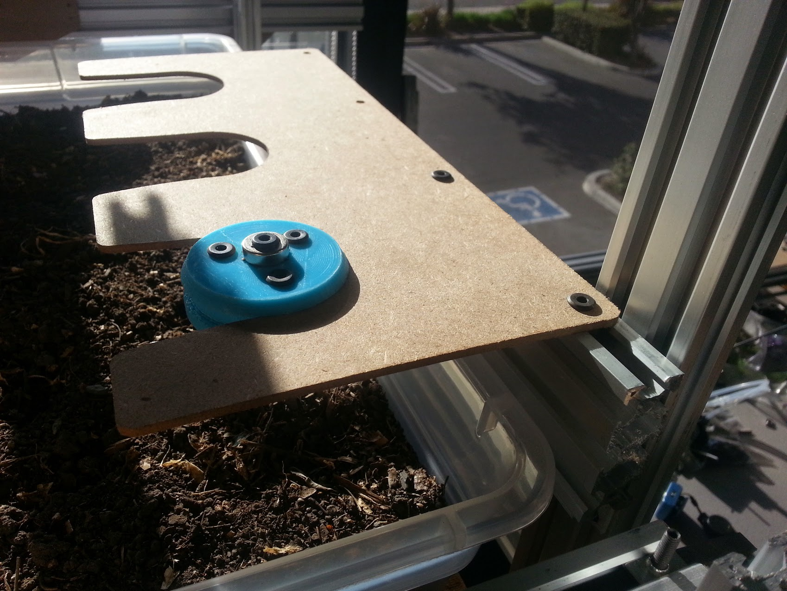
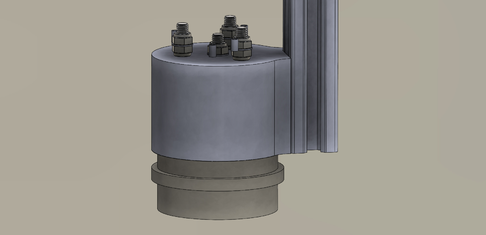
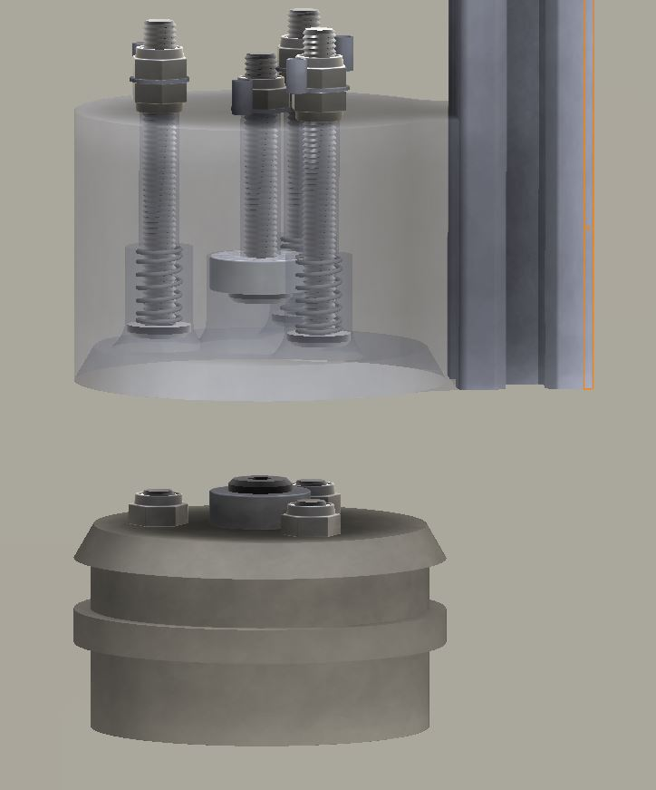

* toc
{:toc}

The V0.4 Universal Tool Mount has been completely redesigned to be actuator-less, simpler, smaller, 3D printable, and more affordable to produce. The primary mechanism for holding the tool in the mount is a pair of strong ring magnets, one on the tool and one on the mount, each held in with 5mm screws. Both the tool and the mount are tapered to allow easy coupling an de-coupling of the components.

In addition to the magnet holding screws, there are three additional pairs of screws in the tool and the mount that make physical contact when the tool and mount are coupled. These three screws, along with the magnet holding screws allow for power and data to be passed from the mount to the tools, with the magnet holding screw being ground. The three screws have springs between the heads and the mount, enforcing them to make consistent electrical contact. In addition, the three screws act as keys to prevent the tool from rotating undesirably in the mount.

FarmBot will use the Z-axis’s leadscrew to have enough mechanical advantage to pull the mount off the tool when the tool is in the tool bay.

## Video Demonstration

<iframe class="embedly-embed" src="//cdn.embedly.com/widgets/media.html?src=https%3A%2F%2Fwww.youtube.com%2Fembed%2FL-dJef9fXNM%3Ffeature%3Doembed&url=https%3A%2F%2Fwww.youtube.com%2Fwatch%3Fv%3DL-dJef9fXNM&image=https%3A%2F%2Fi.ytimg.com%2Fvi%2FL-dJef9fXNM%2Fhqdefault.jpg&key=02466f963b9b4bb8845a05b53d3235d7&type=text%2Fhtml&schema=youtube" width="854" height="480" scrolling="no" frameborder="0" allowfullscreen></iframe>

## Photos

## Universal Tool Mount Issues and Proposed Solutions
  * The tool mount has a lot of unnecessary volume on the top half. This causes it to take much longer to print for very little added strength or utility. The V0.5 tool mount will be slimmed down
  * The body of the tool wants to make contact with the body of the mount at the same time the center screws want to make contact. Because tolerancing is not perfect, either the bodies contact or the screws do. If the bodies contact, then electrical connection is not made. If the screws contact, then the tool wobbles in the mount because of the small contact area.
  * The magnetic connection works extremely well, tools practically jump into the mount. However, there is likely not enough magnetic holding power for tools any heavier than the “blank” tool used for testing. Swapping which screws have magnets and which screws have springs could solve this and the above issue. The center screw can have a spring and no magnet, while the three outer screws have magnets. Contact of the bodies can be prevented with different clearance, ensuring electrical contact is always made, and with the 3 magnet design, a larger contact surface will be made preventing tool wobble. For lighter weight tools not needing 3 pairs of magnets, 3D printed spacers can replace the magnets on the tool.
  * The mounting flange should be made thicker for extra strength
  * Support material had to be added when printing the tool in order to support the second flange. This material was difficult to get out cleanly without damaging the rest of the part. Adding a chamfer will prevent the need for support material.
