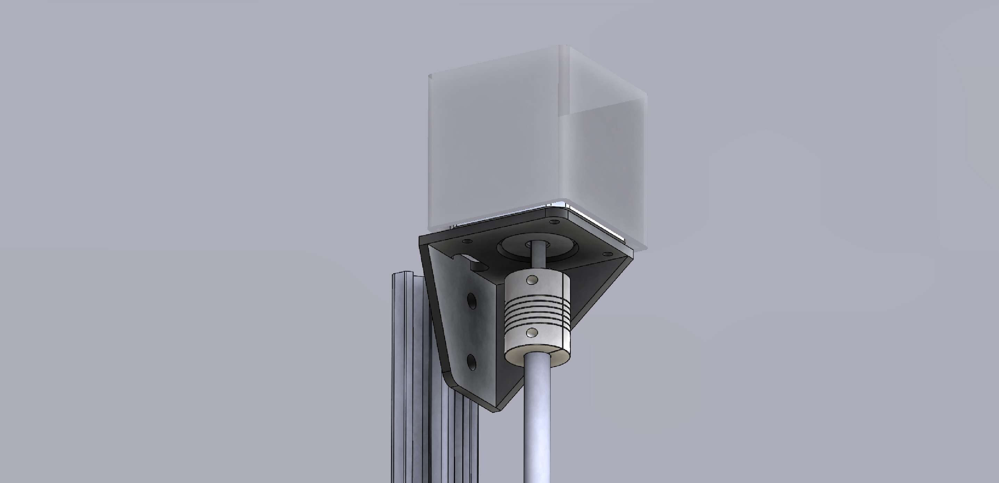
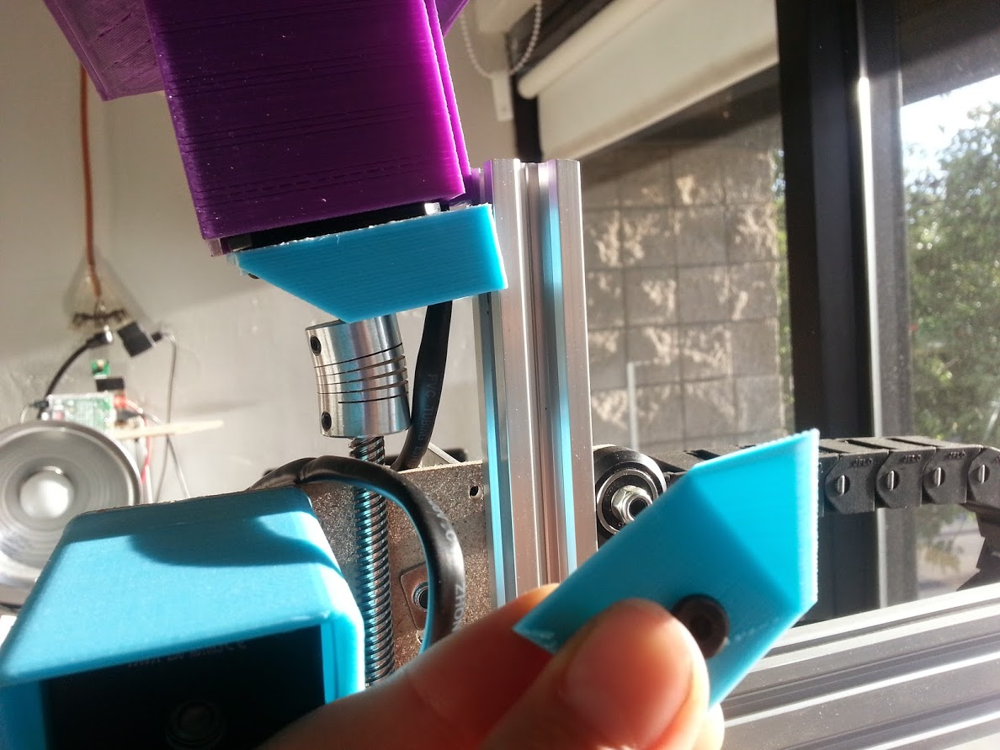

* toc
{:toc}

* The Z-axis extrusion has been changed to a 20x20mm extrusion from a 20x40mm one in order to save space and weight
  * A custom 3D printable or bent sheet metal bracket has been designed to hold the Z-axis motor
  * A 3D printable motor housing has been added
  * Z-Axis Issues and Proposed Solutions
  * The 3D printed bracket is too weak at the points where the screws attach it to the extrusion. The print has the tendency to crack along the layers when screws are tightened. Increasing the thickness here and ensuring there is adequate clearance for the screw to fit in the hole will solve the issue.
  * If the Z-Axis has a failure and attempts to plunge into the soil, the 3D printed bracket has a much greater chance of failure. Perhaps a custom metal bent bracket will be the only solution.



