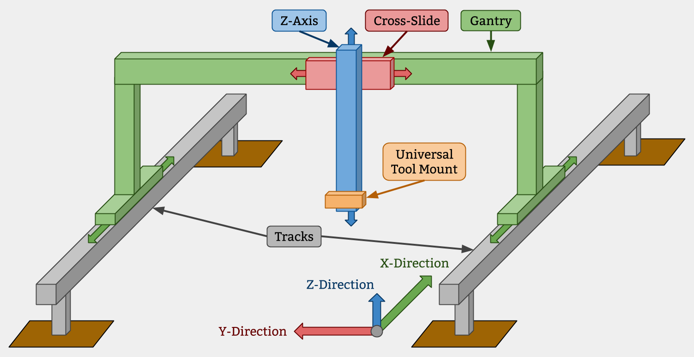

* toc
{:toc}

## Tracks
FarmBot Tracks are one of the components that really differentiate FarmBot technology from traditional free-driving wheeled tractors. The tracks are what allow the system to have great precision in an efficient and simple manner. There are many reasons of why Tracks are superior, a few of which are listed below. You can also read about tracks and precision farming on this blog post.

  * Tracks provide great precision and allow the the FarmBot to return to the same position repeatedly
  * Any type of packing structure of plants can be created and managed
  * Tracks take up less area than paths for tractor wheels and do not compact the soil

## Gantry
Gantrys are the structural component that bridges the two Tracks and moves in the X-direction via an X-Direction Drive System. Typically, it serves as a linear guide for the Cross-Slide and a base for the Y-Direction Drive System that moves the Cross-Slide across the Gantry in the Y-direction. It can also serve as a base for mounting other tools, electronics, supplies, and/or sensors.

## Cross-Slide
A Cross-Slide moves in the Y-Direction across the Gantry. This motion provides the second major degree of freedom for FarmBots and allows operations such as planting to be done anywhere in the XY plane. The Cross-Slide is moved using a Y-Direction Drive System and functions as the base for the Tool Mount and Z-Direction Drive System.

## Z-Axis
The Z-axis attaches to the Cross-Slide and provides the FarmBot with Z-Direction movement. It serves as the base for attaching the Universal Tool Mount and other Tools.

