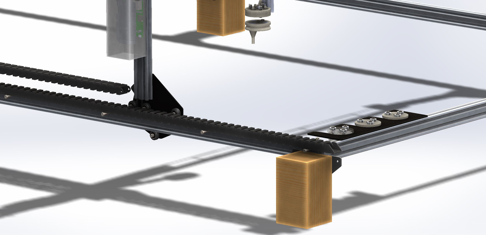
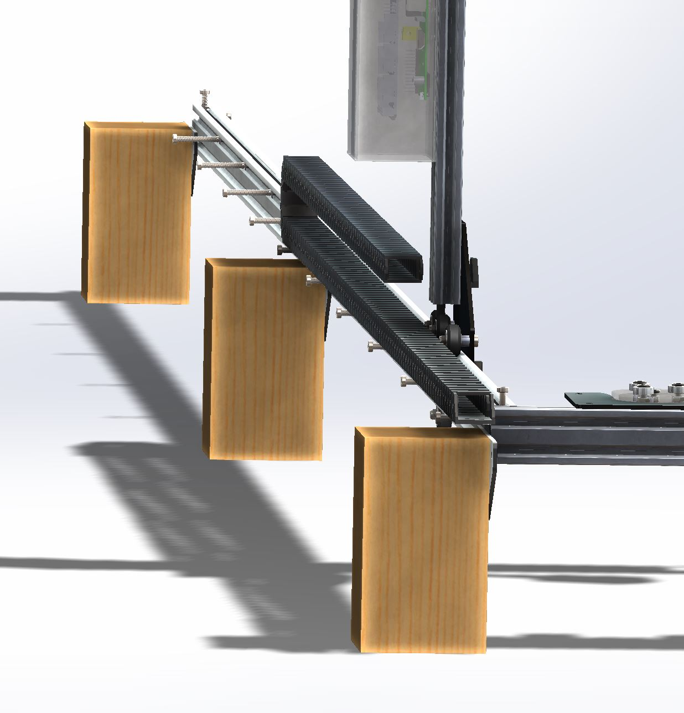
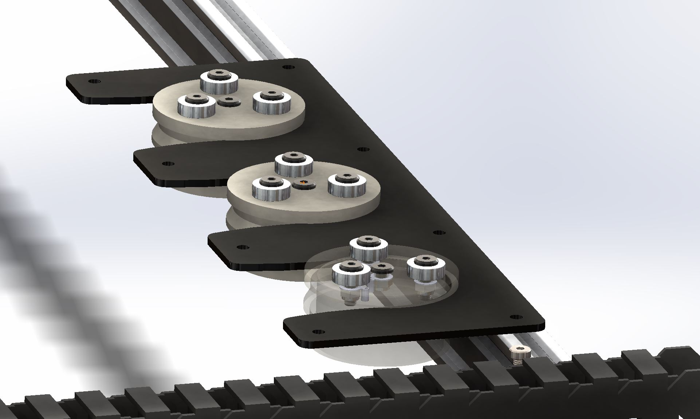
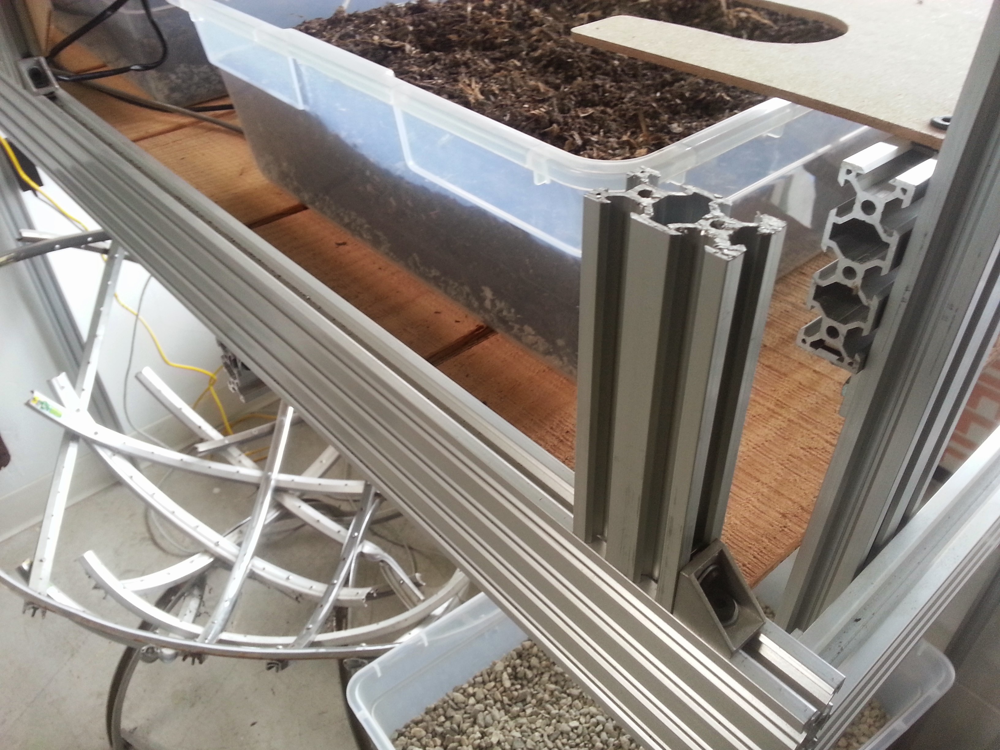
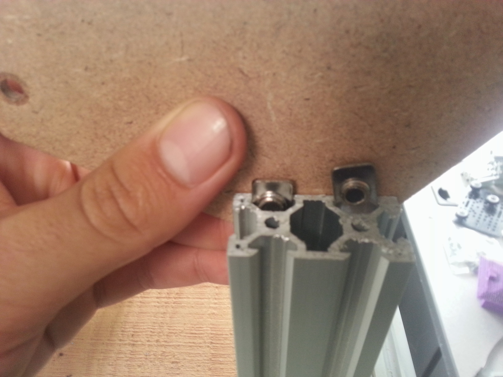
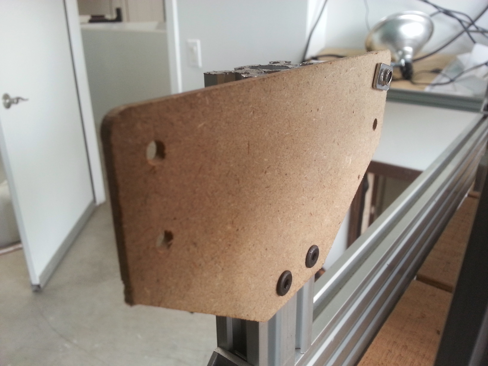
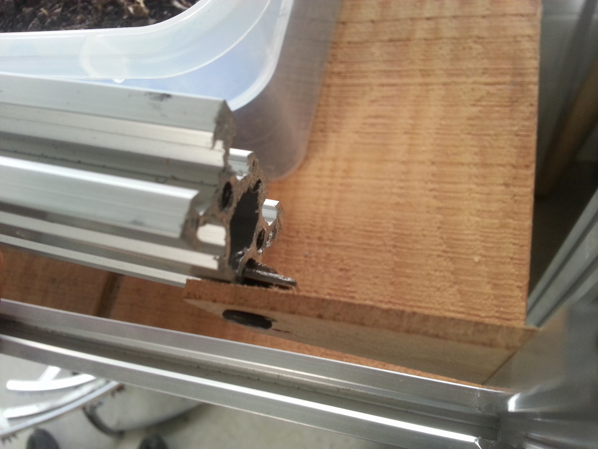
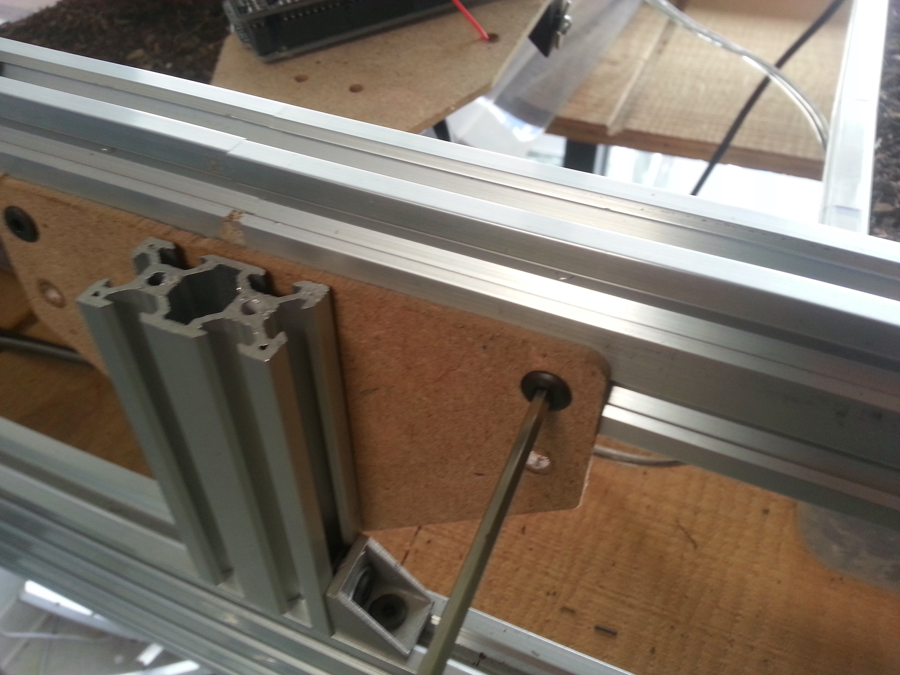
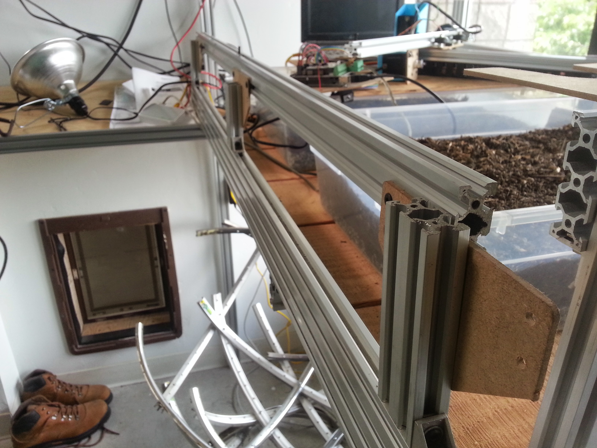

* toc
{:toc}

## Change Log
  * Repositioned the cable carrier alongside the track extrusion rather than below it. This eliminates the custom bent brackets in V0.4 with long screws and tee nuts
  * The track joining plates had to be modified to have a lower profile so that they only cover half of the track extrusions. This allows the cable carrier to rest flush against the extrusions and prevent snagging on top of the plates.

## Assembly Instructions
**Setup the Posts**
  *  Depending on where you are installing your FarmBot will change what material and how you might setup your Track Posts. You might use 2x4s of wood, or aluminum extrusions, or existing infrastructure. The posts might attach to a wooden raised bed, or be set in the ground or in small foundations. The choice is up to you how you set this up.
  * Install short (100-500mm) vertical posts for one of the tracks. Attach or secure the posts however you like, though it is critical to ensure that the posts will not significantly move once installed. Space the posts 1500mm apart, center to center unless you are using shorter track lengths, in which case space the posts that far apart. Ensure the posts are aligned properly and the same height. You may want to use a level to ensure this.
  * If you are setting up multiple track sections (more than 1500mm in total length), it is best to install the end posts first and tie a guide string in between these two posts to ensure your tracks are installed in a straight line.
  * Depending on the width of your FarmBot, space the second Track’s posts the appropriate distance away from the first Track’s. It is critical that the distance between the two sets is consistent, if it is not, there will be unnecessary forces placed on the Gantry and Tracks.

**Attach the Track Plates**
  * The track plates should be screwed onto the inside of the posts using the appropriate fasteners: 8mm M5 screws and tee nuts if the posts are aluminum extrusions, standard wood screws if attaching onto wood posts. The top of the posts should NOT be flush with the top of the plates. Rather, the top of the posts should come up to cover only half of the plates.

