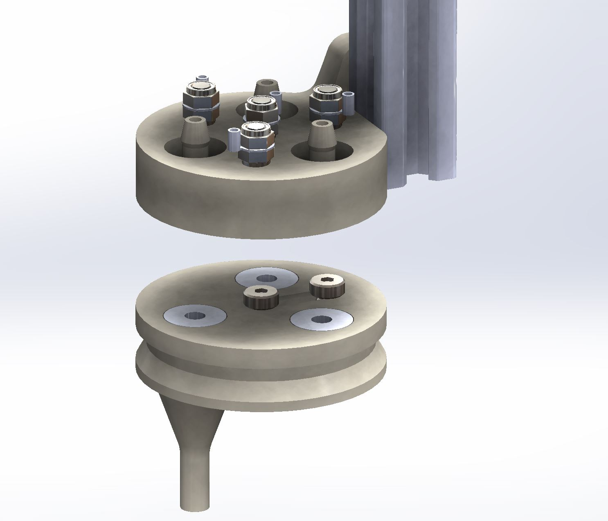
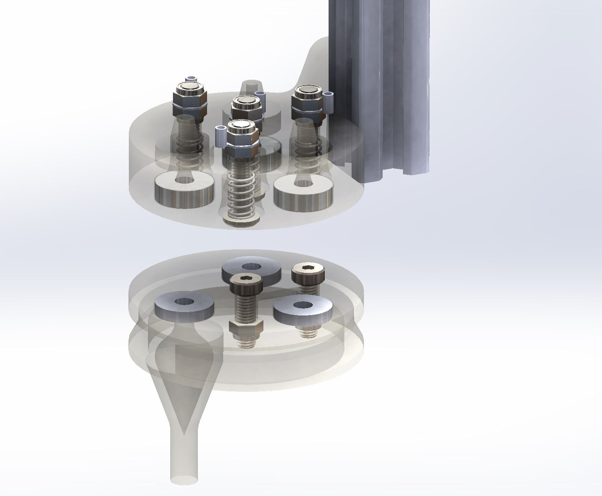
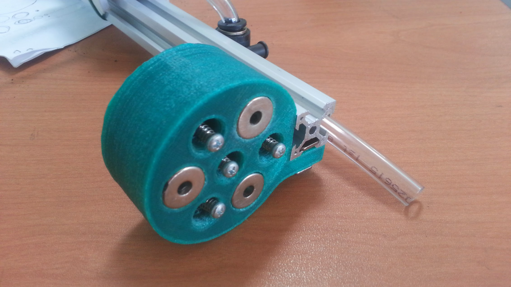
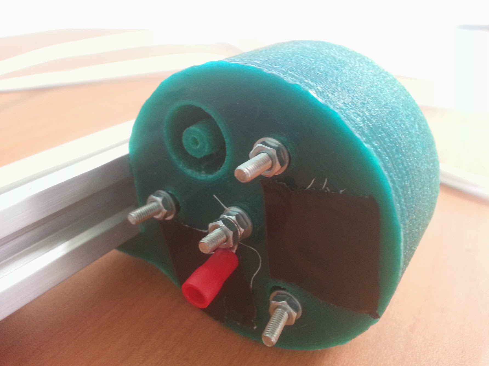
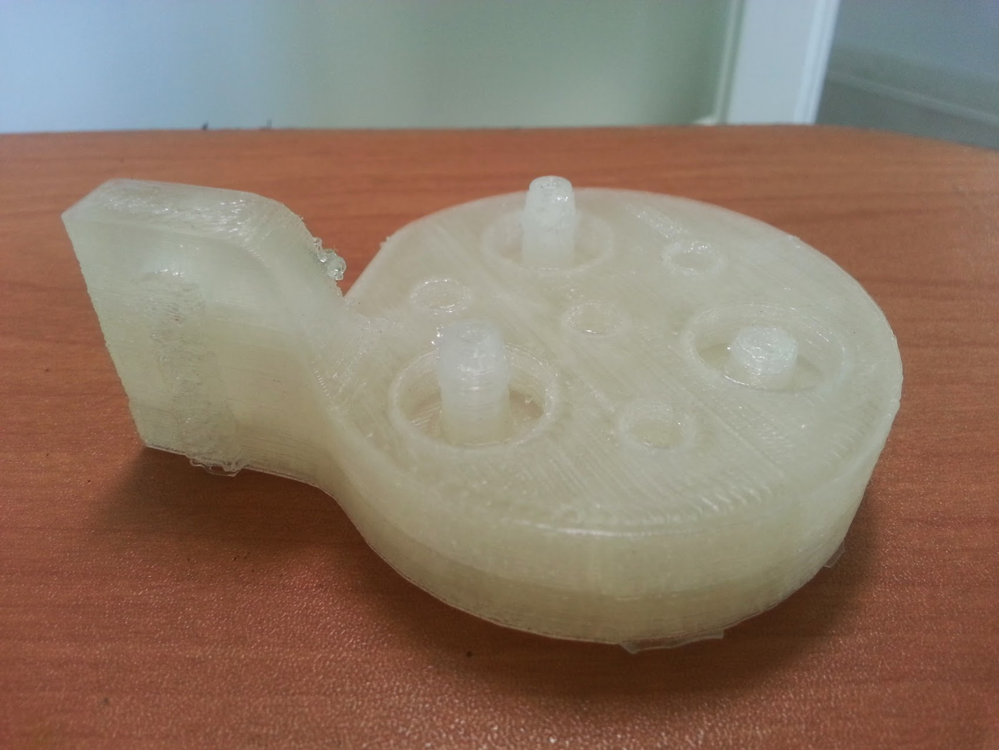
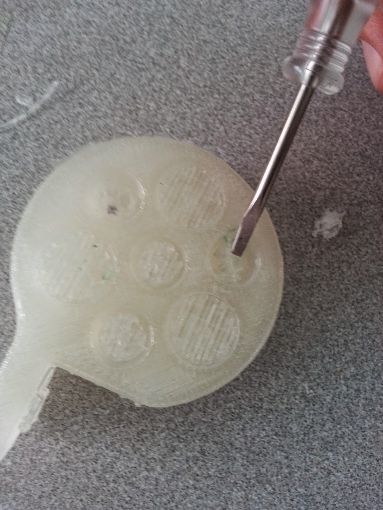

The Universal Tool Mount (UTM) allows FarmBot Genesis to automatically switch tool is on the z-axis depending on the operation needing to be completed. The UTM is ncessary because it is not feasible to have all tools mounted on the z-axis at one time for several reasons:

  * This would be very heavy and create more stresses on all components, as well as necessitate a larger z-axis motor.
  * Most tools need to be the “lowest” thing on the z-axis in order to work. Having multiple tools competing for the lowest position (ex: a temperature probe and a seed injector) would not be ideal and may not work at all. The use of individual tool raising and lowering mechanisms, or a turret style mechanism would be complex, heavy, bulky, and limited in the number of tools it could support.
  * The Z-Axis’s size must be kept to a minimum in order for it to have minimal impact on the plants, especially when there is not very much space between them.
  * The UTM is a single 3D printed component that mounts to the Z-Axis aluminum extrusion using two M5 screws and tee nuts. It features 3 strong neodymium ring magnets to magnetically hold tools in place via washers or other magnets placed in the same configuration on the Tool. The magnets double as the keying system to ensure that tools are properly oriented in the UTM. The magnets also function as the passage ways for water, liquid amendments (eg: fertilizer), and vacuum or compressed air to pass through from the UTM (and the rest of FarmBot) to the Tool. In addition, the UTM has 4 spring loaded screws that make electrical connections with Tools. Two are for power (GND and +5V), and two are for data (0 to +5V).

## Video Demo

<iframe class="embedly-embed" src="//cdn.embedly.com/widgets/media.html?src=https%3A%2F%2Fwww.youtube.com%2Fembed%2FJIVe0dvgx6w%3Ffeature%3Doembed&url=https%3A%2F%2Fwww.youtube.com%2Fwatch%3Fv%3DJIVe0dvgx6w%26feature%3Dyoutu.be&image=https%3A%2F%2Fi.ytimg.com%2Fvi%2FJIVe0dvgx6w%2Fhqdefault.jpg&key=02466f963b9b4bb8845a05b53d3235d7&type=text%2Fhtml&schema=youtube" width="854" height="480" scrolling="no" frameborder="0" allowfullscreen></iframe>

## Photos



## Universal Tool Mount Change Log
There are many changes from the V0.4 UTM design including the following.

  * Switched from the single central magnet design from V0.4 to a three magnet design in order to keep the tools from easily being torqued out from the mount, and to increase the holding power.
  * The ring magnets are now glued in place instead of held in with screws in order to keep the hole free.
  * The ring magnets are now the passageways for air, water, and liquid amendments (eg: fertilizer) to pass through from the UTM to the Tool.
  * The outer diameter of the UTM has increased slightly to accommodate the increased number of pass-through components.
  * Center screw is now spring loaded too.
  * Mounting flange is now 8mm thick instead of 5 for extra strength.
  * There are two versions of the Universal Tool Mount this time around. Both are functionally the same, one is simply optimized for the Fused Deposition Modeling (FDM) 3D printing process while the other is optimized for Stereolithography or Selective Laser Sintering (SLS). The major change is that the FDM version is much bulkier so that no support material is needed. This means that the part takes a long time to print, but it requires very little to no manual cleanup once done printing. The SLS version is significantly smaller in volume, allowing to be printed with less material, thereby saving on time and cost. However, these printers are generally more expensive and not as widely available to the public as FDM printers are such as RepRaps. Therefore both versions have great merit and will are made available for download. Make sure to select the correct model before printing depending on the process you choose or have access to!

## A note about Tools, Power, and Data
Tim Evers and Rory Aronson had a lengthy discussion in email regarding how to handle communication between the tools and the Arduino/RAMPS board. This discussion can be seen on the [Universal Tool Mount wiki page](http://wiki.farmbot.cc/wiki/Universal_Tool_Mount). The summary:

  * Plug the vacuum pump for the seed injector into one of the heating element pin pairs on RAMPS
  * Plug the water pump/valve into the the other heating element pin pairs on RAMPS
  * Plug the Universal Tool Mount’s 2 power wires into the fan pins on RAMPS
  * Plug the Universal Tool Mount’s 2 data pins directly into the Arduino
  * Tools will at first have a single function so communication will be general I/O and not require extra electronics
  * Eventually tools may have more functions and require an I2C connection and additional electronics in the tool to support this communication
  * Note: In these photos, there are M3 screws in the mount. I did not have the M5 screws on hand at the time of taking the photo, thought he mount is designed for M5 screws.
  * The black tape was to temporarily seal those barbs during a test.
  * The SLS version should NOT be printed using an FDM printer as seen in this photo because it requires the use of support material which can be difficult and time consuming to remove, ultimately leaving you with an inferior part. If you are going to use an FDM printer, do not print the SLS version!
  * Note the excessive support material. Again, do NOT print the SLS version with an FDM printer as seen in these photos, it will not come out well.

## Universal Tool Mount Issues and Proposed Solutions
  * The main issue with the V0.5 Universal Tool Mount is that the three pairs of magnets directly mating with each other is too much force for the z-axis to be able to separate them. In fact, it is difficult to remove the tool from the mount even by hand! We tried making a tool without magnets, instead using washers in hope that the attraction would be weaker. That worked but posed a new problem: the attraction to the tool’s washers was not strong enough in comparison to the attraction to the tool’s screws for the electrical connections. This resulted in the mount and tool aligning improperly about 50% of the time.
  * Only having metal where the magnets are (no screws enticing a misalignment) will help prevent misalignment. And not allowing the magnets to touch each other directly will reduce the holding force.
  * Another issue with the magnets is the difficulty of seating them all in the tool mount to the same z-level in order to get good seals between the the tool and the mount. A remedy we tried was supergluing gaskets onto the magnet surfaces of the tool and the tool mount, but that was finicky as a corrective measure, and changed the distances between the tool and mount so the electrical connections no longer worked. That could have been solved with different sized screws or counter bores, but the glued on gaskets we’re still not a great solution.
  * Not having the magnets ever touch might be a better solution.
  * Gluing the magnets into the mount and tool is also problematic. It means that the magnets cannot be easily removed – a major problem if one glues in a magnet with the wrong orientation such that it repels the tool instead of attracts it. In this case, one must take damaging measures to remove the magnet and flip its orientation.
  * Screwing in the magnets to the tool and the mount is a much better solution as was done with the V0.4 design. This will be brought back in V6.
  * Last, depending on the quality of the 3D printed parts, the barbs can be easily broken.
  * This could be solved by replacing the printed barbs with screw-in metal barbs or with higher quality 3D printed parts.
