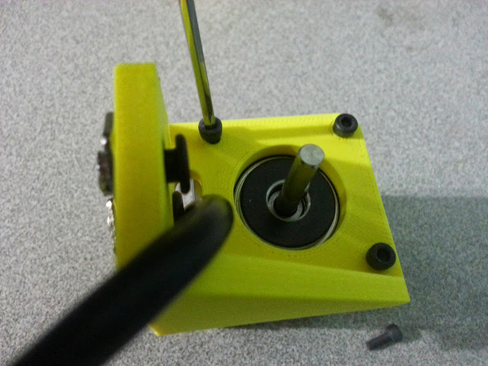

## Z-Axis Change Log
  * The Z-axis motor mounting bracket has been made thicker and the holes for the M5 screws enlarged to 6mm to prevent cracking
  * All ideas for mounting tools to the z-axis extrusion have been nixed in order to keep weight down and the bulkiness of the z-axis to a minimum. Tools are now being consolidated to work with the Universal Tool Mount in combination with component mounted on the Gantry column.



## Z-Axis Assembly Instructions
  * Partially screw 2 8mm M5 screws and tee nuts into the motor mounting bracket. Route the Stepper Motor’s cable through the bracket and attach the motor to the bracket with 4 8mm M3 screws.



