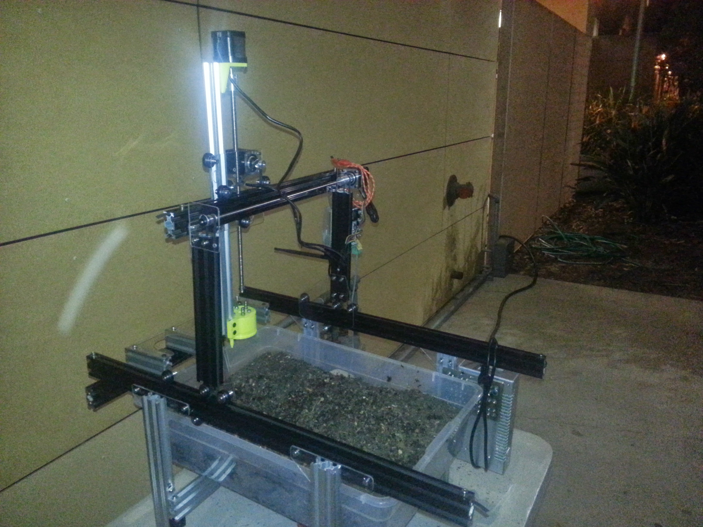
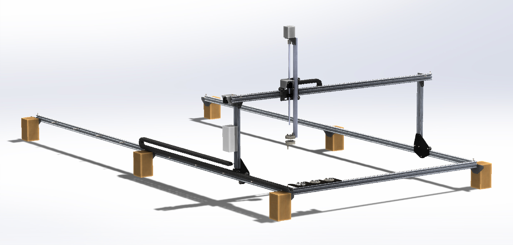
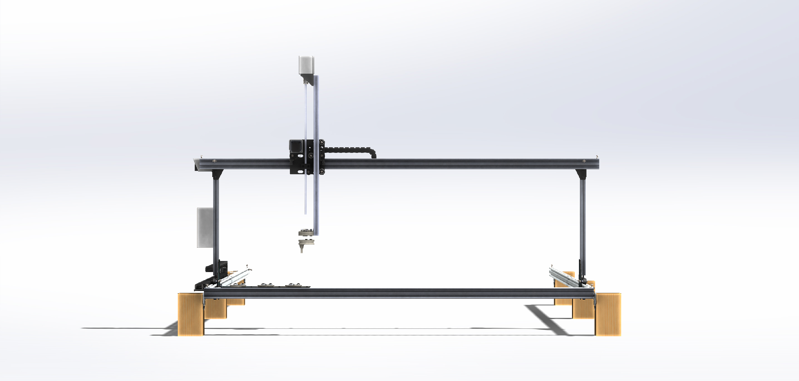
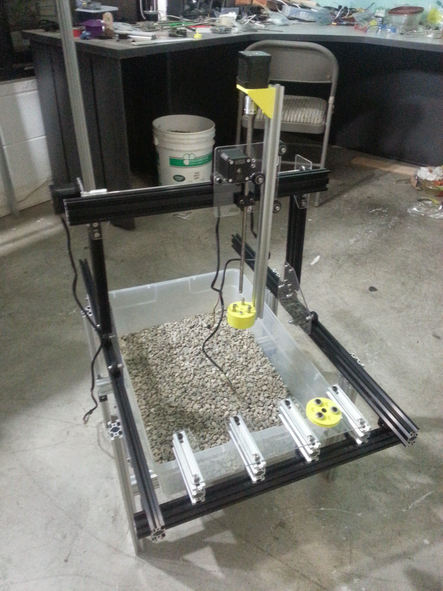
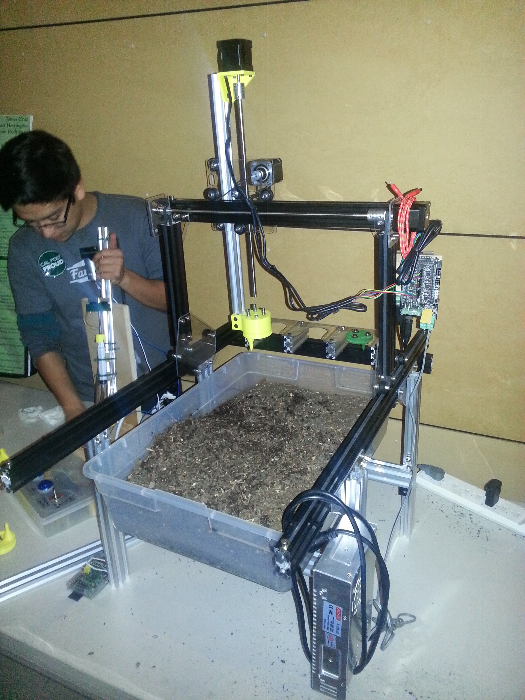

Genesis V0.6 was a very minor update to Genesis V0.5, in fact, the only changes are with the Universal Tool Mounting System. For this reason, you may find that this documentation page looks nearly identical to that of Genesis V0.5 and you may just want to skip down to the Universal Tool Mount Section to see what is new. Here is a summary:

  * Gluing in the magnets on the V0.5 Universal Tool Mount and Tools was problematic, the V0.6 design uses screws to hold the magnets in place
  * Gluing on rubber gaskets to the V0.5 tool mount proved to be unreliable. The V6 liquid lines now use o-rings held in place by a small channel in order to make a seal with the tool.
  * Experimented with screw-in stainless steel barbs for the Universal Tool Mount’s liquid lines
  * Experimented with a miniature Universal Tool Mount and seed injector
  * Note: The prototypes produced and seen in some of these photos used acrylic for the plates and was of a very small scale. This worked great for a prototype but should not be used for a real FarmBot because the acrylic is very flimsy. Also, the size is good for testing the hardware, but not useful for growing a significant amount of food.



