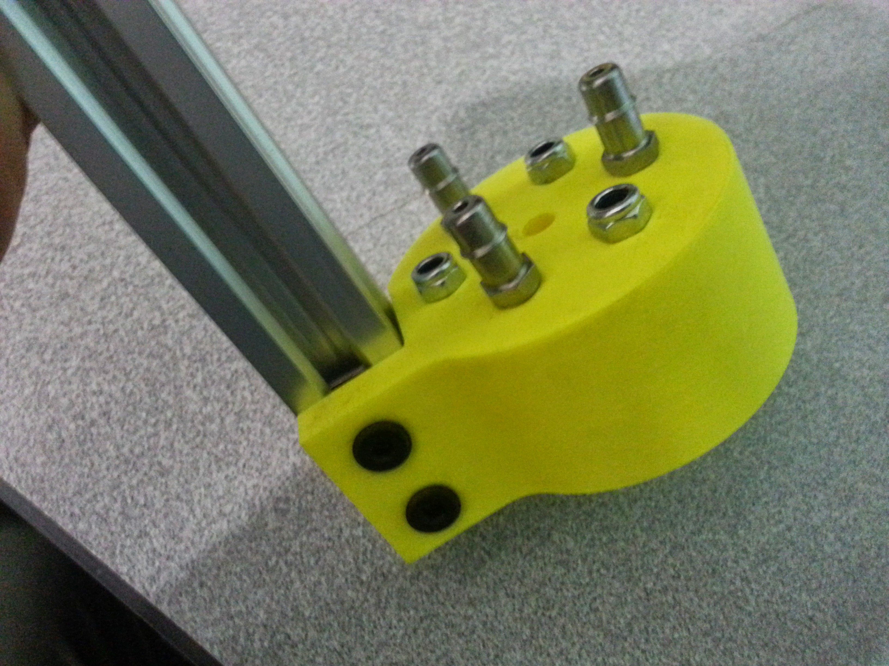
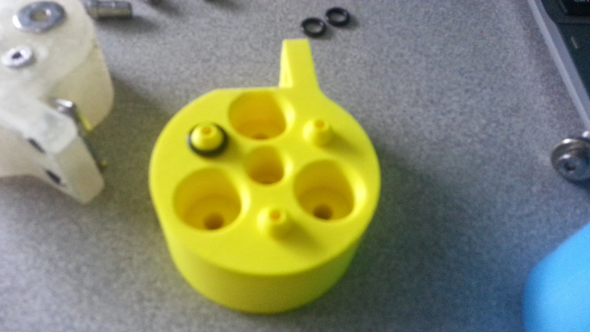
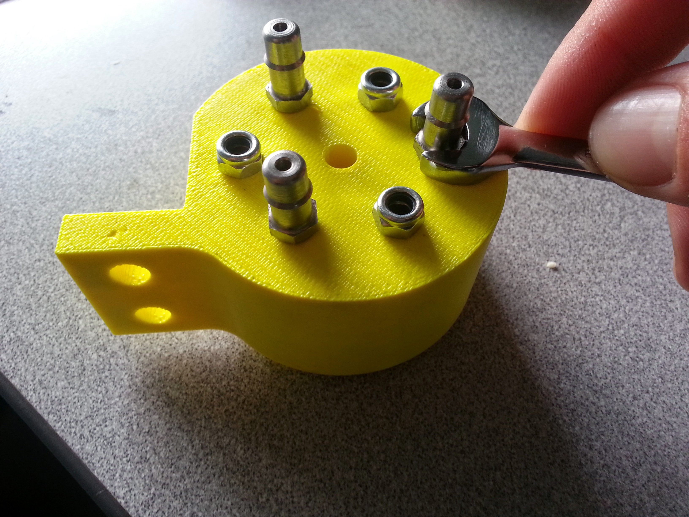

* toc
{:toc}

The Universal Tool Mount (UTM) allows FarmBot Genesis to automatically switch tool is on the z-axis depending on the operation needing to be completed. The UTM is ncessary because it is not feasible to have all tools mounted on the z-axis at one time for several reasons:

  * This would be very heavy and create more stresses on all components, as well as necessitate a larger z-axis motor.
  * Most tools need to be the “lowest” thing on the z-axis in order to work. Having multiple tools competing for the lowest position (ex: a temperature probe and a seed injector) would not be ideal and may not work at all. The use of individual tool raising and lowering mechanisms, or a turret style mechanism would be complex, heavy, bulky, and limited in the number of tools it could support.
  * The Z-Axis’s size must be kept to a minimum in order for it to have minimal impact on the plants, especially when there is not very much space between them.
  * The UTM is a single 3D printed component that mounts to the Z-Axis aluminum extrusion using two M5 screws and tee nuts. It features 3 strong neodymium ring magnets to magnetically hold tools in place via washers or other magnets placed in the same configuration on the Tool. The magnets double as the keying system to ensure that tools are properly oriented in the UTM. The magnets also function as the passage ways for water, liquid amendments (eg: fertilizer), and vacuum or compressed air to pass through from the UTM (and the rest of FarmBot) to the Tool. In addition, the UTM has 4 spring loaded screws that make electrical connections with Tools. Two are for power (GND and +5V), and two are for data (0 to +5V).

## Universal Tool Mount Change Log
  * Instead of using glue to hold in the magnets, the magnets are now secured on both the tools and the tool mount with M5 screws. This also allows them to be reversed in case one puts them in incorrectly.
  * Changed over to screw-in barbs
  * Only one version of the UTM was designed and produced this time in order to reduce complexity of options. The cost savings of a specialized UTM for another printing process is marginal, and the added complexity of having different sized screws and other hardware makes it less appealing to support multiple versions.

## Video Demo

<iframe class="embedly-embed" src="//cdn.embedly.com/widgets/media.html?src=https%3A%2F%2Fwww.youtube.com%2Fembed%2FlnrhFsq8IJg%3Ffeature%3Doembed&url=https%3A%2F%2Fwww.youtube.com%2Fwatch%3Fv%3DlnrhFsq8IJg&image=https%3A%2F%2Fi.ytimg.com%2Fvi%2FlnrhFsq8IJg%2Fhqdefault.jpg&key=02466f963b9b4bb8845a05b53d3235d7&type=text%2Fhtml&schema=youtube" width="854" height="480" scrolling="no" frameborder="0" allowfullscreen></iframe>

## Photos



## A note about Tools, Power, and Data
Tim Evers and Rory Aronson had a lengthy discussion in email regarding how to handle communication between the tools and the Arduino/RAMPS board. This discussion can be seen on the [Universal Tool Mount wiki page](http://wiki.farmbot.cc/wiki/Universal_Tool_Mount). The summary:

  * Plug the vacuum pump for the seed injector into one of the heating element pin pairs on RAMPS
  * Plug the water pump/valve into the the other heating element pin pairs on RAMPS
  * Plug the Universal Tool Mount’s 2 power wires into the fan pins on RAMPS
  * Plug the Universal Tool Mount’s 2 data pins directly into the Arduino
  * Tools will at first have a single function so communication will be general I/O and not require extra electronics
  * Eventually tools may have more functions and require an I2C connection and additional electronics in the tool to support this communication
  * Note: In these photos, there are M3 screws in the mount. I did not have the M5 screws on hand at the time of taking the photo, thought he mount is designed for M5 screws.
  * The black tape was to temporarily seal those barbs during a test.
  * The SLS version should NOT be printed using an FDM printer as seen in this photo because it requires the use of support material which can be difficult and time consuming to remove, ultimately leaving you with an inferior part. If you are going to use an FDM printer, do not print the SLS version!
  * Note the excessive support material. Again, do NOT print the SLS version with an FDM printer as seen in these photos, it will not come out well.

## Universal Tool Mount Issues and Proposed Solutions
  * The main issue with the V0.6 UTM is that there are too many components fighting to be ‘closest’ to each other. There are the three O-rings on the liquid lines that need to be sufficiently compressed in order to get a good seal. This is conflicting with the fact that the four screws (three of which are not spring loaded) also are trying to make contact with the tool, and those are not compressible at all.
  * In V0.7, the remedy will be that the O-rings will be the primary mate with the tool, while all electrical connections will need to be spring loaded. This means that the electrical connections will need to be separate from the screws holding in the magnets.
