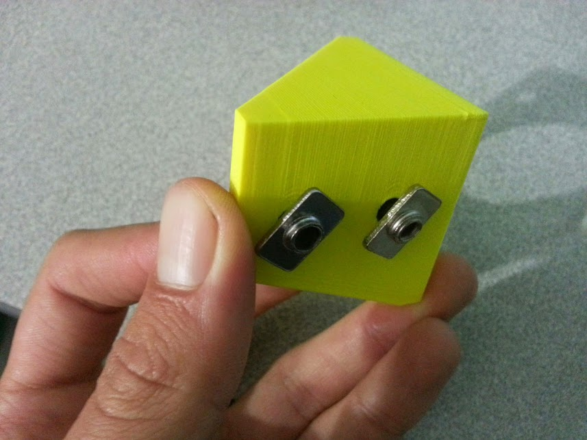
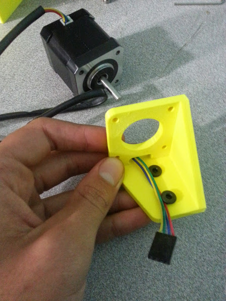
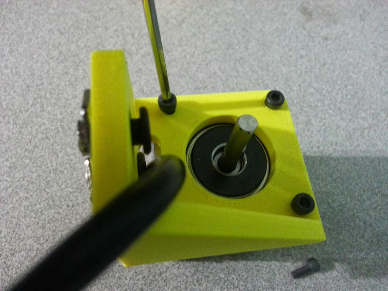

## Z-Axis Change Log
  * No changes were made



## Z-Axis Assembly Instructions
  * Partially screw 2 8mm M5 screws and tee nuts into the motor mounting bracket. Route the Stepper Motor’s cable through the bracket and attach the motor to the bracket with 4 8mm M3 screws.



