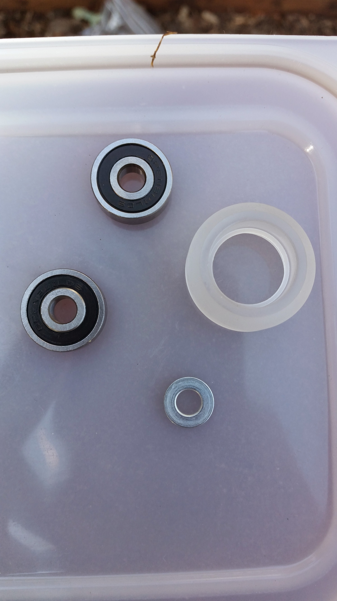
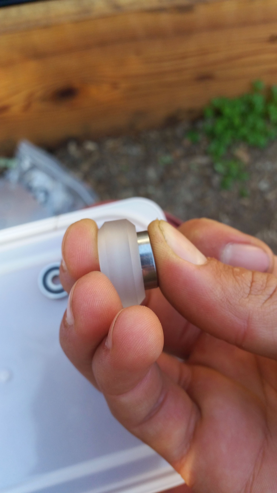
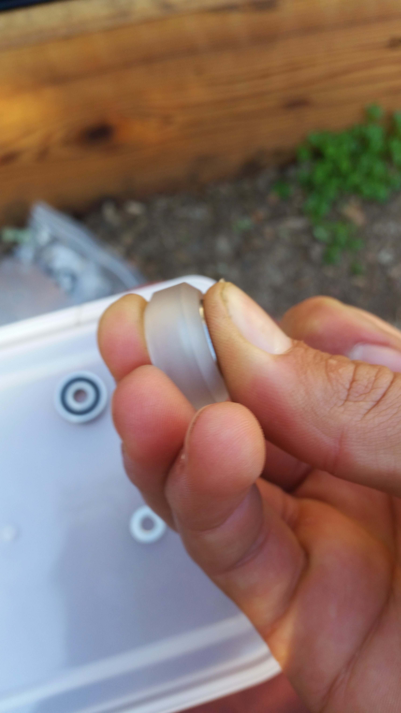
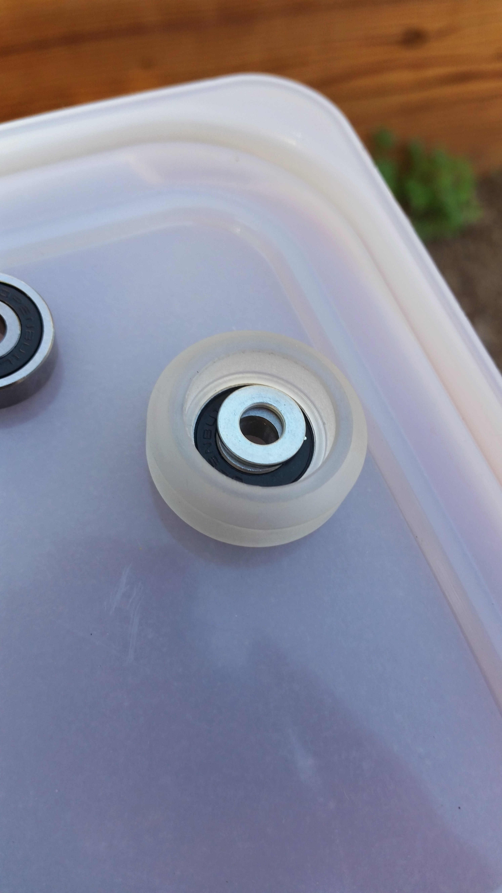

* toc
{:toc}

In order to shorten the time it takes for you to assemble your FarmBot hardware, consider following these preliminary steps.

# Organize your Parts

When you first open up your FarmBot hardware package, pull out all of the component bags so that you develop a full idea for what's included, and so that you can place them on a table or the floor in locations that make sense to you.

For many, grouping parts by type helps with locating them quickly later on. For example: place all your screws in one area, all your plates in another, all your electronics in another, etc.



# Pre-assemble your V-Wheels

Each V-Wheel actually consists of four components:
* One polycarbonate v-wheel
* Two 16mm x 5mm x 5mm stainless steel, rubber sealed ball bearings
* One stainless steel precision shim that fits between the two bearings, inside the wheel

Pre-assembling all your v-wheels at once will save you assembly time later on. To do so, first press one bearing into the polycarbonate wheel.





Then insert the precision shim such that it is resting on the first bearing on the inside of the wheel.

 Then press in the second bearing.

