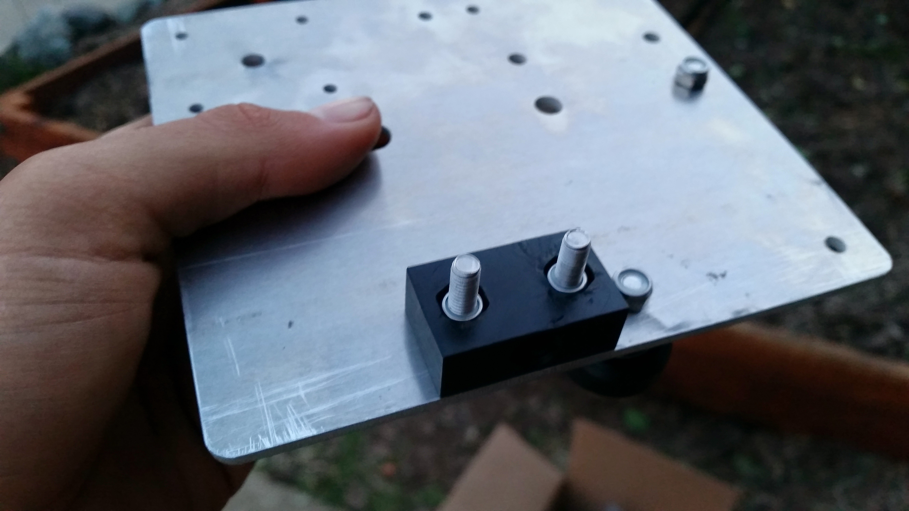
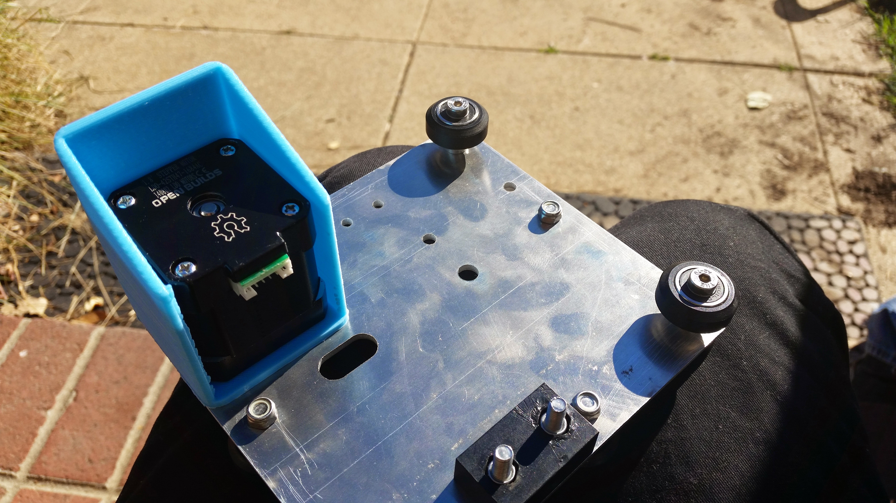
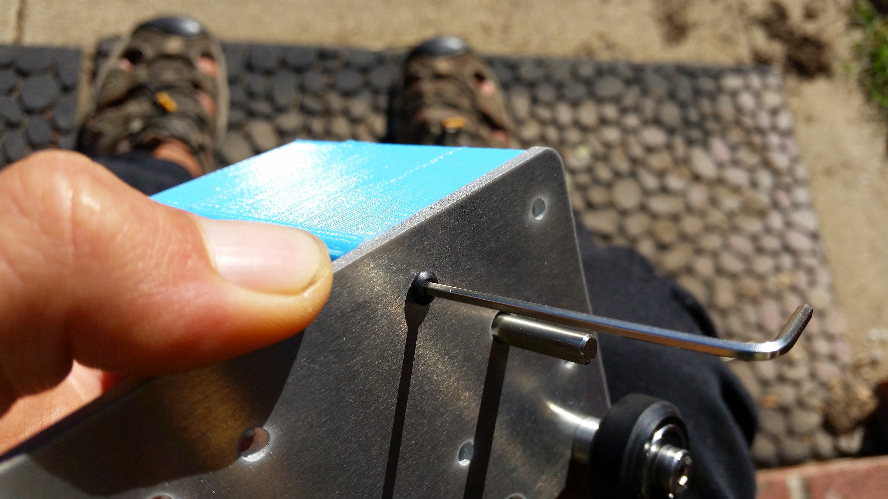
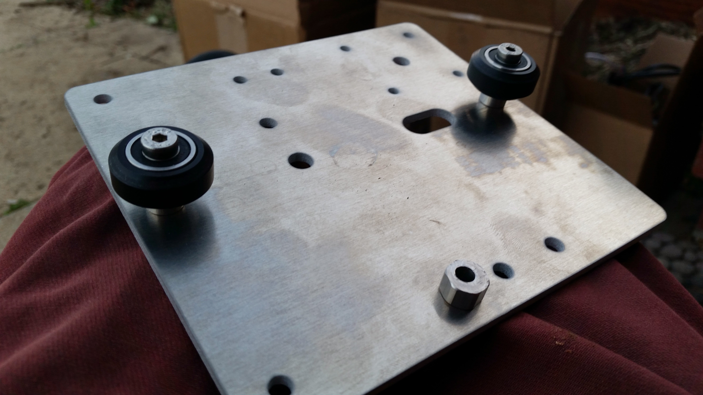

* toc
{:toc}





# Step 1: Attach the Delrin Leadscrew Block

Use two M5x25mm screws and tee nuts to attach the Delrin Leadscrew Block to the Cross-Slide Plate. Note that the motor mount holes and the 'empty corner' of the plate are located to the left of the delrin block.

# Step 2: Attach the Stepper Motor

Use four M3x10mm screws to attach the Stepper Motor and Motor Housing to the Cross-Slide Plate. Make sure the motor and housing are on the same side of the Cross-Slide Plate as the Delrin Block, and that the motor's wiring and the motor housing's open side are facing down towards the Delrin Block.

# Step 3: Add on the Z-Axis V-Wheels

Add two V-wheels with **normal spacers** to the corner holes of the Cross-Slide Plate. The V-wheels should be on the same side of the plate as the Motor and the Delrin Block.

Add a V-wheel with an **eccentric spacer** to the hole nearest the middle of the plate. The V-wheel should be on the same side of the plate as the other components.

# Step 4: Add the Gantry V-Wheels

Flip the Cross-Slide over so that all of the components you have added so far are facing away from you.

Add two wheels with **normal spacers** to the holes in the middle of the left and right edges of the Cross-Slide Plate.

Add a V-wheel with an **eccentric spacer** to the hole in the middle of the bottom edge of the Cross-Slide Plate, nearest the Delrin Block.

