* toc
{:toc}

FarmBot Tracks need to be attached to supporting infrastructure. Where you decide to install your FarmBot will determine how you setup your Tracks and therefor what supporting infrastructure you need. You might attach your track plates to 2x4 wood posts, aluminum extrusion posts, or to existing infrastructure such as a raised bed or greenhouse walls. The choice is up to you how you set this up.



We'll go over two methods here for setting up supporting infrastructure: building a raised bed, and setting up extrusions as posts. Note: some photos and components may be out of date for V0.7 hardware.

# Build a Raised Bed

## Step 1: Acquire Materials
  * Purchase some high quality wood from your local lumber yard. Preferably you will use thicker wood (1-2 inches thick) so that it does not warp easily. This is pretty important because your tracks will need to be very straight for FarmBot to work reliably, and your tracks will be directly attached to the raised bed. When soil becomes wet and when plants grow, this can cause tremendous force on the wood walls of the bed, forcing them outwards. Thicker wood, and extra posts is preferred. In this example, I used 2x12" nominal redwood, and 4x4" nominal wood posts spaced roughly every 5 feet, or one 1.5m extrusion length.
  * You'll also need to pick up some hardware for fastening your raised bed together. I selected 3/8" x 3" lag bolts, and some rustic looking washers.
  * Depending on your climate, you'll likely want to put some type of sealer, stain, or polyurethane on your wood to protect its color and water resistance. I chose Thompson's water sealer.

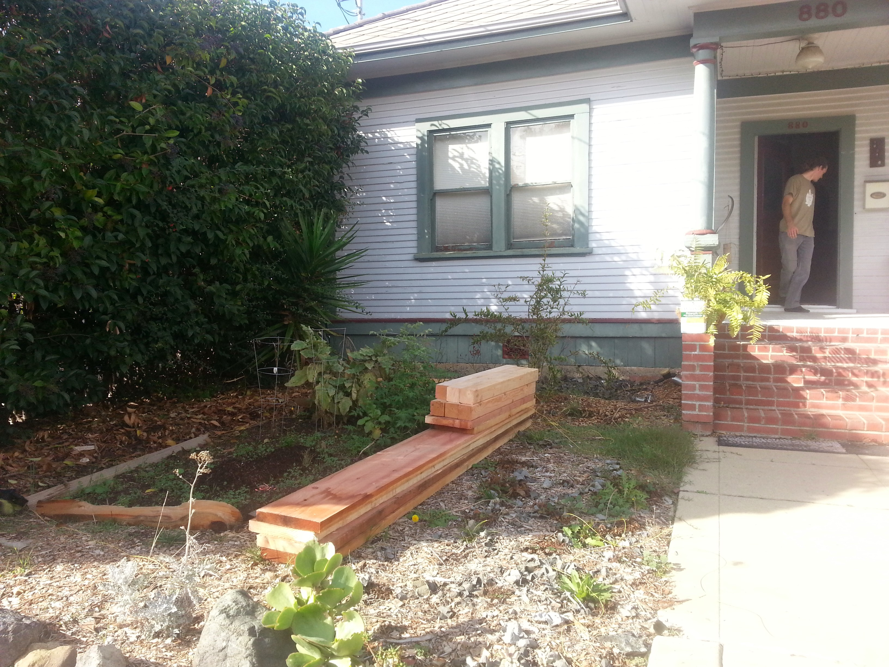

##Step 2: Dig Post Holes
Setup your lumber roughly where your bed will be so that you may find out where to dig your post holes.

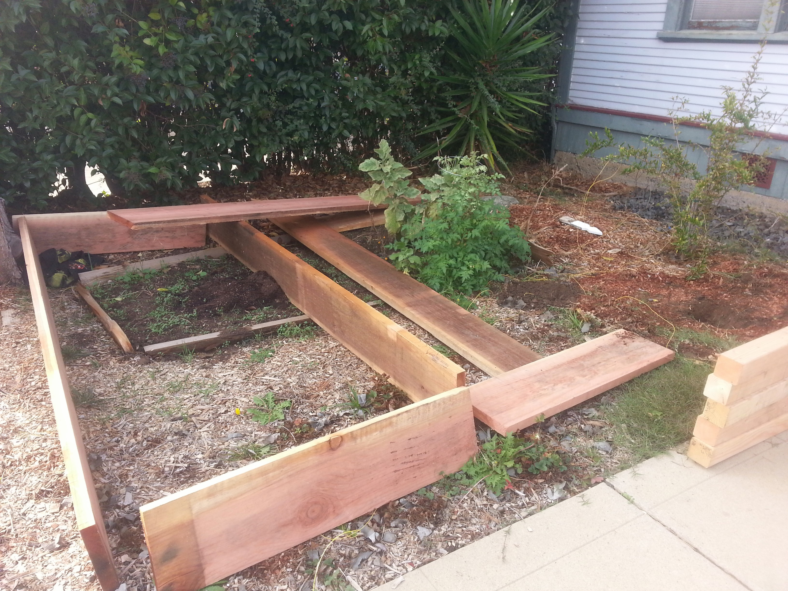

Dig your post holes. A post hole digger and pick axe can help greatly.

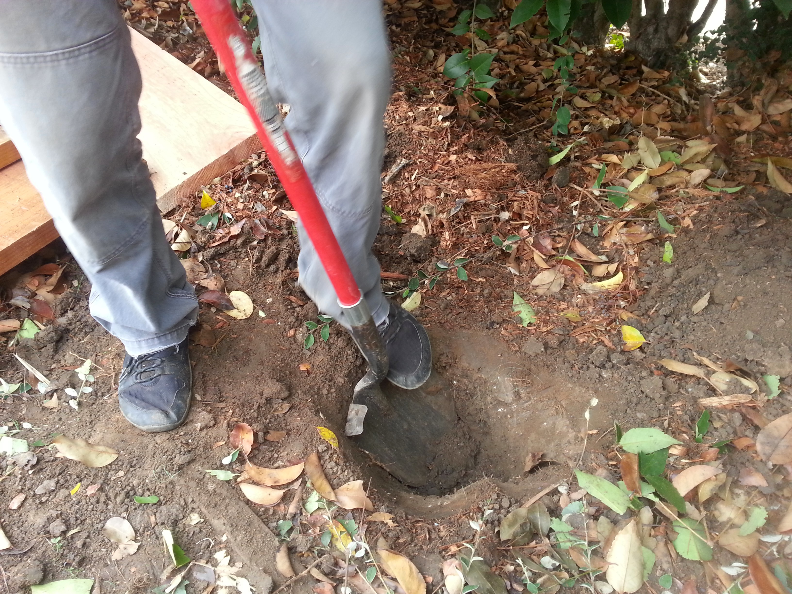

## Step 3: Prepare Your Materials
Sand your wood to remove any weird markings and splinters.

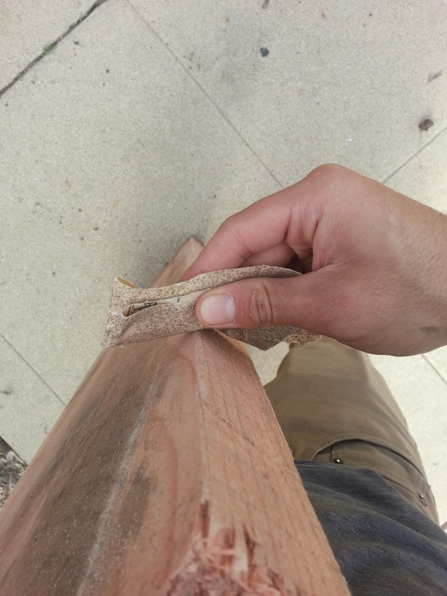

Stain your wood.

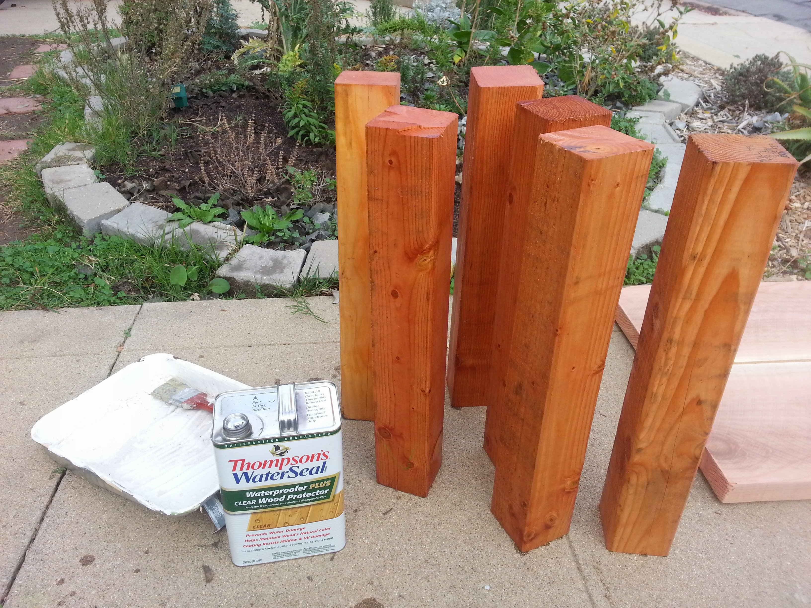

Setup your lumber upside down on a flat surface. We'll drill holes and screw together our bed in this orientation and then flip it over and position it in our holes.

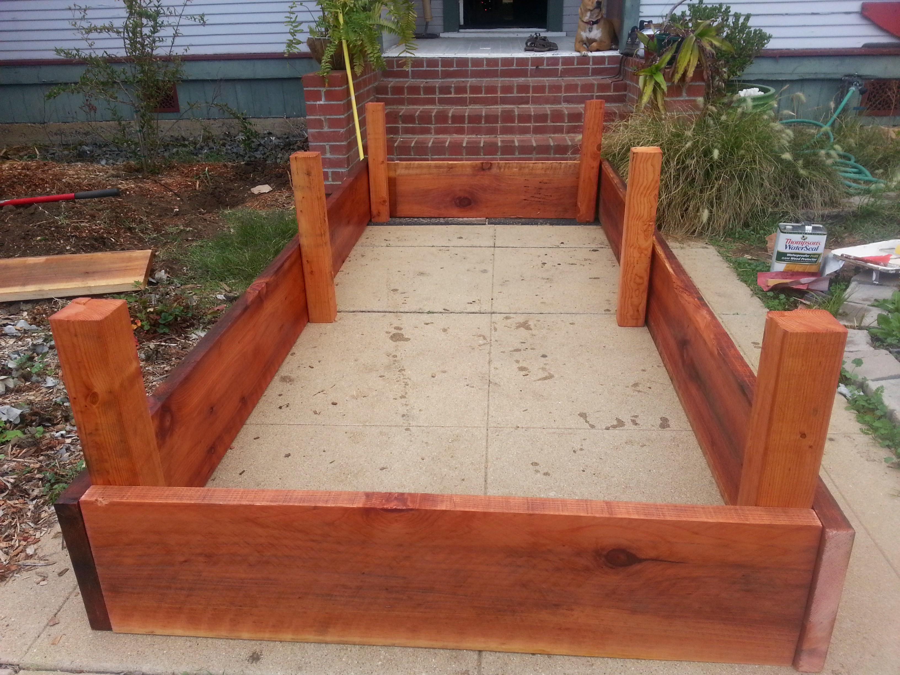

## Step 4: Assemble Your Raised Bed
Measure out and mark where your posts will be. Remember this must correspond to where you dug your post holes!

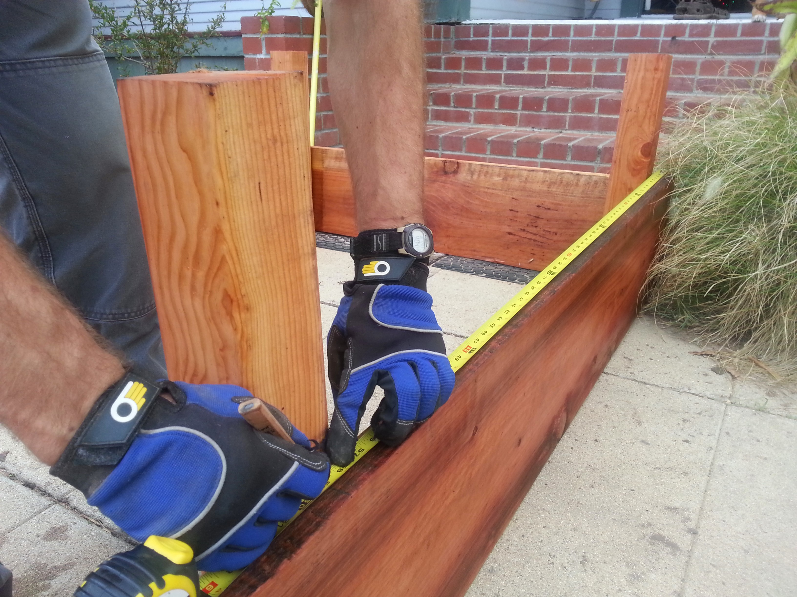

Clamp your posts into place, making sure they are square with the bed sides.

Mark locations where you will drill holes and fasten your boards to your posts. I used 2 lag bolts and washers per board/post interface.



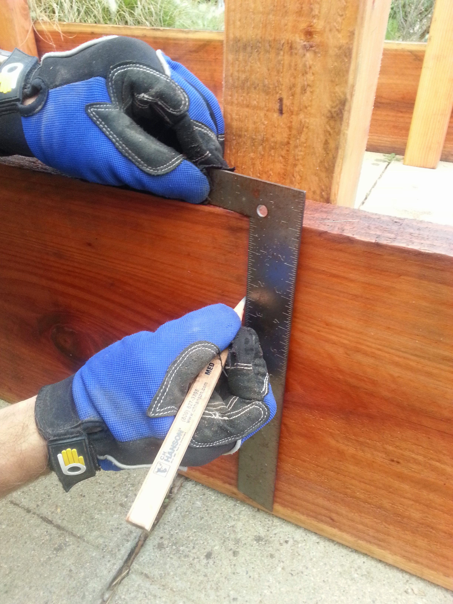

Pre-drill the holes for your lag bolts.

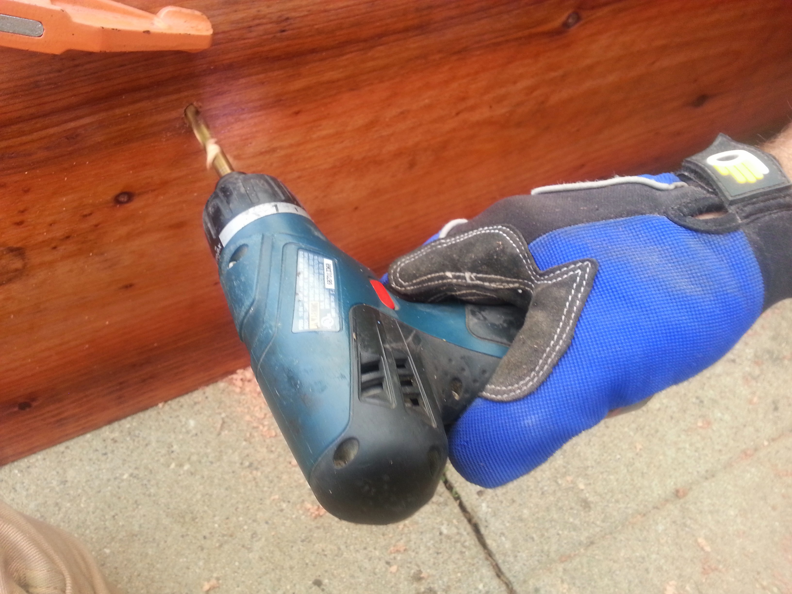

Use a ratcheting socket wrench to quickly screw in your lag bolts.



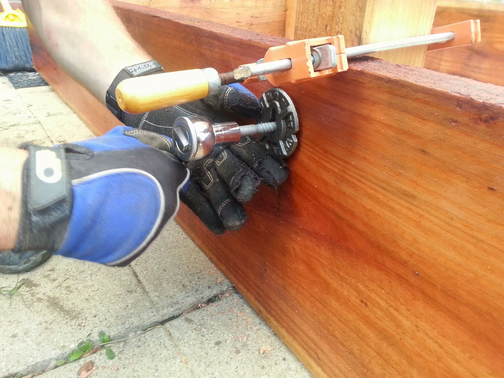

Notice how the corner bolts are staggered so that they do not hit each other, and the washers are oriented the same way.

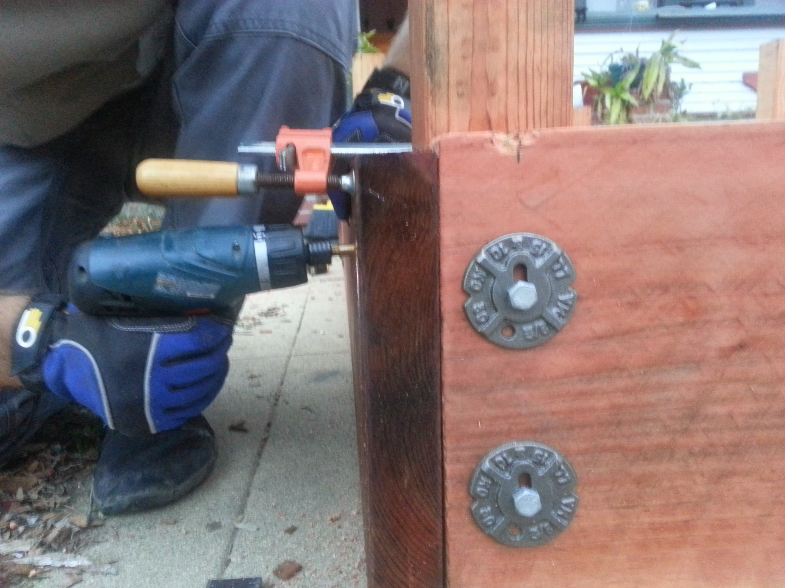

## Step 5: Install Your Raised Bed
* Once your bed is assembled, flip it over and position it in your holes. You may need to pull it out and dig out some of your holes a little more. Use a level to make sure the bed is level.
* Fill it with a mix of soil and compost.

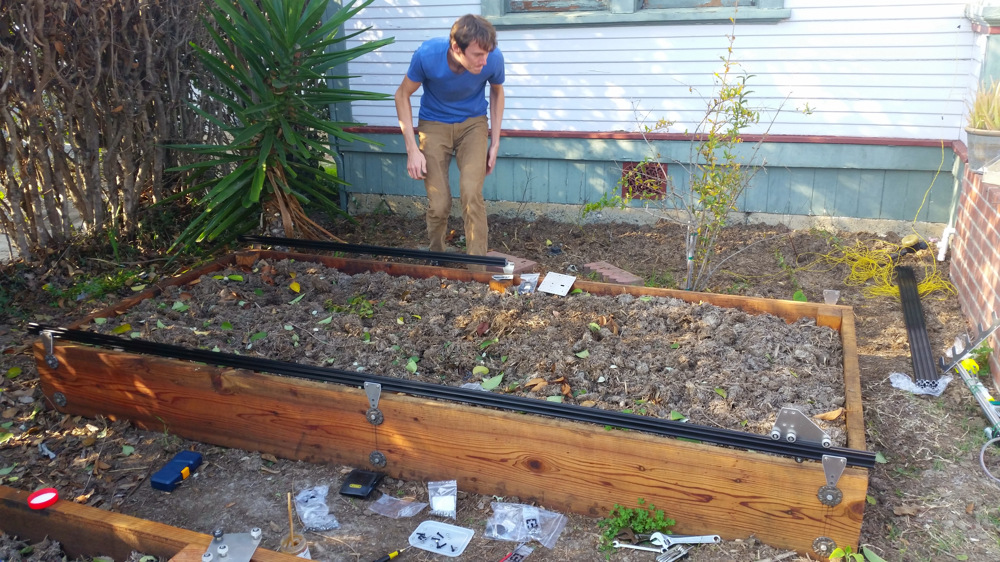

# Setup Extrusion Posts

  * Install short (100-500mm) vertical posts for one of the tracks. Attach or secure the posts however you like, though it is critical to ensure that the posts will not significantly move once installed. Space the posts for one track 1500mm apart, center to center, unless you are using shorter track extrusions, in which case space the posts that far apart. Ensure the posts are aligned properly and the same height. You may want to use a level to ensure this.
  * If you are setting up multiple track extrusions (more than 1500mm in total length), it is best to install the end posts first and tie a guide string in between these two posts to ensure your tracks are installed in a straight line.
  * Depending on the width of your FarmBot, space the second Track’s posts the appropriate distance away from the first Track’s. It is critical that the distance between the two Tracks is consistent, if it is not, there will be forces placed on the Gantry and Tracks as the Gantry moves across.
  * You can use shims or other spacers to better align track plates in case your posts are not perfect.

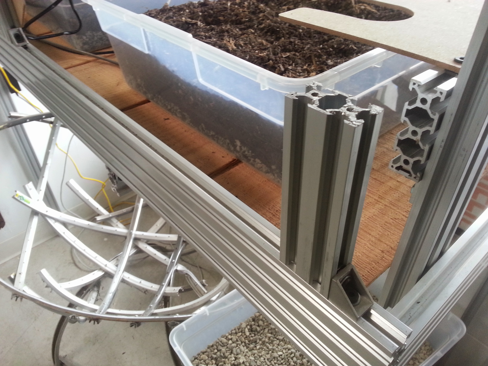

