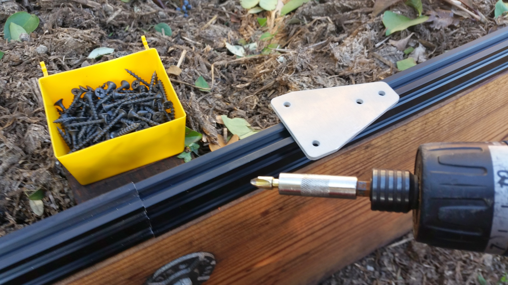
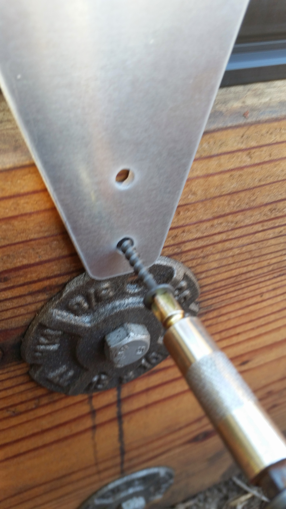
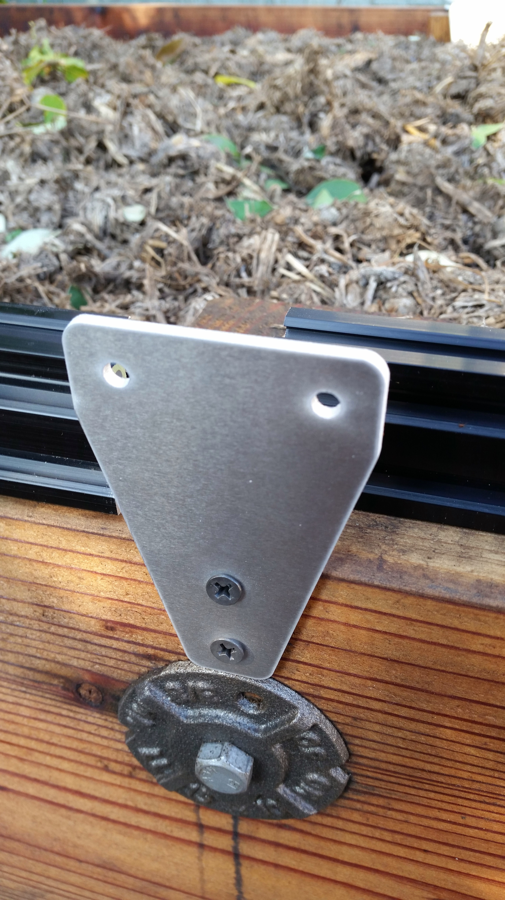
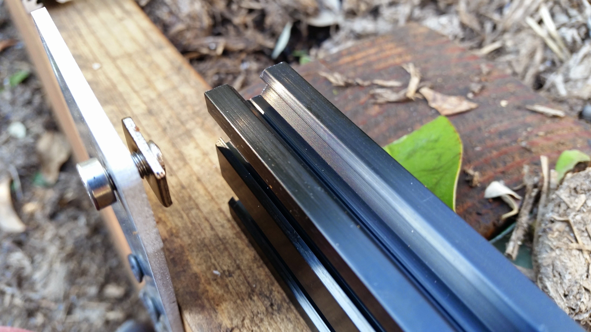
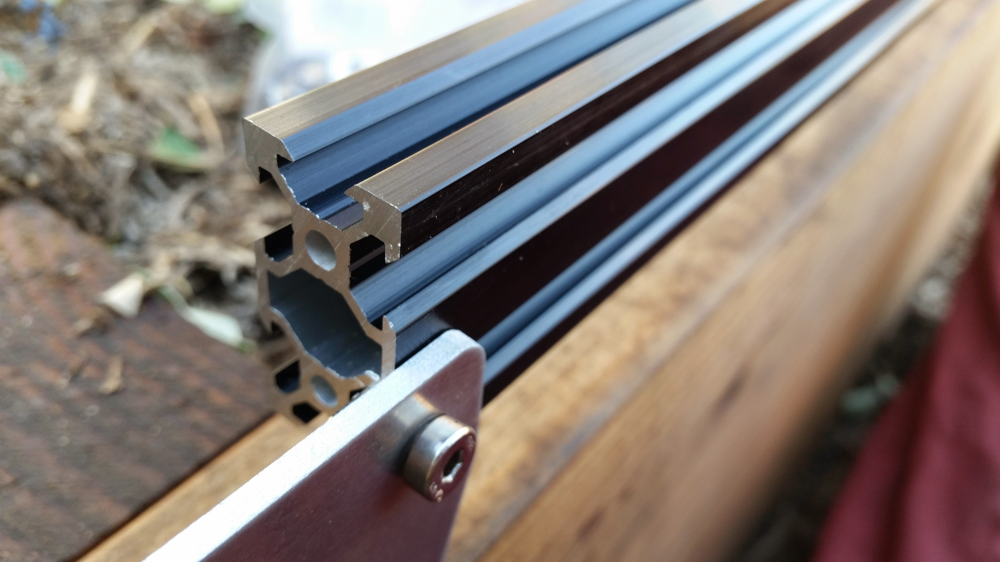
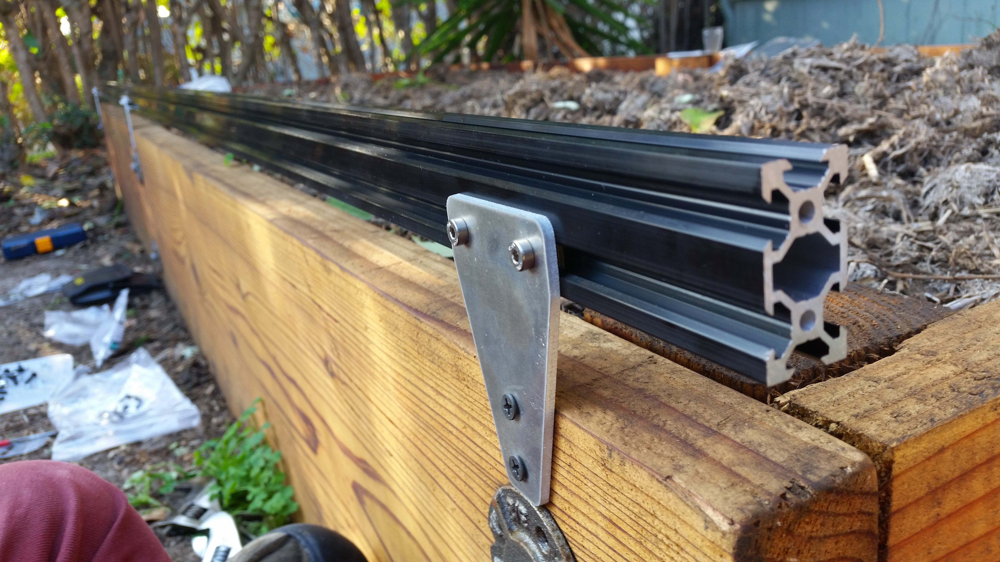

* toc
{:toc}

# Step 1: Attach the Track Plates



## Raised Bed Method
Get your supplies ready: Track Plates, a drill, and wood screws.

Position your plates and screw them in.



## Extrusion-Posts Method
The track plates should be screwed onto the inside of the posts using the appropriate fasteners: 8mm M5 screws and tee nuts if the posts are aluminum extrusions, standard wood screws if attaching onto wood posts. The top of the posts should NOT be flush with the top of the plates. Rather, the top of the posts should come up to cover only half of the plates.

# Step 2: Attach the Track Extrusions to the Track Plates



Lightly screw together an M5x8mm screw and tee nut to the track plate.

Slide the bottom half of a 20x40mm extrusion onto the teenut and lightly tighten the screw. Don't worry about alignment until you have a second extrusion in place to line it up with.



For track plates at the end of your tracks, use both screws and tee nuts to fasten your single extrusion to the plate.

