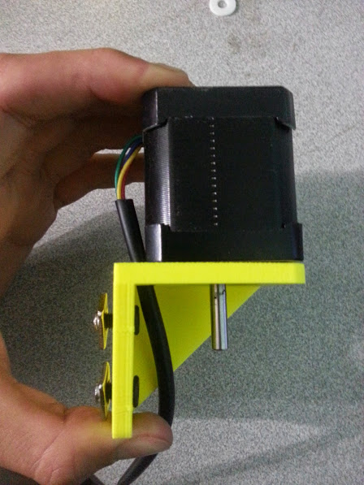

* toc
{:toc}

# Step 1: Attach the Stepper Motor to the Z-Axis Motor Bracket

Partially screw two M5x8mm screws and tee nuts into the z-axis motor mounting bracket.

Route the Stepper Motor’s cable through the bracket.

Attach the motor to the bracket with four M3x8mm screws.

