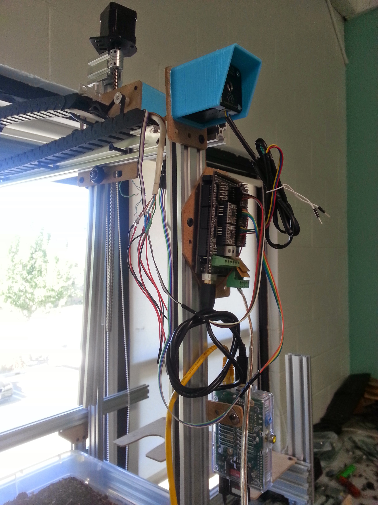
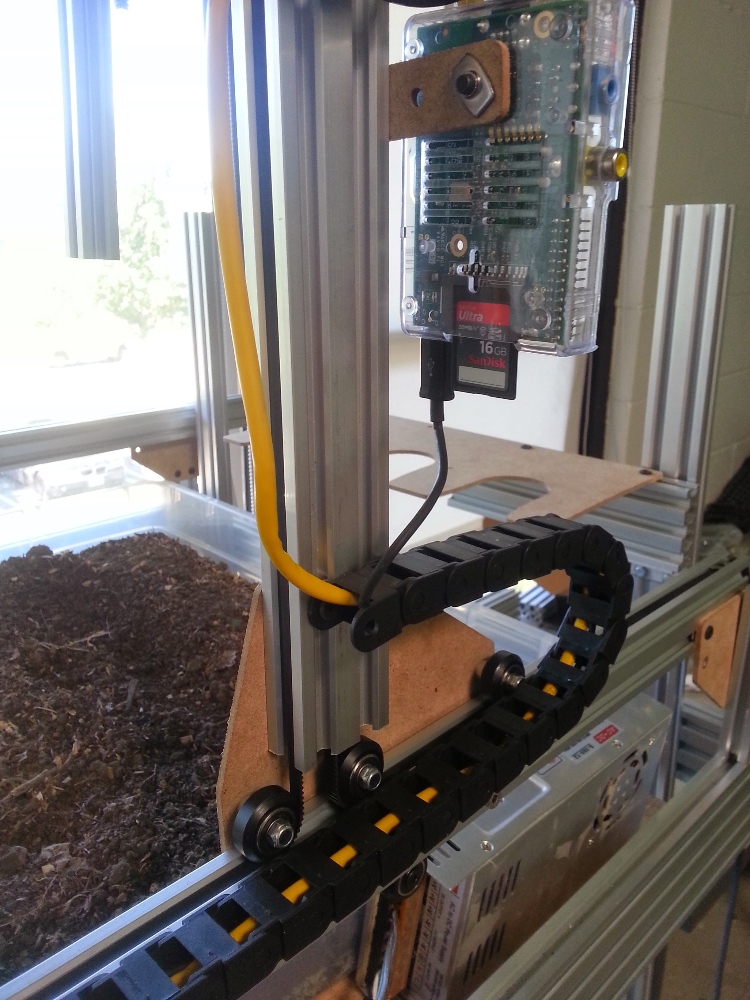
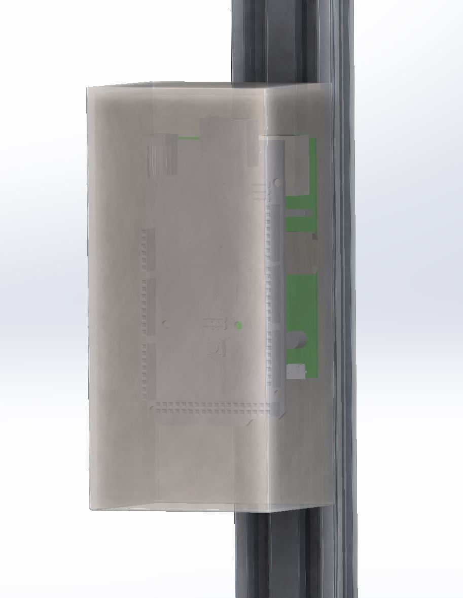

* toc
{:toc}

V0.7 hardware integrates [Rotary Encoders](http://wiki.farmbot.cc/wiki/Rotary_Encoders) onto the back of each of the stepper motors. This is important to ensure that FarmBot always knows where it is in the circumstances when it has been inadvertently moved (by kids or pets) or it tries to move but is prevented from doing so due to some obstruction (rocks, branches, kids, pets). Unfortunately, there are no readily accessible add-on rotary encoders from popular sites like Adafruit or Sparkfun (as of September 2014), however, there are a handful of companies who do produce small, add-on encoders that mount nicely to the back panel of the stepper motor and hook onto a second shaft coming from the motor. The encoders modeled in the renderings below are based on those offered by [Schneider Electric](http://motion.schneider-electric.com/downloads/datasheets/17_mtr.pdf).

As of prototpying V0.7 hardware, low-cost rotary encoders have not yet been found or tested. Furthermore, the Arduino firmware does not yet support closed-loop feedback control.



