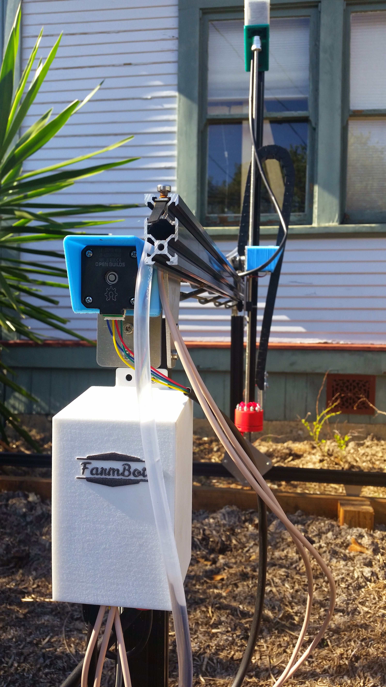
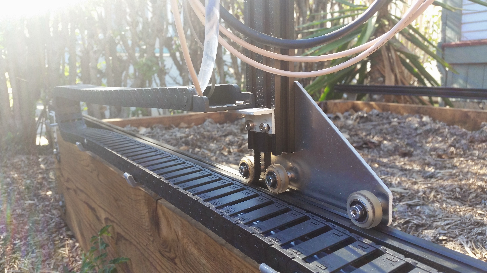
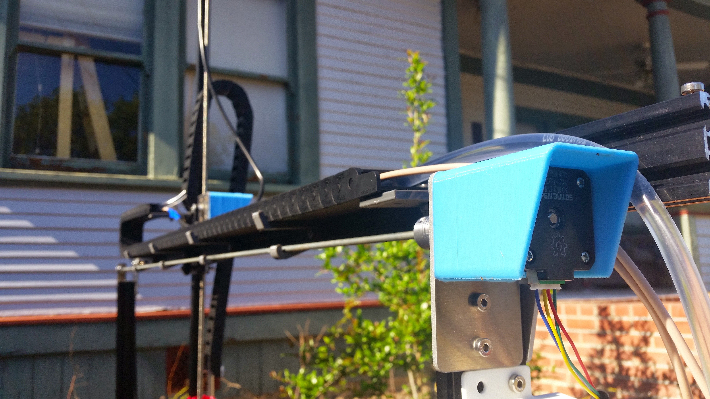
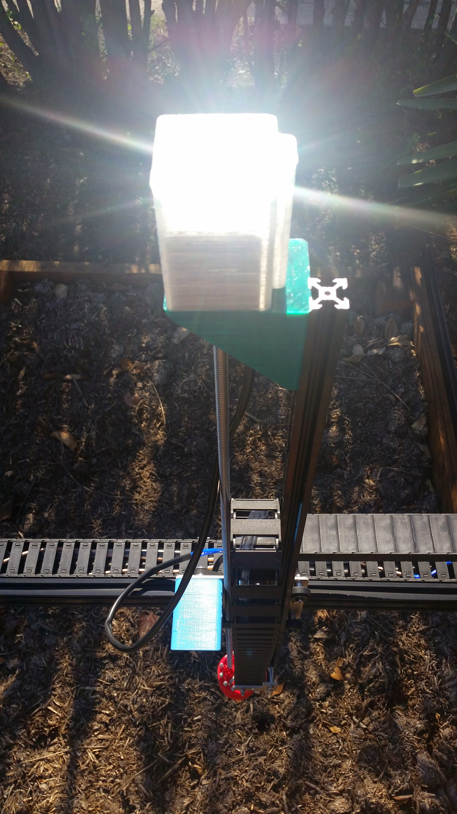
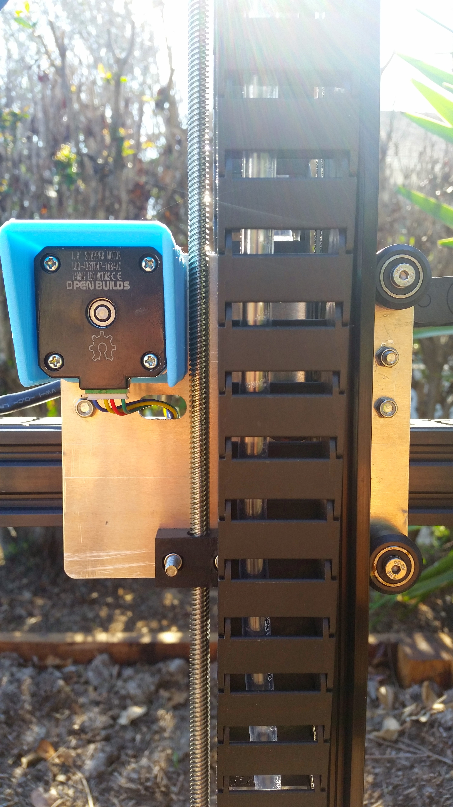
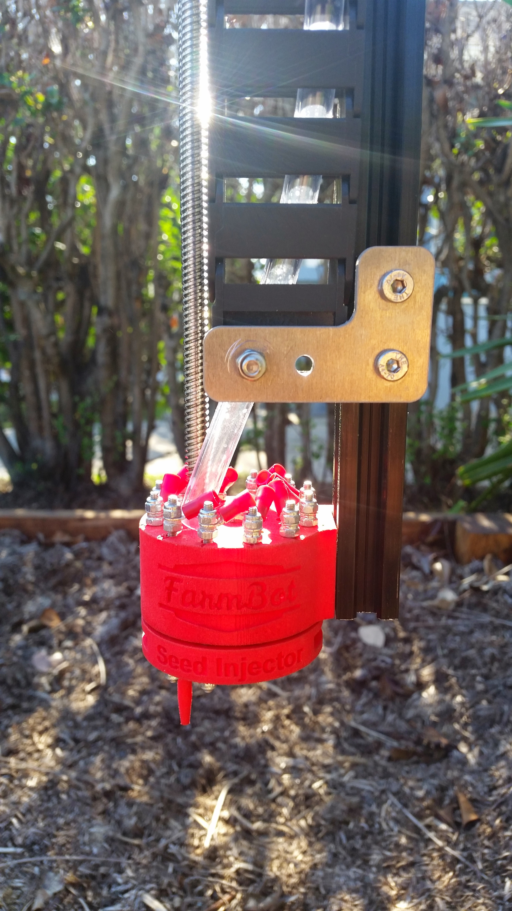
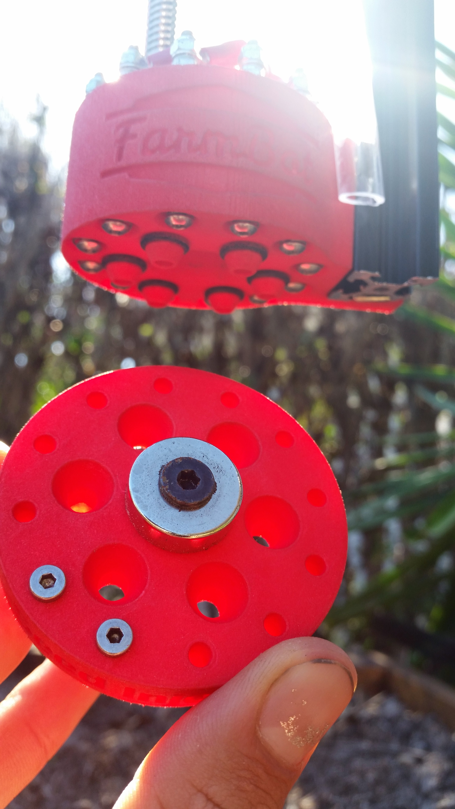
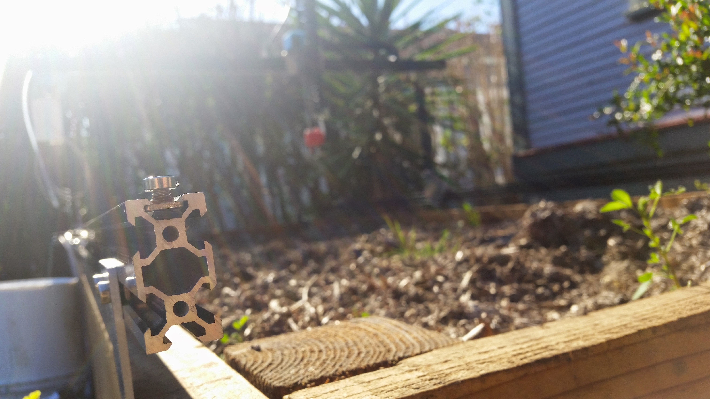

* toc
{:toc}

Genesis V0.7 was the first FarmBot device since V0.1 that was built to scale, built to remain outside, and built with mostly production quality components. For this prototype, our tracks our 3m long (2 extrusions), and the gantry spans 1.5m wide (1 extrusion). This size device will become our 'standard' size device meant for smaller spaces and people just getting started with FarmBot. With V0.8, we'll introduce an 'XL' version that will be twice as wide and twice as long.

We made several improvements in V0.7, including:

  * Endstops from every axis have been removed and their functionality will be replaced by rotary encoders
  * The z-axis motor mount has been strengthened with another gusset
  * Added a z-axis cable carrier
  * The track plates and gantry corner plates have been redesigned and are now identical parts for reduced complexity and an equivalent process for scaling the bot in both the X and Y directions
  * Upgraded the universal tool mount to support 6 liquid lines and 12 electrical connections, trying out a single central magnet design
  * Designed a 3D printable quick access electronics enclosure
  * Upgraded to larger cable carriers
  * Added 3D printed driveshaft and cable carrier supports on the Gantry, and 3D printed cable carrier supports on the Tracks
  * Extended the horizontal motor housings to better protect the rotary encoders

