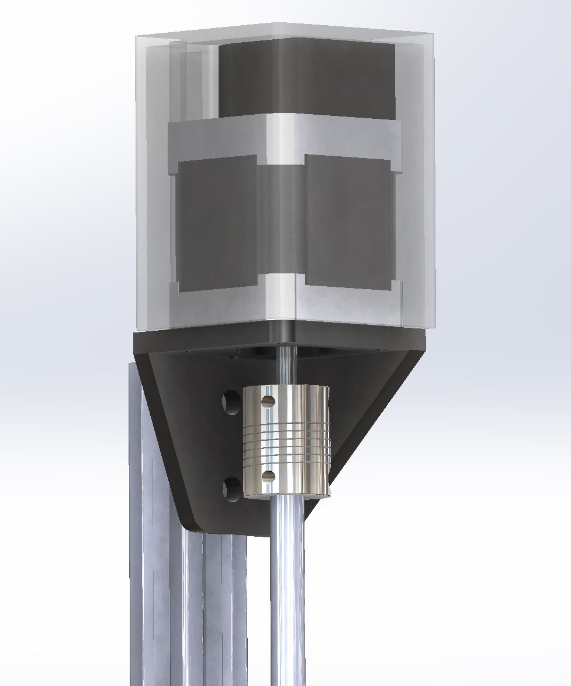

## Change Log
  * The 3D printed motor mounting bracket has been strengthened with an extra gusset.
  * A cable carrier has been added to help contain and support the tubing and wires leading to the Universal Tool Mount.



