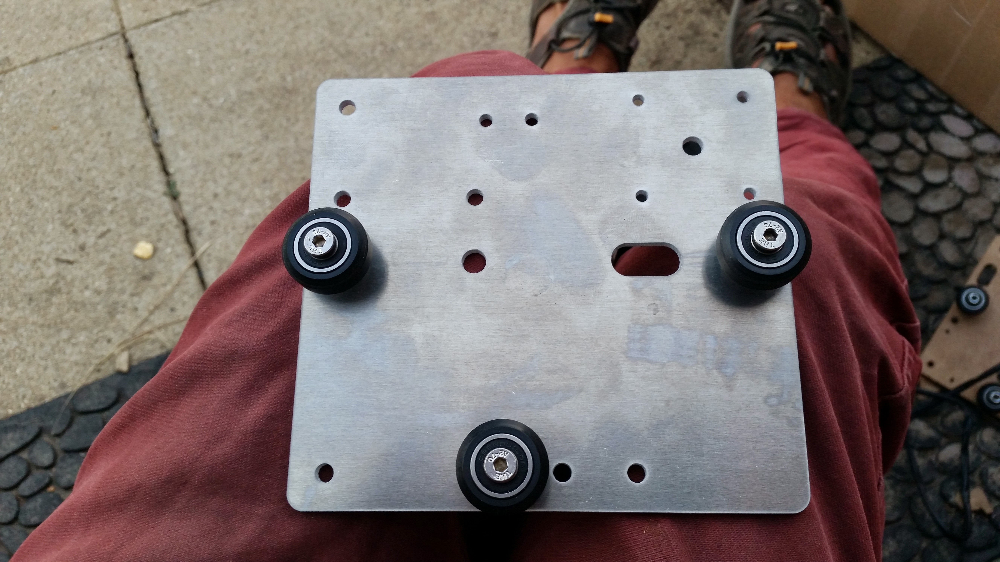

* toc
{:toc}



# Step 1: Gather the Parts

Gather all the parts you will need for the Cross-Slide and lay them out in a logical manner. You will need:

* One Cross-Slide plate
* Six complete V-wheels
* Six M5x30mm screws
* Four M5x16mm screws
* Four *normal* 6mm spacers
* Two *eccentric* 6mm spacers
* Six washers
* Ten M5 locknuts
* One delrin leadscrew block
* One NEMA 17 Stepper Motor
* One 3D printed motor housing
* Four M3 x 10mm screws
* One 20 tooth GT2 pulley
* Two M3x5mm setcrews
* One 3D printed long cable carrier mounting bracket

_Note: Not all required parts are shown in this image._

# Step 2: Attach the Delrin Leadscrew Block

Use two **M5x16mm screws** and two **M5 locknuts** to attach the **delrin leadscrew block** to the **Cross-Slide plate**.



# Step 3: Attach the Stepper Motor

Use four **M3x10mm screws** to attach the **stepper motor** and **motor housing** to the **Cross-Slide plate**. Make sure the motor and housing are on the same side of the Cross-Slide Plate as the delrin leadscrew block, and that the motor's wiring and the motor housing's open side are facing down towards the delrin leadscrew block.

# Step 4: Add on the Z-Axis V-Wheels

Using **M5x30mm screws**, attach two **V-wheels** with **normal 6mm spacers** to the corner holes of the **Cross-Slide Plate**. The V-wheels should be on the same side of the plate as the motor and the delrin leadscrew block. Secure these wheels with a **washer** and an **M5 locknut** on the other side of the plate.

Add a **V-wheel** with an **eccentric 6mm spacer** to the hole nearest the middle of the **Cross-Slide plate**. The V-wheel should be on the same side of the plate as the other components and secured with a **washer** and an **M5 locknut** on the other side.

# Step 5: Add the Gantry V-Wheels

Flip the Cross-Slide over so that all of the components you have added so far are facing away from you.

Using **M5x30mm screws**, **washers**, and **M5 locknuts**, attach two **V-wheels** with **normal 6mm spacers** to the holes in the middle of the left and right edges of the **Cross-Slide plate**.

_Note: this picture does not show the other components attached yet. The other components should be facing away from you._

Add a **V-wheel** with an **eccentric 6mm spacer** to the hole in the middle of the bottom edge of the **Cross-Slide plate**, nearest the **delrin block**.

# Step 6: Add the Cable Carrier Mounting Bracket

Use two **M5x16mm screws** and **M5 locknuts** to secure the 3D printed **cable carrier mounting bracket** to the **Cross-Slide plate**. The bracket should be on the opposite side of the plate as the motor. The bracket should be oriented such that the bracket part is below the mounting screws.



