* toc
{:toc}



# Step 1: Assemble the Gantry Plates

Gather and lay out all of the parts. You will need:
* Two Gantry Plates
* Eight complete V-wheels
* Eight M5 x 30mm screws
* Eight M5 locknuts
* Eight washers
* Six *normal* 6mm spacers
* Two *eccentric* 6mm spacers

You will also need a 3mm hex driver and an 8mm wrench.



Insert an *eccentric* spacer into the bottom, largest hole in one of the gantry plates.

Insert a screw through one of the complete V-wheels, and then through the eccentric spacer and plate.

On the other side of the gantry plate, add a washer to the screw and then an M5 locknut.

Use the 3mm hex driver and 8mm wrench to tighten the assembly.

Insert an M5 screw through a V-wheel, followed by a *normal* spacer. Then insert the screw through the gantry plate as shown below. The wheel should be on the same side of the plate as the first wheel you installed. On the other side of the plate, place a washer onto the screw and tighten the assembly with an M5 locknut.

Repeat these steps for the remaining two V-wheels, such that your gantry plate assembly looks like this:

Now, repeat the above steps for the second gantry plate assembly. You should end up with two gantry plate assemblies that are mirror images of each other, as shown below:

# Step 2: Adjust the V-Wheel spacing

The eccentric spacer on the lone wheel of each Gantry Plate is used for making fine adjustments to the spacing between the lone wheel and the three other wheels. Adjusting this spacing is the key to having your Gantry move smoothly and wobble-free across your Tracks.

If the spacing is too little, then the Gantry will not fit onto the Tracks at all. If the spacing is too great, then the Gantry will be wobbly and loose. Let's adjust our eccentric spacing to be just right.

## Fit Test
First, see if your gantry plate will easily slide onto the Tracks. It will very likely either be too loose and wobble, or too tight and not fit at all.



## Adjusting the eccentric spacer
1. Remove the gantry plate from the tracks
2. Grab a 10mm wrench and slide it onto the eccentric spacer. Turn the spacer about 1/32 of a turn. Depending on the direction you turn the spacer, and the current orientation of the spacer, your spacing will either increase or decrease. Your goal is to adjust the spacer in the direction you need, so do some experimentation to find out which direction to turn it.
3. Once you have adjusted the spacer 1/32 of a turn, do another fit test.
4. Continue the steps above until your gantry plate glides smoothly and wobble free across your tracks.

{%
include callout.html
type="success"
title="The perfect fit"
content="The perfect fit is subjective and you'll need to play around to get it just right. Here is our best tip: Adjust your wheel spacing so that it is as large as possible without inducing wobbling or rattling. This will ensure you are not over tightening your wheels and risking damage.

You would rather have a wobbly wheel that you can tighten than damaged components.

Don't expect your Gantry to roll like a ball down a hill. A well fitted gantry will have a little bit of friction. Again, just play around with the spacing and use your best judgement."
%}

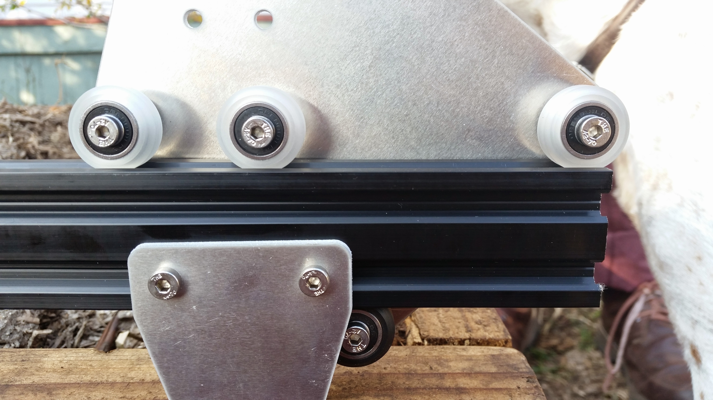

# Step 3: Attach the Gantry Columns

Use four M5x8mm screws and tee nuts to attach a 500mm long extrusion to each gantry plate. Make sure that the column is attached to the same side of the Gantry Plate as the V-wheels.



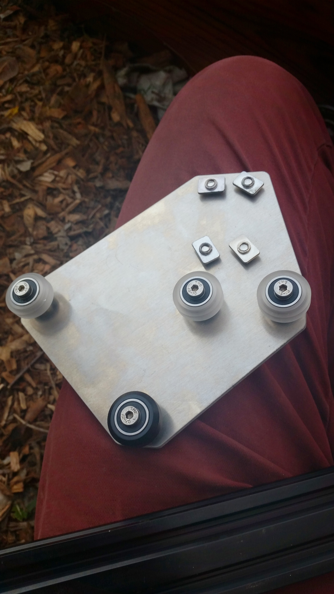

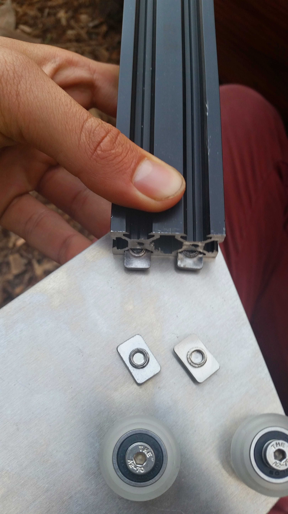

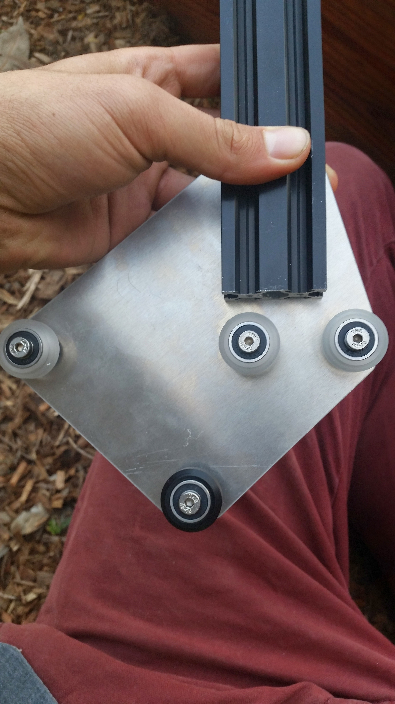

Now slide your gantry column and plate assemblies onto your tracks.

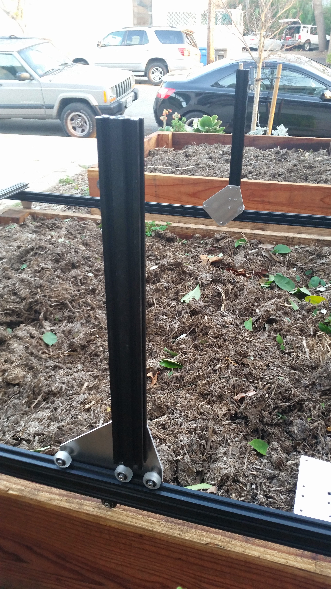

# Step 4: Attach the Gantry Corner Brackets

Attach one corner bracket on top of each gantry column using two M5x8mm screws and tee nuts. Make sure the brackets are on the correct side of the extrusion.

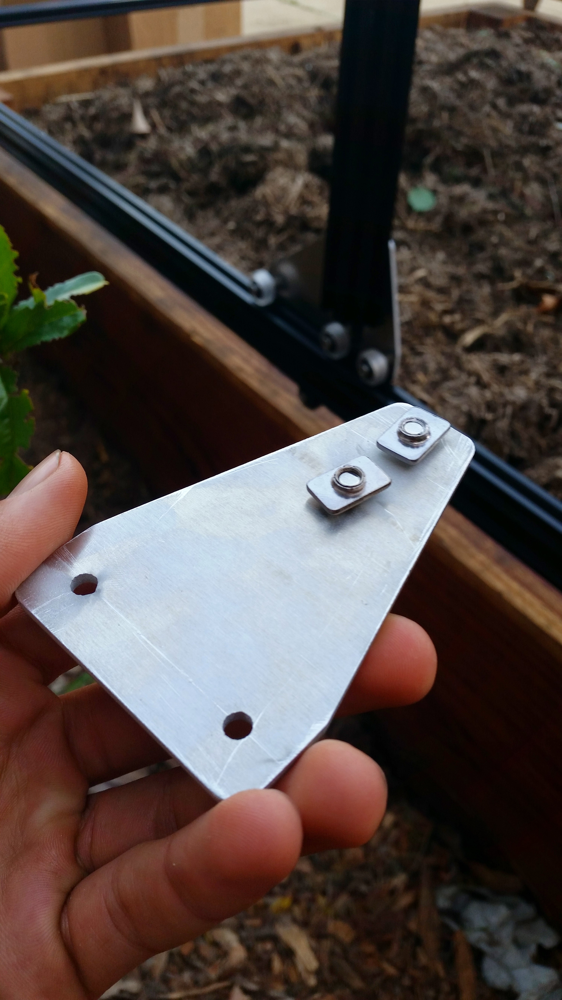

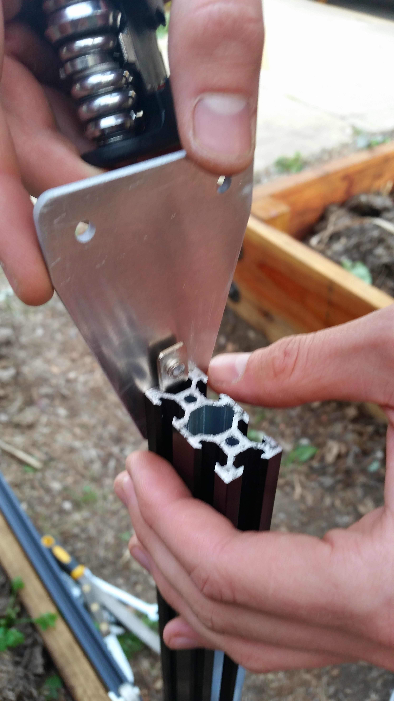

# Step 5: Attach the Main Beam to the Columns

With your gantry columns mounted on your tracks, use four M5x8mm screws and tee nuts to attach the gantry main beam to the gantry corner brackets. Note the location of the extrusion in relationship to the corner bracket and column.



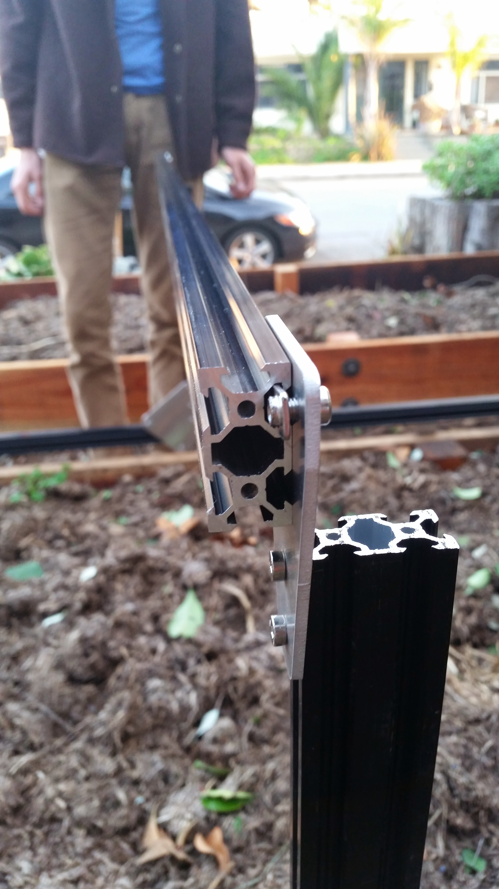

# Step 6: Attach the Gantry Motor and Driveshaft

Use four M3x10mm screws to attach the stepper motor and motor housing to the motor mount plate. Make sure to position the motor's wires and the motor housing's open side down.

Slide a GT2 pulley onto the motor and tighten it using the two M3 setscrews and a 1.5mm allen wrench.

Slide a 5mm to 5mm flex coupling onto the motor shaft and tighten it using the two M4 setscrews and a 3mm allen wrench.

Use two M5x8mm screws and teenuts to attach the motor plate assembly to the gantry column as shown.

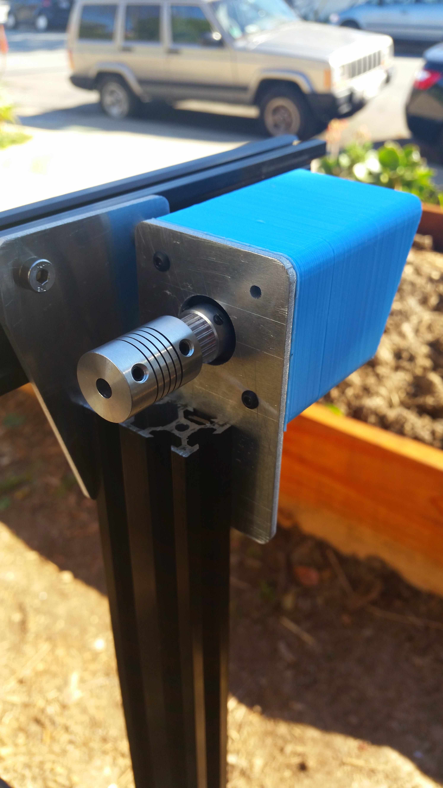

Using two M5x8mm screws and tee nuts, attach the driveshaft bearing plate onto the outside face of the gantry column that does not have the motor on it.

Feed the driveshaft through the driveshaft bearing plate and insert it into the flex coupling.



Slide onto the free end of the driveshaft a 5mm lock collar, then a 5mm x 16mm x 5mm bearing, and then a GT2 pulley. Position the bearing inside the driveshaft bearing plate, and tighten the lock collar and GT2 pulley such they they hold the bearing in place inside the plate.

# Step 7: Add Driveshaft and Cable Carrier Supports

Remember those five extra tee nuts you inserted into the gantry main beam prior to attaching it to the columns? Its time to use those, along with five M5x8mm screws, to attach our five Driveshaft and Cable Carrier Supports to the Gantry main beam.

Spread your supports equally along the Gantry while placing the driveshaft into its holding place within each support. Tighten down the supports.





# Step 8: Feed and Secure the Belts

Feed GT2 timing belt down the center of your gantry column, ensuring the orientation is correct so that the belt teeth will engage the motor pulley properly.

Grab the end of the GT2 belt and feed it under the middle V-wheel of your gantry plate,then forward along the track extrusion, and then under the front V-wheel. The flat side of the belt should be in contact with your V-wheels.



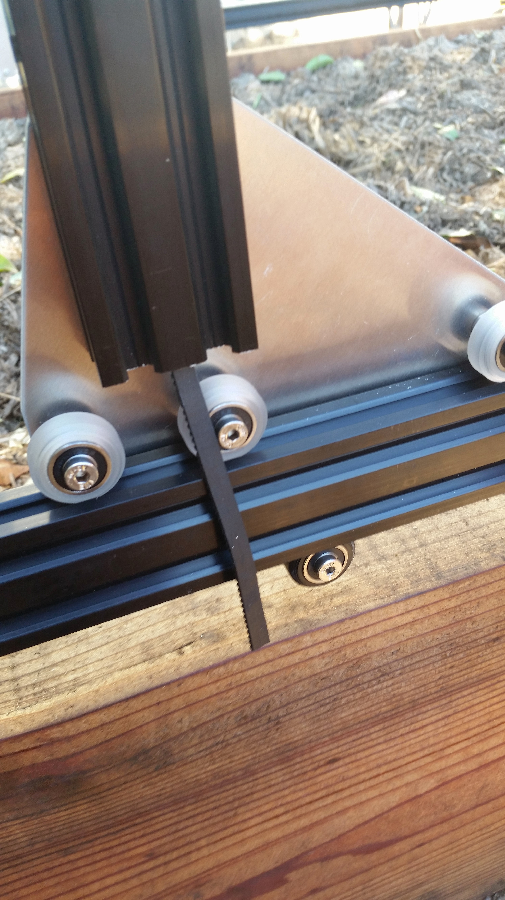

Secure the end of your belt to the front end of your Tracks by using an M5x8mm screw and tee nut.



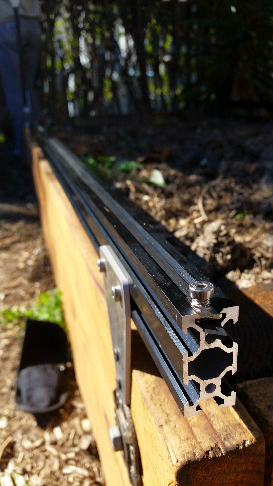

Take the back half of the belt and feed it over the motor pulley, down the back of the extrusion, under the back V-wheel on the Gantry Plate, and back along the Track extrusions.

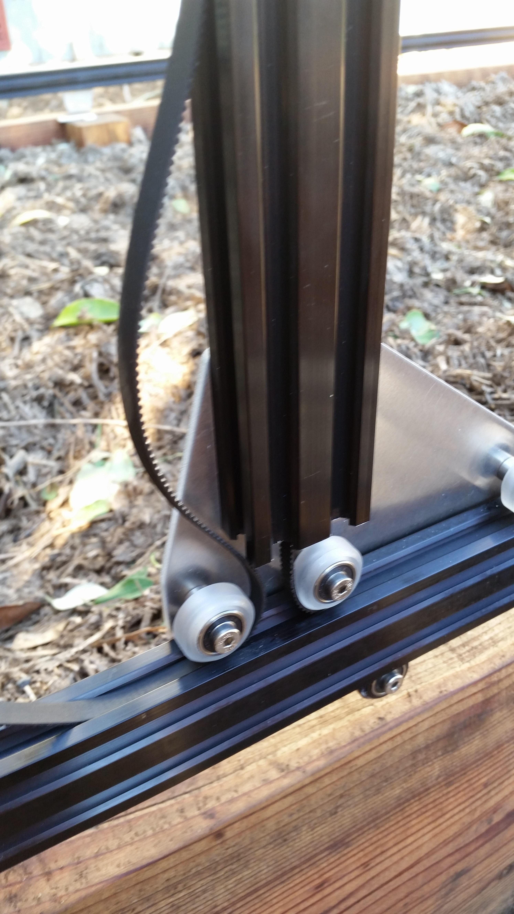

Secure the belt at the end of the Tracks. Put a small amount of tension on the belt as you tighten the M5 screw.

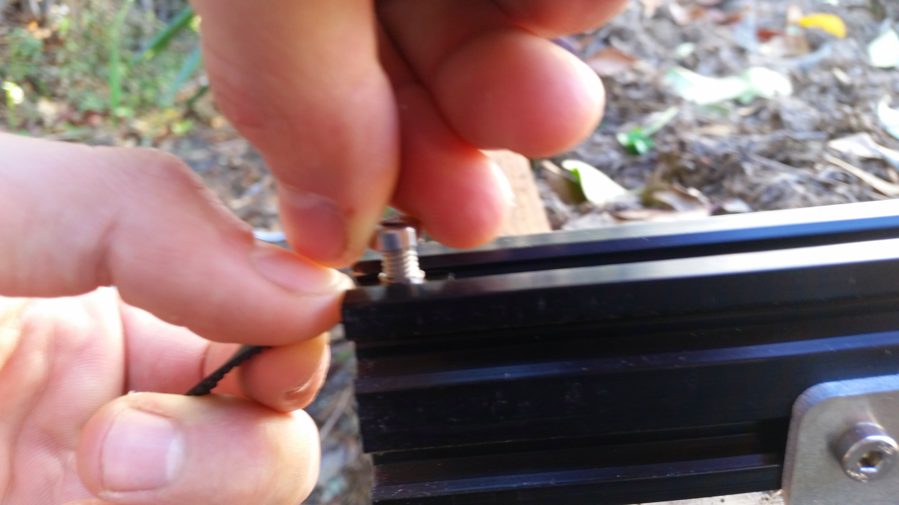

Repeat the above steps for the second belt on the other side of the Gantry.

# Step 9: Equalize and Synchronize the Gantry

## Equalizing
An equalized Gantry is one that is exactly perpendicular to the Tracks such that it is not crooked, and so that it is not being torqued. A crooked or torqued Gantry can cause creaking, extra wear on the v-wheels, and introduce a high amount of friction into the system. It also just looks bad.

To equalize the Gantry, move it along the Tracks gently and slowly about 12 inches or 30cm, pushing or pulling **from the middle of the main beam**. This process will remove any torque on the Gantry, and ensure it is not crooked. If you push or pull the Gantry from one of the gantry columns, or anywhere that is not the middle of the main beam, then you will torque the Gantry and make it crooked. Don't do that.

## Synchronizing
Now that the Gantry is equalized, we want to synchronize the movement of each side of the Gantry. This will ensure that when the motor spins, each side of the Gantry moves exactly in sync - meaning that the Gantry will not be torqued or become crooked.

Synchronize the Gantry by tightening the flex coupling onto the driveshaft (that thing we skipped back in Step 6). Now, a rotation of your motor should move both pulleys and therefore both sides of the Gantry exactly the same amount at the same time.



