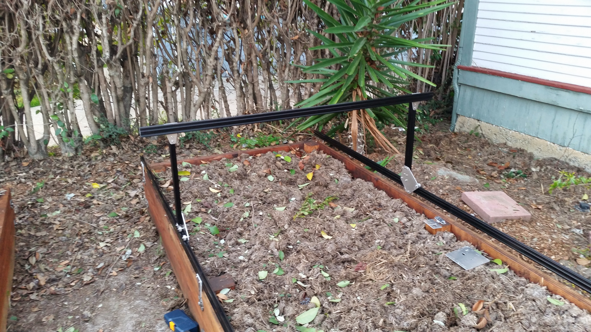

* toc
{:toc}

## Change Log
  * Plates are now 5mm thick and screws lengthened appropriately
  * Addition of stainless steel washers between nuts and plates to improve connection and reduce wear on the plates.
  * 3D printed cable carrier and driveshaft brackets now have a gusset to prevent deformation due to day/night heat cycling
  * Pulley and flex coupling set screws are now stainless steel
  * Driveshaft and driveshaft bearing are now stainless steel
  * V-wheel bearings are now stainless steel

# Photos

# Bill of Materials

|Part Name                     |Description                   |Source                        |$/unit                        |Qty.                          |Subtotal                      |
|------------------------------|------------------------------|------------------------------|------------------------------|------------------------------|------------------------------|
|Main Beam Aluminum Extrusion  |1.5m long 20x40mm V-Slot aluminum extrusion for spanning the width between the tracks|OpenBuilds                    |$19.50                        |1                             |$19.50
|Gantry Corner Plates          |5mm thick aluminum plates to attach the vertical columns to the main beam|Big Blue Saw                  |$5.00                         |2                             |$10.00
|Vertical Columns Aluminum Extrusion|500mm long 20x40mm V-Slot aluminum extrusions|OpenBuilds                    |$6.50                         |2                             |$13.00
|Gantry Main Plates            |5mm thick aluminum plates to attach the V-wheels to the Vertical Columns|Big Blue Saw                  |$15.00                        |2                             |$30.00
|Complete V-Wheels             |Includes one polycarbonate wheel, two stainless steel rubber sealed ball bearings (16mm OD, 5mm ID, 5mm thick, trade name: S625-2RS), and one precision shim (10mm OD x 5mm Bore x 1mm thickness)|[FarmBot Shop](http://go.farmbot.it/shop/complete-v-wheels/)|$10.00                        |8                             |$80.00
|6mm Aluminum Spacers          |5mm bore, for offsetting the V-wheels from the plates|OpenBuilds                    |$0.20                         |6                             |$1.20
|6mm Eccentric Spacers         |For adjusting the distance between the V-wheels|OpenBuilds                    |$2.00                         |2                             |$4.00
|M5x30mm Screws                |Stainless steel type 316, 0.8 thread pitch, low-profile 3mm hex heads|[FarmBot Shop](http://go.farmbot.it/shop/m5-screws/)|$0.60                         |8                             |$4.80
|M5 Locknuts                   |Stainless steel with nylon insert, 0.8mm thread pitch|McMaster Carr                 |$0.08                         |12                            |$0.96
|Gantry Motor Mount Plate      |5mm thick aluminum plate to attach the gantry motor to the vertical column|Big Blue Saw                  |$5.00                         |1                             |$5.00
|NEMA 17 Stepper Motor         |Dual 5mm shafts               |                              |$30.00                        |1                             |$30.00
|NEMA 17 Cable                 |0.5m length                   |                              |                              |1                             |
|Rotary Encoder                |Differential output, 200 line/rev minimum, 5mm bore|                              |$50.00                        |1                             |$50.00
|Rotary Encoder Cable          |0.5m length                   |                              |                              |1                             |
|Motor Housing                 |Waterproof 3D printed plastic |Shapeways                     |$30.86                        |1                             |$30.86
|M3x10mm Screws                |Stainless steel, for attaching the stepper motor to the mounting plate|[FarmBot Shop](http://go.farmbot.it/shop/m5-screws/)|$0.30                         |4                             |$1.20
|GT2 Pulley                    |Aluminum, 20 tooth, 5mm bore  |OpenBuilds                    |$5.50                         |2                             |$11.00
|M3x5mm Setscrew               |Stainless steel, knurled end, two per GT2 pulley|McMaster Carr                 |$0.30                         |4                             |$1.20
|5mm to 5mm Flex Coupling      |For attaching the stepper motor to the drive shaft|Adafruit                      |$4.95                         |1                             |$4.95
|M4 Setscrews                  |Stainless, for the Flex Coupling|                              |                              |                              |
|Driveshaft                    |Stainless, 5mm diameter, 1.5m in length|McMaster Carr                 |$32.68                        |1                             |$32.68
|Driveshaft and Cable Carrier Brackets|3D printed plastic            |Shapeways                     |$10.55                        |6                             |$63.30
|Drive Shaft Bearing           |Stainless steel, rubber sealed, 16mm OD, 5mm ID, 5mm thickness. (S625-2RS)|[FarmBot Shop](http://go.farmbot.it/shop/stainless-steel-ball-bearings/)|$4.00                         |1                             |$4.00
|Drive Shaft Lock Collars      |5mm ID, they capture the drive shaft bearing in place|OpenBuilds                    |$0.90                         |2                             |$1.80
|Drive Shaft Bearing Plate     |5mm thick aluminum plate to hold the drive shaft’s bearing|Big Blue Saw                  |$5.00                         |1                             |$5.00
|M5x10mm Screws                |Stainless steel type 316, 0.8 thread pitch, low-profile 3mm hex heads|[FarmBot Shop](http://go.farmbot.it/shop/m5-screws/)|$0.40                         |34                            |$13.60
|Tee Nuts                      |Stainless steel, for attaching M5 screws to OpenBuilds aluminum extrusions|                              |$0.30                         |30                            |$9.00
|Cable Carrier                 |1.5m length, 15x40mm          |Inventables                   |$38.25                        |1                             |$38.25
|Cable Carrier Mounting Brackets|3D printed plastic            |Shapeways                     |$9.99                         |2                             |$19.98
|GT2 Timing Belt               |1.6m                          |Alibaba                       |$1.33                         |1.6                           |$2.13
|                              |                              |                              |                              |Total                         |$486.53



