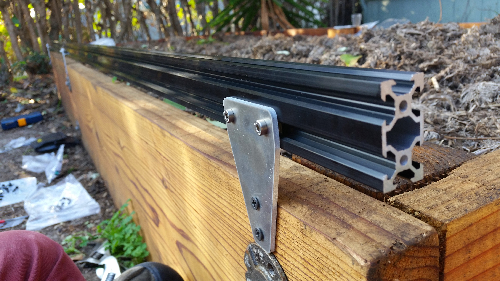

## Change Log
* The track plates are now 5mm thick
* 3D printed cable carrier brackets have an added gusset to prevent deformation due to cable carrier weight, residual internal tension from the printing process, and day/night heat cycling

# Photos

# Bill of Materials

|Part Name                     |Description                   |Source                        |$/unit                        |Qty.                          |Subtotal                      |
|------------------------------|------------------------------|------------------------------|------------------------------|------------------------------|------------------------------|
|Vertical Posts                |Can be aluminum extrusions, wood posts, or other supporting infrastructure|-                             |-                             |6                             |-
|Track Extrusions              |20x40mm, 1.5m length V-Slot Aluminum Extrusions|[OpenBuilds](http://openbuildspartstore.com/v-slot-20-x-40mm/)|$19.50                        |4                             |$78.00
|Track Plates                  |5mm thick aluminum plates to join Track Extrusions end to end and to supporting infrastructure|[Big Blue Saw](http://bigbluesaw.com)|$5.00                         |6                             |$30.00
|Fasteners                     |For attaching the Track Joining Plates to the Vertical Posts. Could be wood screws, machine screws with tee nuts, etc.|Hardware Store                |$0.20                         |12                            |$2.40
|M5x10mm Screws                |Stainless steel, 0.8 thread pitch, low-profile 3mm hex heads|McMaster Carr                 |$0.25                         |30                            |$7.50
|Tee Nuts                      |Stainless steel, for attaching M5 screws to OpenBuilds aluminum extrusions|                              |$0.30                         |28                            |$8.40
|M5 Locknuts                   |M5 stainless steel locknuts with nylon insert, 0.8mm thread pitch|McMaster Carr                 |$0.08                         |2                             |$0.16
|Cable Carrier                 |1.5m length, 15x40mm          |Inventables                   |$38.20                        |1                             |$38.20
|Cable Carrier Mounting Bracket|3D printed                    |Shpeways                      |$9.99                         |1                             |$9.99
|Cable Carrier Support Brackets|3D printed                    |Shapeways                     |$6.36                         |10                            |$63.60
|GT2 Timing Belt               |10m                           |Alibaba                       |$1.33                         |10                            |$13.30
|                              |                              |                              |                              |Total                         |$271.15



