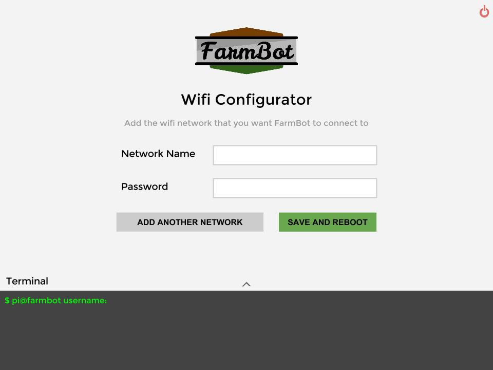

The [WiFi Configurator utility](https://github.com/FarmBot/wifi-configurator) is a piece of software that makes it easy to connect a WiFi enabled device that does not have a screen and keyboard (such as your FarmBot's Raspberry Pi) to a WiFi network. With this utility installed, you will not ever need to connect a keyboard and screen to the device or SSH into the device over an ethernet connection just to connect it to a WiFi network.





When the utility is installed, it works as follows:
1. When the device boots up, it automatically starts up the WiFi Configurator utility
2. The utility checks a config file for network names (SSIDs) and passwords that it can use to connect to a WiFi network. Initially there will not be any names or passwords in the config file, so the device will not be able to connect to anything.
4. In this case, the utility will tell the device to create its own WiFi network called **FarmBot WiFi**.
5. Using your phone or laptop, connect to the FarmBot WiFi network and open up a web browser. Navigate to any web page, such as google.com.
6. Instead of going to google.com, you will be redirected to the WiFi Configurator page.

7. From here, enter in the name of the WiFi network (SSID) you would like your FarmBot to normally connect to, and that network's password. You can add more than one network if you want. The names and passwords are saved in the config file mentioned in Step 2.
8. Now press **Save and Restart Utility**. The WiFi Configurator utility will restart, check the config file for an SSID and password, and connect to that network.
9. If none of the networks in the config file are within range, or the passwords are wrong, then the utility will go back to Step 4.

# Installation Instructions (Coming Soon)



