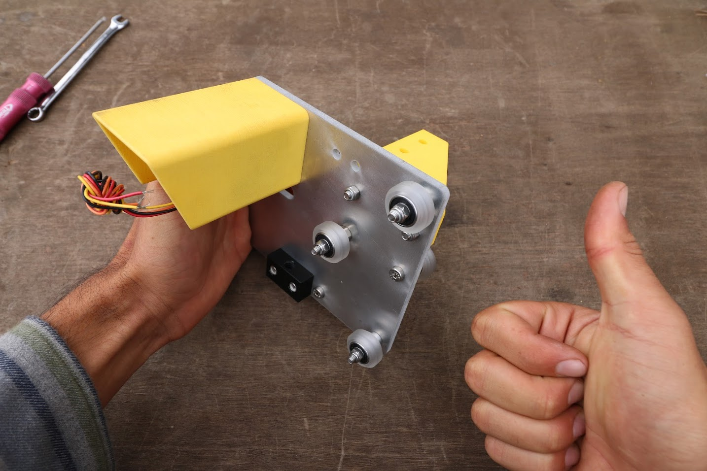
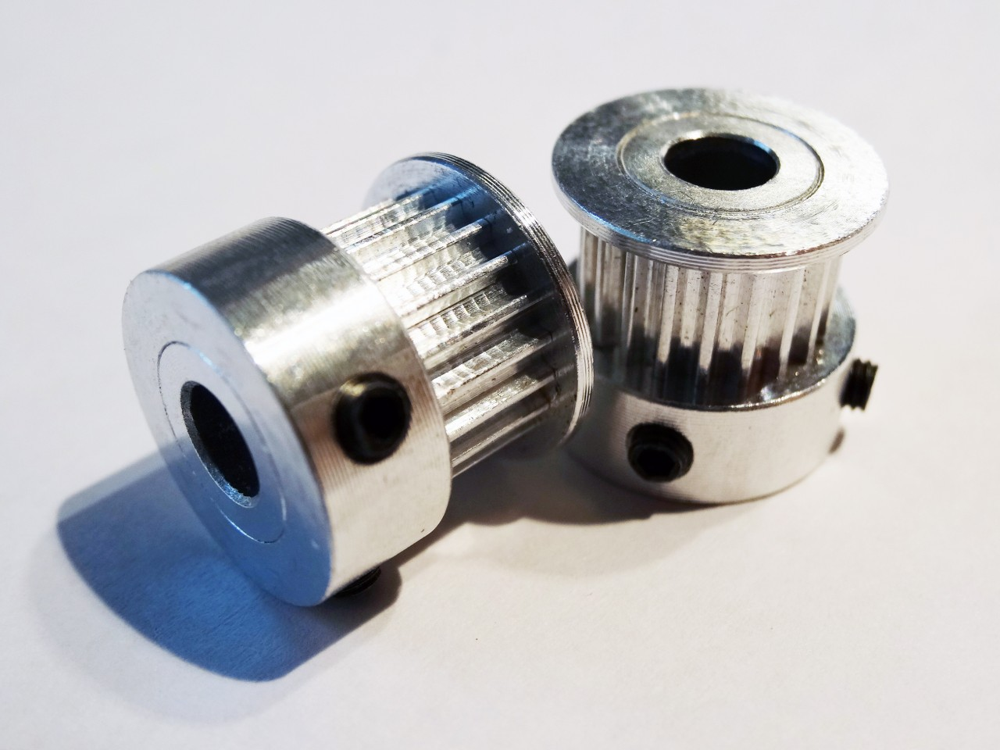
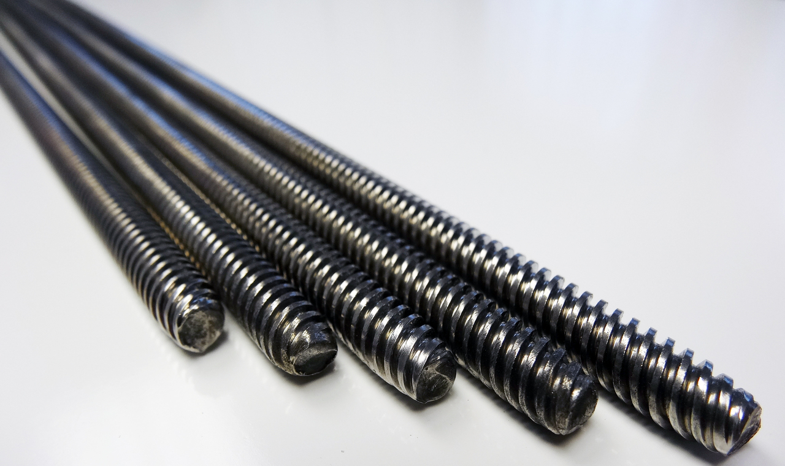

* toc
{:toc}

Use the tables below to easily order all of the parts for a FarmBot from our recommended suppliers. Clicking a component's name will jump you down the page where you can see that component's tech specs, view drawings and photos, find links to other suppliers, and download CAD models and manufacturing files in various formats.

You can also **[bulk download the entire CAD library](https://drive.google.com/open?id=0B-wExYzQcnp3T2trQUNSMmhLQnM)** and **[all manufacturing files](https://drive.google.com/folderview?id=0B-wExYzQcnp3U2NPZy1QQmQxWFU&usp=sharing)**.







## Extrusions

|Component                     |Recommended Supplier          |$/Unit                        |Qty.                          |Subtotal                      |
|------------------------------|------------------------------|------------------------------|------------------------------|------------------------------|
|[Track Extrusions](#track-extrusions) (20mm x 40mm x 1.5m)|[OpenBuilds](http://openbuildspartstore.com)|$11.00                        |1                             |$11.00
|[Gantry Columns](#gantry-columns) (20mm x 60mm x 0.5m)|[OpenBuilds](http://openbuildspartstore.com)|$21.45                        |4                             |$85.80
|[Gantry Main Beam](#gantry-main-beam) (20mm x 60mm x 1.5m)|[OpenBuilds](http://openbuildspartstore.com)|$25.30                        |1                             |$25.30
|[Z-Axis Extrusion](#z-axis-extrusion) (20mm x 20mm x 1m)|[OpenBuilds](http://openbuildspartstore.com)|$8.50                         |2                             |$17.00
|                              |                              |**TOTAL**                     |**8**                         |**$139.10**

## Plates

|Component                     |Recommended Supplier          |$/Unit                        |Qty.                          |Subtotal                      |
|------------------------------|------------------------------|------------------------------|------------------------------|------------------------------|
|[Track End Plates](#track-end-plates)|[Big Blue Saw](https://www.bigbluesaw.com/)|$5.00                         |2                             |$10.00
|[Track Joining Plates](#track-joining-plates)|[Big Blue Saw](https://www.bigbluesaw.com/)|$5.00                         |4                             |$20.00
|[Gantry Main Plates](#gantry-main-plates)|[Big Blue Saw](https://www.bigbluesaw.com/)|$15.00                        |2                             |$30.00
|[Gantry Corner Plates](#gantry-corner-plates)|[Big Blue Saw](https://www.bigbluesaw.com/)|$5.00                         |2                             |$10.00
|[Gantry Motor Mount Plate](#gantry-motor-mount-plate)|[Big Blue Saw](https://www.bigbluesaw.com/)|$5.00                         |1                             |$5.00
|[Gantry Driveshaft Bearing Plate](#gantry-driveshaft-bearing-plate)|[Big Blue Saw](https://www.bigbluesaw.com/)|$5.00                         |1                             |$5.00
|[Cross-Slide Plate](#cross-slide-plate)|[Big Blue Saw](https://www.bigbluesaw.com/)|$20.00                        |1                             |$20.00
|[Z-Axis Cable Carrier Mounting Plate](#z-axis-cable-carrier-mounting-plate)|[Big Blue Saw](https://www.bigbluesaw.com/)|$5.00                         |1                             |$5.00
|                              |                              |**TOTAL**                     |**14**                        |**$105.00**

## Fasteners and Hardware

|Component                     |Recommended Supplier          |$/Unit                        |Qty.                          |Subtotal                      |
|------------------------------|------------------------------|------------------------------|------------------------------|------------------------------|
|[M3 x 10mm Screws](#m3-screws)|[McMaster Carr](http://www.mcmaster.com/)|$0.08                         |12                            |$0.96
|[M3 x 20mm Screws](#m3-screws)|[McMaster Carr](http://www.mcmaster.com/)|$0.17                         |4                             |$0.68
|[M3 x 40mm Screws](#m3-screws)|[McMaster Carr](http://www.mcmaster.com/)|$0.17                         |12                            |$2.04
|[M3 x 5mm Setscrews](#m3-setscrews)|[McMaster Carr](http://www.mcmaster.com/)|$0.30                         |6                             |$1.80
|[M3 Locknuts](#m3-locknuts)|[McMaster Carr](http://www.mcmaster.com/)|$0.04                         |16                            |$0.64
|[M4 Setscrews](#m4-setscrews)|[McMaster Carr](http://www.mcmaster.com/)|$0.50                         |8                             |$4.00
|[M5 x 10mm Screws](#m5-screws)|[McMaster Carr](http://www.mcmaster.com/)|$0.25                         |76                            |$19.00
|[M5 x 12mm Screws](#m5-screws)|[McMaster Carr](http://www.mcmaster.com/)|$0.18                         |2                             |$0.36
|[M5 x 16mm Screws](#m5-screws)|[McMaster Carr](http://www.mcmaster.com/)|$0.27                         |4                             |$1.08
|[M5 x 20mm Screws](#m5-screws)|[McMaster Carr](http://www.mcmaster.com/)|$0.37                         |6                             |$2.22
|[M5 x 30mm Screws](#m5-screws)|[McMaster Carr](http://www.mcmaster.com/)|$0.37                         |17                            |$6.29
|[M5 Washers](#m5-washers)|                              |                              |                              |
|[M5 x 6mm Spacers](#m5-x-6mm-spacers)|[OpenBuilds](http://openbuildspartstore.com)|$0.20                         |10                            |$2.00
|[M5 x 20mm Spacers](#m5-x-20mm-spacers)|[OpenBuilds](http://openbuildspartstore.com)|$0.45                         |2                             |$0.90
|[M5 x 6mm Eccentric Spacers](#m5-x-6mm-eccentric-spacers)|[OpenBuilds](http://openbuildspartstore.com)|$2.00                         |4                             |$8.00
|[M5 Locknuts](#m5-locknuts)|[McMaster Carr](http://www.mcmaster.com/)|$0.08                         |37                            |$2.96
|[M5 Tee Nuts](#m5-tee-nuts)|[Alibaba](http://alibaba.com) |$0.28                         |66                            |$18.46
|[Wood Screws](#wood-screws)|[Home Depot](http://www.homedepot.com/)|$0.20                         |12                            |$2.40
|                              |                              |**TOTAL**                     |**294**                       |**$73.79**

## Drivetrain

|Component                     |Recommended Supplier          |$/Unit                        |Qty.                          |Subtotal                      |
|------------------------------|------------------------------|------------------------------|------------------------------|------------------------------|
|[V-Wheels](#v-wheels) |[OpenBuilds](http://openbuildspartstore.com)|$3.60                         |14                            |$50.40
|[Bearings](#bearings) |[Wuliang Bearing](http://dgyaqin.en.alibaba.com/product/60045112218-213603619/High_quality_S625_2RS_5x16x5mm_rustproof_stainless_steel_bearing_S625_2RS.html)|$0.40                         |29                            |$11.60
|[Precision Shims](#precision-shims)|[OpenBuilds](http://openbuildspartstore.com)|$0.25                         |14                            |$3.50
|[Driveshaft](#driveshaft)|[McMaster Carr](http://www.mcmaster.com/#3180t35/=10zegmh)|$26.61                        |1                             |$26.61
|[M5 Lock Collar](#m5-lock-collar)|[McMaster Carr](http://www.mcmaster.com/#57485k22/=10zeiur)|$5.11                         |1                             |$5.11
|[GT2 Timing Belt](#gt2-timing-belt)|[Alibaba](http://jinfeixiang.en.alibaba.com/product/60268210705-800981894/GT2_timing_belt_6mm_width_rubber_with_glass_fibre_material.html)|$1.33                         |12                            |$15.96
|[20 Tooth GT2 Pulleys](#gt2-pulleys)|[OpenBuilds](http://openbuildspartstore.com)|$5.50                         |3                             |$16.50
|[5mm to 5mm Flex Coupling](#5mm-to-5mm-flex-coupling)|[Adafruit](https://www.adafruit.com/)|$4.95                         |1                             |$4.95
|[5mm to 8mm Flex Coupling](#5mm-to-8mm-flex-coupling)|[Adafruit](https://www.adafruit.com/)|$4.95                         |1                             |$4.95
|[8mm ACME Leadscrew](#8mm-acme-leadscrew)|[OpenBuilds](http://openbuildspartstore.com)|$31.50                        |1                             |$31.50
|[Leadscrew Block](#leadscrew-block)|[OpenBuilds](http://openbuildspartstore.com)|$6.95                         |1                             |$6.95
|                              |                              |**TOTAL**                     |**79**                        |**$180.79**

## Electronics and Wiring

|Component                     |Recommended Supplier          |$/Unit                        |Qty.                          |Subtotal                      |
|------------------------------|------------------------------|------------------------------|------------------------------|------------------------------|
|[Electronics Housing](#electronics-housing)|[McMaster Carr](http://www.mcmaster.com/)|$32.34                        |1                             |$32.34
|[Power Supply](#power-supply)|[OpenBuilds](http://openbuildspartstore.com)|$35.00                        |1                             |$35.00
|[5V Power Adapter](#5v-power-adapter)|[Adafruit](https://www.adafruit.com/)|$9.95                         |1                             |$9.95
|[Raspberry Pi 2](#raspberry-pi-2)|[Adafruit](https://www.adafruit.com/)|$40.00                        |1                             |$40.00
|[Arduino Mega, RAMPS shield, Pololu Drivers, and USB cable](#arduino-mega-2560)|[Sainsmart](http://www.sainsmart.com/)|$49.00                        |1                             |$49.00
|[NEMA 17 Stepper Motors and Rotary Encoders with 0.5m, 2.5m, and 3.5m cables](#nema-17-stepper-motors)|[Alibaba](http://www.alibaba.com/)|$50                           |3                             |$150
|[15 x 30mm Cable Carrier](#15-x-30mm-cable-carrier)|[Inventables](http://www.inventables.com/)|$19.65                        |1                             |$19.65
|[15 x 40mm Cable Carrier](#15-x-40mm-cable-carrier)|[Inventables](http://www.inventables.com/)|$38.20                        |2                             |$76.40
|[Universal Tool Mount Cable](#universal-tool-mount-cable)|[McMaster Carr](http://www.mcmaster.com/)|$19.20                        |1                             |$19.20
|[Solenoid Valve](#solenoid-valve)|[Adafruit](https://www.adafruit.com/)|$6.95                         |1                             |$6.95
|[Vacuum Pump](#vacuum-pump)|[Spark Fun](https://www.sparkfun.com/)|$14.95                        |1                             |$14.95
|[Peripheral Cable](#peripheral-cable)|[McMaster Carr](http://www.mcmaster.com/)|$3.00                         |2                             |$6.00
|[Jumper Wire](#jumper-wire)|[McMaster Carr](http://www.mcmaster.com/)|$0.50                         |2                             |$1.00
|                              |                              |**TOTAL**                     |**18**                        |**$460.44**

## Tubing

|Component                     |Recommended Supplier          |$/Unit                        |Qty.                          |Subtotal                      |
|------------------------------|------------------------------|------------------------------|------------------------------|------------------------------|
|[Vacuum and Water Tubing](#vacuum-and-water-tubing)|[McMaster Carr](http://www.mcmaster.com/#5233k56/=10zk276)|$0.79                         |10                            |$7.90
|[Barbs](#barbs)       |[McMaster Carr](http://www.mcmaster.com/)|$5.60                         |3                             |$16.80
|[Barbed Adapter](#barbed-adapter)|[McMaster Carr](http://www.mcmaster.com/)|$1.30                         |1                             |$1.30
|[Hose Clamps](#hose-clamps)|[McMaster Carr](http://www.mcmaster.com/)|$0.72                         |1                             |$0.72
|[Garden Hose Adapter](#garden-hose-adapter)|[McMaster Carr](http://www.mcmaster.com/)|$5.26                         |1                             |$5.26
|[O-rings](#o-rings)   |[McMaster Carr](http://www.mcmaster.com/)|$0.23                         |3                             |$0.69
|                              |                              |**TOTAL**                     |**19**                        |**$32.67**

## 3D Prints

|Component                     |Recommended Supplier          |$/Unit                        |Qty.                          |Subtotal                      |
|------------------------------|------------------------------|------------------------------|------------------------------|------------------------------|
|[Short Cable Carrier Mounts](#short-cable-carrier-mounts)|[Shapeways](http://shapeways.com)|$9.99                         |3                             |$29.97
|[Long Cable Carrier Mount](#long-cable-carrier-mounts)|[Shapeways](http://shapeways.com)|$13.54                        |1                             |$13.54
|[Cable Carrier Supports](#cable-carrier-supports)|[Shapeways](http://shapeways.com)|$6.36                         |10                            |$63.60
|[Cable Carrier and Driveshaft Supports](#cable-carrier-and-driveshaft-supports)|[Shapeways](http://shapeways.com)|$10.55                        |6                             |$63.30
|[Z-Axis Motor Mount](#z-axis-motor-mount)|[Shapeways](http://shapeways.com)|$33.29                        |1                             |$33.29
|[Horizontal Motor Cover](#horizontal-motor-cover)|[Shapeways](http://shapeways.com)|$30.86                        |2                             |$61.72
|[Vertical Motor Cover](#vertical-motor-cover)|[Shapeways](http://shapeways.com)|$34.97                        |1                             |$34.97
|[Universal Tool Mount](#universal-tool-mount)|[Shapeways](http://shapeways.com)|$56.15                        |1                             |$56.15
|[Seed Injector Tool Base](#seed-injector-tool-base)|[Shapeways](http://shapeways.com)|$18.00                        |1                             |$18.00
|[Watering Tool Base](#watering-tool-base)|[Shapeways](http://shapeways.com)|$18.00                        |1                             |$18.00
|                              |                              |**TOTAL**                     |**27**                        |**$392.54**

## Miscellaneous

|Component                     |Recommended Supplier          |$/unit                        |Qty.                          |Subtotal                      |
|------------------------------|------------------------------|------------------------------|------------------------------|------------------------------|
|[15 x 5 x 5mm Ring Magnets](#ring-magnets)|[Apex Magnets](https://www.apexmagnets.com)|$1.69                         |9                             |$15.21
|[Compression Springs](#compression-springs)|[Amazon](http://www.amazon.com/Compression-Spring-Stainless-Compressed-Capacity/dp/B005S4HP6K/ref=sr_1_7?s=industrial&ie=UTF8&qid=1437506716&sr=1-7&keywords=spring&refinements=p_n_feature_eleven_browse-bin%3A3622111011%2Cp_n_feature_seven_browse-bin%3A5485702011)|$1.21                         |12                            |$14.52
|                              |                              |**TOTAL**                     |**21**                        |**$29.73**

## Totals

|Category                      |# of Components               |Subtotal                      |
|------------------------------|------------------------------|------------------------------|
|Extrusions                    |8                             |$139.10
|Plates                        |14                            |$105.00
|Fasteners and Hardware        |294                           |$73.79
|Drivetrain                    |79                            |$180.79
|Electronics and Wiring        |18                            |$460.44
|Tubing                        |19                            |$32.67
|3D Prints                     |27                            |$392.54
|Miscellaneous                 |21                            |$29.73
|**GRAND TOTAL**               |**480**                       |**$1,414.06**

{%
include callout.html
type="info"
title="Don't forget about hidden costs"
content="If you're thinking about building a FarmBot yourself, be aware that the prices in the tables above do not take into account shipping fees, taxes, and minimum order quantities. If you build one FarmBot on your own, expect to pay an average of 30% more for the components than the listed prices.

Also note that the grand total does not include materials for supporting infrastructure such as a raised bed. The type of infrastructure you decide to install could cost as little as $10 for small wood posts in the ground or as much as $300 for a high quality raised bed with soil.

**Overall, expect to pay between $2,000 and $2,500 to build a FarmBot on your own.**"
%}

# Extrusions

## Track Extrusions
Track extrusions are the primary structural component of the tracks sub-assembly. They can be combined end-to-end in order to create longer tracks. The gantry v-wheels roll along the track extrusions, allowing FarmBot to move in the x-direction.

|                              |                              |
|------------------------------|------------------------------|
|**Length**                    |1m
|**Profile**                   |20mm x 40mm V-Slot
|**Material**                  |6063-T5 Aluminum
|**Finish**                    |Black anodization
|**Supplier**                  |[OpenBuilds](http://openbuildspartstore.com)
|**Price**                     |$21.45/extrusion
|**CAD Models**                |coming soon

## Gantry Columns
The gantry columns are made from aluminum extrusions. They can be scaled to be taller or shorter to satisfy your needs. The two large spaces inside the columns are used to conceal and protect the GT2 timing belts that run along the tracks and up to the gantry pulleys.

|                              |                              |
|------------------------------|------------------------------|
|**Length**                    |0.5m
|**Profile**                   |20mm x 40mm V-Slot
|**Material**                  |6063-T5 Aluminum
|**Finish**                    |Black anodization
|**Supplier**                  |[OpenBuilds](http://openbuildspartstore.com)
|**Price**                     |$8.50/extrusion
|**CAD Models**                |coming soon

## Gantry Main Beam
This aluminum extrusion serves as the gantry's primary structural element. The cross-slide's v-wheels move across this extrusion, allowing FarmBot to move in the y-direction. It is possible to make this extrusion longer or shorter to suit your needs.

|                              |                              |
|------------------------------|------------------------------|
|**Length**                    |1.5m
|**Profile**                   |20mm x 60mm V-Slot
|**Material**                  |6063-T5 Aluminum
|**Finish**                    |Black Anodization
|**Supplier**                  |[OpenBuilds](http://openbuildspartstore.com)
|**Price**                     |$25.30/extrusion
|**CAD Models**                |coming soon

## Z-Axis Extrusion

|                              |                              |
|------------------------------|------------------------------|
|**Length**                    |1m
|**Profile**                   |20mm x 20mm V-Slot
|**Material**                  |6063-T5 Aluminum
|**Finish**                    |Black Anodization
|**Supplier**                  |[OpenBuilds](http://openbuildspartstore.com)
|**Price**                     |$11/extrusion
|**CAD Models**                |coming soon

# Plates

## Track End Plates

|                              |                              |
|------------------------------|------------------------------|
|**Thickness**                 |5mm
|**Material**                  |6061 Aluminum
|**Finish**                    |None
|**Manufacturer**              |[Big Blue Saw](https://www.bigbluesaw.com/)
|**CAD Models**                |coming soon

## Track Joining Plates

|                              |                              |
|------------------------------|------------------------------|
|**Thickness**                 |5mm
|**Material**                  |6061 Aluminum
|**Finish**                    |None
|**Manufacturer**              |[Big Blue Saw](https://www.bigbluesaw.com/)
|**CAD Models**                |coming soon

## Gantry Main Plates

|                              |                              |
|------------------------------|------------------------------|
|**Thickness**                 |5mm
|**Material**                  |6061 Aluminum
|**Finish**                    |None
|**Manufacturer**              |[Big Blue Saw](https://www.bigbluesaw.com/)
|**CAD Models**                |coming soon

## Gantry Corner Plates

|                              |                              |
|------------------------------|------------------------------|
|**Thickness**                 |5mm
|**Material**                  |6061 Aluminum
|**Finish**                    |None
|**Manufacturer**              |[Big Blue Saw](https://www.bigbluesaw.com/)
|**CAD Models**                |coming soon

## Gantry Motor Mount Plate

|                              |                              |
|------------------------------|------------------------------|
|**Thickness**                 |5mm
|**Material**                  |6061 Aluminum
|**Finish**                    |None
|**Manufacturer**              |[Big Blue Saw](https://www.bigbluesaw.com/)
|**CAD Models**                |Coming soon

## Gantry Driveshaft Bearing Plate

|                              |                              |
|------------------------------|------------------------------|
|**Thickness**                 |5mm
|**Material**                  |6061 Aluminum
|**Finish**                    |None
|**Manufacturer**              |[Big Blue Saw](https://www.bigbluesaw.com/)
|**CAD Models**                |coming soon

## Cross-Slide Plate

|                              |                              |
|------------------------------|------------------------------|
|**Thickness**                 |5mm
|**Material**                  |6061 Aluminum
|**Finish**                    |None
|**Manufacturer**              |[Big Blue Saw](https://www.bigbluesaw.com/)
|**CAD Models**                |Coming soon

## Z-Axis Cable Carrier Mounting Plate

|                              |                              |
|------------------------------|------------------------------|
|**Thickness**                 |5mm
|**Material**                  |6061 Aluminum
|**Finish**                    |None
|**Manufacturer**              |[Big Blue Saw](https://www.bigbluesaw.com/)
|**CAD Models**                |coming soon

# Fasteners and Hardware

## M3 Screws

|                              |                              |
|------------------------------|------------------------------|
|**Trade Name**                |M3 Low-Profile Socket Head Cap Screw
|**Material**                  |Type 316 Stainless Steel
|**Length**                    |10mm, 20mm, and 40mm
|**Threads**                   |M3 x 0.5mm
|**Head Height**               |2mm
|**Head Diameter**             |5.5mm
|**Socket Size**               |2mm Hex
|**Tensile Strength**          |70,000 psi
|**Supplier**                  |[McMaster Carr](http://mcmaster.com)
|**CAD Models**                |coming soon

## M3 Setscrews

|                              |                              |
|------------------------------|------------------------------|
|**Trade Name**                |Knurl Grip Cup Point Set Screw
|**Material**                  |18-8 Stainless Steel
|**Length**                    |5mm
|**Threads**                   |M3 x 0.5mm
|**Hex Size**                  |1.5mm
|**Supplier**                  |[McMaster Carr](http://www.mcmaster.com/#91313a122/=10ykixo)
|**Price**                     |$6.22 per pack of 25
|**CAD Models**                |[SolidWorks](https://drive.google.com/open?id=0B-wExYzQcnp3Q1FMc0VYemVlREk), [IGS](https://drive.google.com/open?id=0B-wExYzQcnp3WWpFMV9IaUZsb3M), [STEP](https://drive.google.com/open?id=0B-wExYzQcnp3aWJMQWhXWnBtaUU)

## M3 Locknuts

|                              |                              |
|------------------------------|------------------------------|
|**Trade Name**                |Nylon-Insert Locknut
|**Threads**                   |M3 x 0.5mm
|**Height**                    |4mm
|**Width**                     |5.5mm
|**Material**                  |18-8 Stainless Steel
|**Supplier**                  |[McMaster Carr](http://www.mcmaster.com/#93625a100/=10yktdn)
|**Price**                     |$5.10 per pack of 100
|**CAD Models**                |coming soon

## M4 Setscrews
These setscrews are used to secure the driveshaft flex coupling to the driveshaft and to the gantry motor's primary shaft.

|                              |                              |
|------------------------------|------------------------------|
|**Material**                  |18-8 Stainless Steel
|**Threads**                   |M4 x 0.7mm pitch
|**Length**                    |5mm
|**Hex Size**                  |2mm
|**Point Style**               |Knurl-Grip Cup
|**Supplier**                  |[McMaster Carr](http://www.mcmaster.com/#91313a137/=10zdtdu)
|**Price**                     |$6.30/pack of 25

## M5 Screws
M5 screws of various lengths are used throughout FarmBot to attach plates and 3D printed parts to extrusions, V-wheels to plates, and other components together. They are usually terminated with an M5 tee nut or an M5 locknut.

|                              |                              |
|------------------------------|------------------------------|
|**Trade Name**                |Low-profile socket head cap screws
|**Material**                  |Type 316 Stainless Steel
|**Tensile Strength**          |70,000psi
|**Length**                    |10, 12, 16, 20, and 30mm
|**Threads**                   |M5, 0.8 pitch
|**Head Type**                 |3mm Hex
|**Head Height**               |3.5mm
|**Head Diameter**             |8.5mm
|**Supplier**                  |[McMaster Carr](http://mcmaster.com)
|**Price**                     |$6.31, $6.38, $7.28, $8.52, $9.67/pack of 25 depending on length

## M5 Washers
These washers are used throughout FarmBot in combination with M5 screws and M5 locknuts. They allow components to be attached to plates securely while preventing damage to the plate when tightening and loosening locknuts.

.JPG)

|                              |                              |
|------------------------------|------------------------------|
|**Material**                  |Stainless Steel
|**Supplier**                  |[McMaster Carr](http://mcmaster.com)
|**Price**                     |
|**CAD Models**                |Coming soon

## M5 x 6mm Spacers
These spacers are used to offset V-wheels from plates so that they may engage extrusions.

|                              |                              |
|------------------------------|------------------------------|
|**Material**                  |Aluminum
|**Outer Diameter**            |10mm
|**Inner Diameter**            |5.10mm
|**Length**                    |6mm
|**Supplier**                  |[OpenBuilds](http://openbuildspartstore.com)
|**Price**                     |$0.20/each

## M5 x 20mm Spacers

|                              |                              |
|------------------------------|------------------------------|
|**Material**                  |Aluminum
|**Outer Diameter**            |10mm
|**Inner Diameter**            |5.10mm
|**Length**                    |20mm
|**Supplier**                  |[OpenBuilds](http://openbuildspartstore.com)
|**Price**                     |$0.45/each

## M5 x 6mm Eccentric Spacers
When rotated, eccentric spacers accurately position V-wheels on a plate such that they can firmly engage V-slot aluminum extrusions. They are only used on wheels on one side of an extrusion. Adjustments are made by using a 10mm wrench on the spacer itself.

|                              |                              |
|------------------------------|------------------------------|
|**Material**                  |Stainless Steel
|**Height**                    |6mm (not including rim)
|**Bore**                      |5mm
|**Rim**                       |Fits into a 7.12mm hole
|**Hex Size**                  |10mm
|**Divot**                     |Indicates shortest distance from rim to bore
|**Supplier**                  |[OpenBuilds](http://openbuildspartstore.com)
|**Price**                     |$2.00

## M5 Locknuts
These nuts resist loosening because their nylon insert grips the screw that they are attached to.

|                              |                              |
|------------------------------|------------------------------|
|**Material**                  |Type 18-8 Stainless Steel
|**Hex Size**                  |8mm
|**Height**                    |5mm
|**Threads**                   |M5 x 0.8 pitch
|**Locking Mechanism**         |Nylon Insert
|**Supplier**                  |[McMaster Carr](http://www.mcmaster.com/#93625a200/=10z0bi4)
|**Price**                     |$6.30/pack of 100

## M5 Tee Nuts
Combined with M5 screws, these drop-in style tee nuts allow components such as plates and 3D printed parts to be attached quickly and securely anywhere on a V-slot aluminum extrusion.

|                              |                              |
|------------------------------|------------------------------|
|**Material**                  |Stainless Steel
|**Threads**                   |M5 x 0.8mm pitch
|**Fits Slot Size**            |6
|**Supplier**                  |[Alibaba](http://alibaba.com)
|**Price**                     |$0.28/each

## Wood Screws
These are used to attach the track end plates and track joining plates to supporting infrastructure such as a raised.

|                              |                              |
|------------------------------|------------------------------|
|**Material**                  |Steel
|**Finish**                    |Zinc Plated
|**Length**                    |1 inch
|**Head Diameter**             |0.438 inches
|**Supplier**                  |[Home Depot](http://homedepot.com)
|**Price**                     |$4.76/pack of 100

# Drivetrain

## V-Wheels
These polycarbonate V-wheels are precision machined to allow FarmBot to move in the X, Y, and Z directions smoothly and precisely. Each wheel requires two bearings and one precision shim to operate correctly.

|                              |                              |
|------------------------------|------------------------------|
|**Material**                  |Clear Polycarbonate
|**Outer Diameter**            |23.9mm
|**Inner Diameter**            |16mm
|**Width**                     |10.23mm
|**Compression Strength**      |86 Mpa
|**Rockwell Hardness**         |M 75
|**Supplier**                  |[OpenBuilds ](http://openbuildspartstore.com)
|**Price**                     |$3.95/each or $71.95/pack of 20

## Bearings
These stainless steel bearings resist corrosion and have rubber seals to keep debris out. Two of them are used in every V-wheel, and one is used to support the driveshaft in the driveshaft bearing plate.

.JPG)

|                              |                              |
|------------------------------|------------------------------|
|**Trade Name**                |SS-625-2RS (SS = Stainless Steel, 625 = Bearing Size, 2RS = Two Rubber Seals)
|**Material**                  |Stainless Steel
|**Outer Diameter**            |16mm
|**Inner Diameter**            |5mm
|**Width/Thickness**           |5mm
|**Sealed?**                   |Rubber sealed
|**Supplier**                  |Alibaba
|**Cost**                      |$0.30/each, MOQ = 1,000
|**CAD Models**                |Coming Soon

## Precision Shims
These small washers are placed in between the two bearings in every V-wheel. They keep the bearings from squishing into each other and binding when the wheel is tightened onto a plate.

|                              |                              |
|------------------------------|------------------------------|
|**Material**                  |Stainless Steel
|**Outer Diameter**            |10mm
|**Inner Diameter**            |5mm
|**Thickness**                 |1mm
|**Supplier**                  |[OpenBuilds](http://openbuildspartstore.com)
|**Price**                     |$0.25/each

## Driveshaft
The driveshaft is used to transfer power from the gantry motor such that both gantry pulleys are synchronized and can move the gantry along the tracks without binding.

|                              |                              |
|------------------------------|------------------------------|
|**Material**                  |17-4 PH Stainless Steel
|**Finish**                    |Precision Ground
|**Diameter**                  |5mm
|**Length**                    |6ft
|**Yield Strength**            |118,000 psi
|**Supplier**                  |[McMaster Carr](http://www.mcmaster.com/#3180t35/=10zegmh)
|**Price**                     |$26.61
|**CAD Models**                |Coming soon

## M5 Lock Collar
The M5 lock collar is used in combination with a GT2 pulley to "capture" and hold in place the driveshaft bearing inside the driveshaft bearing plate.

|                              |                              |
|------------------------------|------------------------------|
|**Material**                  |Type 303 Stainless Steel
|**Inner Diameter**            |5mm
|**Outer Diameter**            |13mm
|**Thickness/Width**           |6mm
|**Setscrew**                  |M3 x 3mm length
|**Supplier**                  |[McMaster Carr](http://www.mcmaster.com/#57485k22/=10zeiur)
|**Price**                     |$5.11

## GT2 Timing Belt

|                              |                              |
|------------------------------|------------------------------|
|**Material**                  |Neoprene with Fiberglass Cords
|**Length**                    |Two 4.5m lengths and one 2m length
|**Width**                     |5mm
|**Thickness**                 |0.75mm
|**Pitch**                     |GT2 (2mm)
|**Supplier**                  |[OpenBuilds](http://openbuildspartstore.com)
|**Price**                     |$2.50/foot

## GT2 Pulleys
These pulleys are attached directly to NEMA 17 stepper motor shafts or onto the driveshaft. They transfer power from the motor to the belt such that FarmBot can move in the X and Y directions.

|                              |                              |
|------------------------------|------------------------------|
|**Material**                  |Aluminum
|**Number of Teeth**           |20
|**Inner Diameter**            |5mm
|**Outer Diameter**            |15mm
|**Height**                    |14mm
|**Setscrews**                 |Two, 1.5mm
|**Max Belt Width**            |7mm
|**Pitch**                     |GT2 (2mm)
|**Supplier**                  |[OpenBuilds](http://openbuildspartstore.com)
|**Price**                     |$5.50

## 5mm to 5mm Flex Coupling
This aluminum coupling connects the gantry stepper motor to the driveshaft. It is secured with two setscrews on each shaft.

|                              |                              |
|------------------------------|------------------------------|
|**Material**                  |Aluminum
|**Length**                    |25mm
|**Outer Diameter**            |18mm
|**Inner Diameter**            |5mm
|**Supplier**                  |[Adafruit](https://www.adafruit.com/products/1175)
|**Price**                     |$4.95

## 5mm to 8mm Flex Coupling
This aluminum coupling connects the Z-axis stepper motor to the leadscrew to allow FarmBot to move in the Z direction.

|                              |                              |
|------------------------------|------------------------------|
|**Material**                  |Aluminum
|**Length**                    |25mm
|**Outer Diameter**            |18mm
|**Inner Diameters**           |5mm and 8mm
|**Supplier**                  |[Adafruit](https://www.adafruit.com/products/1176)
|**Price**                     |$4.95

## 8mm ACME Leadscrew
This stainless steel leadscrew allows FarmBot to move in the Z direction.

|                              |                              |
|------------------------------|------------------------------|
|**Material**                  |Stainless Steel
|**Diameter**                  |8mm
|**Threads**                   |Tr8*8-2p (4 starts)
|**Pitch**                     |2mm
|**Lead**                      |8mm
|**Length**                    |1,040mm
|**Supplier**                  |[OpenBuilds](http://openbuildspartstore.com)
|**Price**                     |$31.50

## Leadscrew Block
This delrin block attaches to the cross-slide plate so that the leadscrew can move through it, allowing FarmBot to move in the Z direction.

|                              |                              |
|------------------------------|------------------------------|
|**Material**                  |Delrin
|**Threads**                   |Tr8*8-2p (4 starts)
|**Pitch**                     |2mm
|**Lead**                      |8mm
|**Mounting Holes**            |M5, 20mm apart
|**Length**                    |34mm
|**Width**                     |20mm
|**Thickness**                 |12mm
|**Supplier**                  |[OpenBuilds](http://openbuildspartstore.com)
|**Price**                     |$6.95

# Electronics and Wiring

## Electronics Housing
This waterproof housing protects FarmBot's electronics from rain and debris. It has a clear front cover and keeps water out with a rubber gasket.

|                              |                              |
|------------------------------|------------------------------|
|**Material**                  |
|**Waterproof?**               |Yes
|**Length**                    |
|**Width**                     |
|**Depth**                     |
|**Supplier**                  |McMaster Carr
|**Price**                     |

## Power Supply

|                              |                              |
|------------------------------|------------------------------|
|**Output**                    |12 volt, 30 amp DC
|**Input**                     |110 or 220 volt AC
|**Supplier**                  |[OpenBuilds](http://openbuildspartstore.com/12v-30a-power-supply/)
|**Price**                     |$35

## 5V Power Adapter

|                              |                              |
|------------------------------|------------------------------|
|**Supplier**                  |
|**Price**                     |

## Raspberry Pi 2

|                              |                              |
|------------------------------|------------------------------|
|**CPU**                       |BCM2836 ARM v7 quad core
|**RAM**                       |1 GB
|**Recommended Supplier**      |[Adafruit](https://www.adafruit.com/products/2358)
|**Other Suppliers**           |Amazon, Radio Shack, Spark Fun, Element14
|**Price**                     |$39.95

## Arduino Mega 2560
This is the microcontroller that powers FarmBot. It receives G-code commands from the Raspberry Pi and then sends signals to move motors, read sensors, activate peripherals, and more.

|                              |                              |
|------------------------------|------------------------------|
|**Microcontroller**           |ATmega2560
|**Operating Voltage**         |5V
|**Input Voltage**             |7-12V recommended, 60-20V limts
|**Digital I/O Pins**          |54 (15 provide PWM output)
|**Analog Input Pins**         |16
|**DC Current per I/O Pin**    |40 mA
|**DC Current for 3.3V Pin**   |50 mA
|**Flash Memory**              |256 KB (8 KB used by bootloader)
|**SRAM**                      |8 KB
|**EEPROM**                    |4 KB
|**Clock Speed**               |16 MHz
|**Recommended Supplier**      |[Sainsmart](http://www.sainsmart.com/arduino/control-boards/sainsmart-mega2560-r3-development-board-compatible-with-arduino-mega2560-r3.html)
|**Other Suppliers**           |Arduino, Amazon, Adafruit, Spark Fun
|**Price**                     |$11.83

## RAMPS Shield

|                              |                              |
|------------------------------|------------------------------|
|**Recommended Supplier**      |[SainsSmart](http://www.sainsmart.com/sainsmart-3d-printer-control-board-ramps-1-4-for-arduino-reprap-mendel-prusa.html)
|**Other Suppliers**           |Amazon, Spark Fun, Adafruit
|**Price**                     |$12.82

## Pololu Stepper Drivers

|                              |                              |
|------------------------------|------------------------------|
|**Recommended Supplier**      |[SainSmart](http://www.sainsmart.com/sainsmart-a4988-stepper-motor-driver-3d-printer-carrier-for-reprap-ramps-prusa.html)
|**Other Suppliers**           |Pololu, Amazon, Adafruit, Spark Fun
|**Price**                     |$6.71

## USB Cable

Connects the Raspberry Pi to the Arduino.

|                              |                              |
|------------------------------|------------------------------|
|**Connector 1**               |
|**Connector 2**               |
|**Length**                    |3 inches
|**Supplier**                  |
|**Price**                     |

## NEMA 17 Stepper Motors

|                              |                              |
|------------------------------|------------------------------|
|**Resolution**                |200 steps/revolution
|**Winding Type**              |Bipolar
|**Voltage**                   |
|**Current Draw**              |
|**Wiring**                    |4 wire
|**Primary Shaft**             |5mm diameter, ___ length
|**Secondary Shaft**           |5mm diameter, ___length
|**Supplier**                  |
|**Price**                     |

## Rotary Encoders

|                              |                              |
|------------------------------|------------------------------|
|                              |

## 15 x 30mm Cable Carrier

|                              |                              |
|------------------------------|------------------------------|
|**Material**                  |Nylon PA66
|**Length**                    |1m
|**Inside Height**             |15mm
|**Inside Width**              |30mm
|**Outside Height**            |20mm
|**Outside Width**             |38.2mm
|**Pitch**                     |20mm
|**Bending Radius**            |28mm
|**Number of Links**           |50
|**Recommended Supplier**      |[Inventables](https://www.inventables.com/technologies/drag-chain)
|**Price**                     |$19.65

## 15 x 40mm Cable Carrier

|                              |                              |
|------------------------------|------------------------------|
|**Material**                  |Nylon PA66
|**Length**                    |1m
|**Inside Height**             |15mm
|**Inside Width**              |40mm
|**Outside Height**            |20mm
|**Outside Width**             |48.2mm
|**Pitch**                     |20mm
|**Bending Radius**            |28mm
|**Number of Links**           |50
|**Recommended Supplier**      |[Inventables](https://www.inventables.com/technologies/drag-chain)
|**Price**                     |$25.45

## Universal Tool Mount Cable

|                              |                              |
|------------------------------|------------------------------|
|                              |

## Solenoid Valve

|                              |                              |
|------------------------------|------------------------------|
|                              |

## Vacuum Pump

|                              |                              |
|------------------------------|------------------------------|
|                              |

## Power Supply Cable

|                              |                              |
|------------------------------|------------------------------|
|                              |

## Peripheral Cable

|                              |                              |
|------------------------------|------------------------------|
|                              |

## Jumper Wire

|                              |                              |
|------------------------------|------------------------------|
|**Guage**                     |18
|**Wire Type**                 |Stranded Copper
|**Supplier**                  |[McMaster Carr](http://mcmaster.com)
|**Price**                     |

# Tubing

## Vacuum and Water Tubing

|                              |                              |
|------------------------------|------------------------------|
|**Material**                  |Masterkleer PVC
|**Inner Diameter**            |1/4"
|**Outer Diameter**            |3/8"
|**Wall Thickness**            |1/16"
|**Bend Radius**               |1" Minimum
|**Max Pressure**              |35 psi at 73° F
|**Temperature Range**         |-45° to 165° F
|**Supplier**                  |[McMaster Carr](http://www.mcmaster.com/#5233k56/=10zk276)
|**Price**                     |$0.24 per ft.

## Barbs

|                              |                              |
|------------------------------|------------------------------|
|**Material**                  |Stainless Steel
|**Supplier**                  |McMaster Carr
|**Price**                     |

## Barbed Adapter

|                              |                              |
|------------------------------|------------------------------|
|**Material**                  |
|**Supplier**                  |McMaster Carr
|**Price**                     |

## Hose Clamps

|                              |                              |
|------------------------------|------------------------------|
|**Material**                  |Stainless Steel
|**Supplier**                  |[McMaster Carr](http://mcmaster.com)
|**Price**                     |

## Garden Hose Adapter

|                              |                              |
|------------------------------|------------------------------|
|**Material**                  |
|**Supplier**                  |[McMaster Carr](http://mcmaster.com)
|**Price**                     |

## O-rings

|                              |                              |
|------------------------------|------------------------------|
|**Material**                  |
|**Outer Diameter**            |
|**Inner Diameter**            |
|**Thickness**                 |
|**Supplier**                  |[McMaster Carr](http://mcmaster.com)
|**Price**                     |

# 3D Prints

## Short Cable Carrier Mounts

|                              |                              |
|------------------------------|------------------------------|
|**Manufacturer**              |[Shapeways](http://shapeways.com)
|**Price**                     |

## Long Cable Carrier Mounts

|                              |                              |
|------------------------------|------------------------------|
|**Manufacturer**              |[Shapeways](http://shapeways.com)
|**Price**                     |

## Cable Carrier Supports

|                              |                              |
|------------------------------|------------------------------|
|**Manufacturer**              |[Shapeways](http://shapeways.com)
|**Price**                     |

## Cable Carrier and Driveshaft Supports

|                              |                              |
|------------------------------|------------------------------|
|**Manufacturer**              |[Shapeways](http://shapeways.com)
|**Price**                     |

## Z-Axis Motor Mount

|                              |                              |
|------------------------------|------------------------------|
|**Manufacturer**              |[Shapeways](http://shapeways.com)
|**Price**                     |

## Horizontal Motor Cover

|                              |                              |
|------------------------------|------------------------------|
|**Manufacturer**              |[Shapeways](http://shapeways.com)
|**Price**                     |

## Vertical Motor Cover

|                              |                              |
|------------------------------|------------------------------|
|**Manufacturer**              |[Shapeways](http://shapeways.com)
|**Price**                     |

## Universal Tool Mount

|                              |                              |
|------------------------------|------------------------------|
|**Manufacturer**              |[Shapeways](http://shapeways.com)
|**Price**                     |

## Seed Injector Tool Base

|                              |                              |
|------------------------------|------------------------------|
|**Manufacturer**              |[Shapeways](http://shapeways.com)
|**Price**                     |

## Watering Tool Base

|                              |                              |
|------------------------------|------------------------------|
|**Manufacturer**              |[Shapeways](http://shapeways.com)
|**Price**                     |

# Miscellaneous

## Ring Magnets

|                              |                              |
|------------------------------|------------------------------|
|**Material**                  |Neodymium (NdFeB)
|**Grade**                     |N48
|**Coating**                   |Nickle (Ni)
|**Magnetization**             |Through ring
|**Pull Force**                |7.59 lbf
|**Outer Diameter**            |15mm
|**Inner Diameter**            |5mm
|**Thickness**                 |5mm
|**Supplier**                  |[Apex Magnets](https://www.apexmagnets.com/15-x-5-x-5mm-rings)
|**Price**                     |$16.99/pack of 10

## Compression Springs

|                              |                              |
|------------------------------|------------------------------|
|**Material**                  |Stainless Steel
|**Supplier**                  |[Amazon](http://amazon.com)
|**Price**                     |

