* toc
{:toc}

<iframe width="100%" height="480" src="https://sketchfab.com/models/542d1041c50744e8b727630e25e35e5a/embed?ui_controls=0&amp;ui_infos=0&amp;ui_related=0" frameborder="0" allowfullscreen mozallowfullscreen="true" webkitallowfullscreen="true" onmousewheel=""></iframe>



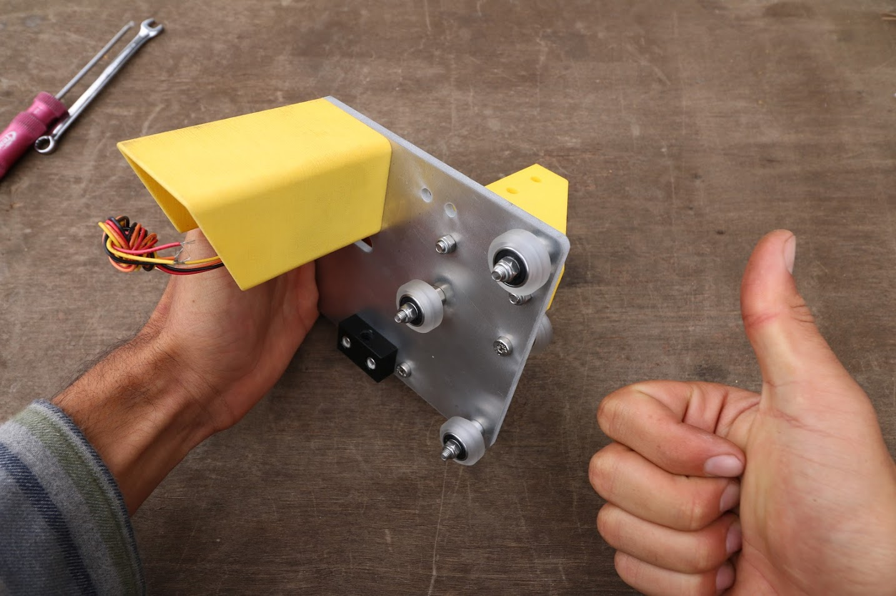

# Assembly Instructions



## Step 1: Gather the Parts and Tools
Gather all the cross-slide parts from the table below and lay them out in a logical manner. To complete the assembly, you will also need the following tools:

* 3mm hex (allen) wrench
* 8mm wrench

.JPG)

_Note: Not all required parts are shown in this image._

|Part Name                     |Description                   |Qty.                          |
|------------------------------|------------------------------|------------------------------|
|Cross-Slide Plate             |5mm thick aluminum            |1
|Complete V-Wheels             |Includes one polycarbonate wheel, two stainless steel rubber sealed ball bearings (16mm OD, 5mm ID, 5mm thick, trade name: S625-2RS), and one precision shim (10mm OD x 5mm Bore x 1mm thickness)|6
|6mm Aluminum Spacers          |5mm bore, for offsetting the V-wheels from the plates|4
|6mm Eccentric Spacers         |For adjusting the distance between the V-wheels|2
|M5x30mm Screws                |Stainless steel type 316, 0.8 thread pitch, low-profile 3mm hex heads|6
|Cable Carrier Mounting Bracket|3D printed plastic            |1
|M5x10mm Screws                |Stainless steel type 316, 0.8 thread pitch, low-profile 3mm hex heads|4
|M5 Locknuts                   |M5 stainless steel locknuts with nylon insert, 0.8mm thread pitch|12
|Leadscrew Block               |Delrin, for the z-axis leadscrew to attach to|1
|M5x16mm Screws                |Stainless Steel, for attaching the leadscrew block to the Cross-Slide Plate|4
|NEMA 17 Stepper Motor         |Dual 5mm shafts               |1
|NEMA 17 Cable                 |2.5m length                   |1
|Rotary Encoder                |Differential output, 200 line/rev minimum, 5mm bore|1
|Rotary Encoder Cable          |2.5m length                   |1
|Motor Housing                 |Waterproof 3D printed plastic |1
|M3x10mm Screws                |Stainless steel, for attaching the stepper motor to the mounting plate|4
|GT2 Pulley                    |Aluminum, 20 tooth, 5mm bore  |1
|M3x5mm Setscrew               |Stainless steel, knurled end, two per GT2 pulley|2

## Step 2: Attach the Delrin Leadscrew Block
Use two **M5x16mm screws** and two **M5 locknuts** to attach the **delrin leadscrew block** to the **cross-slide plate**.



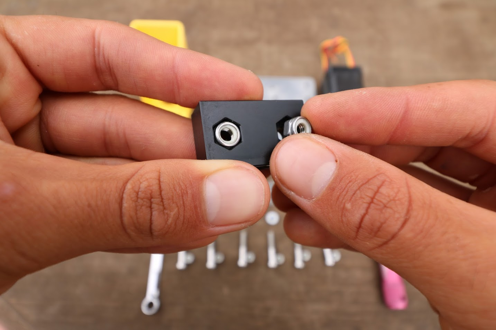

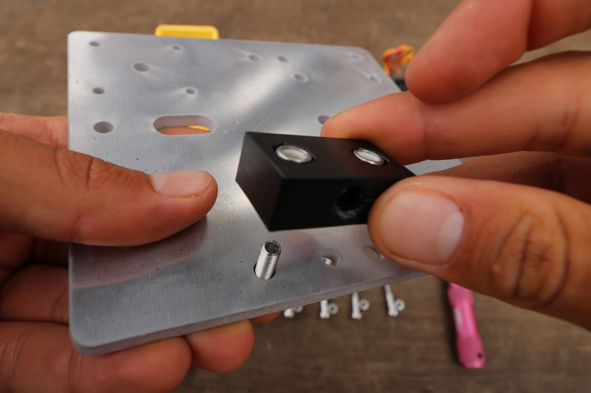

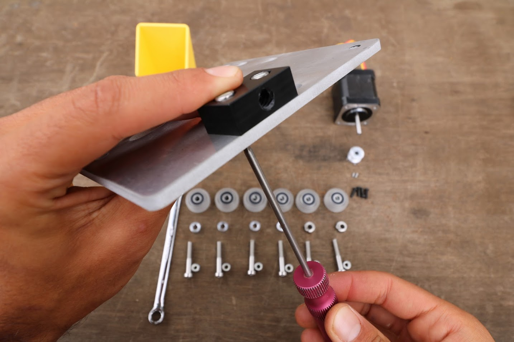

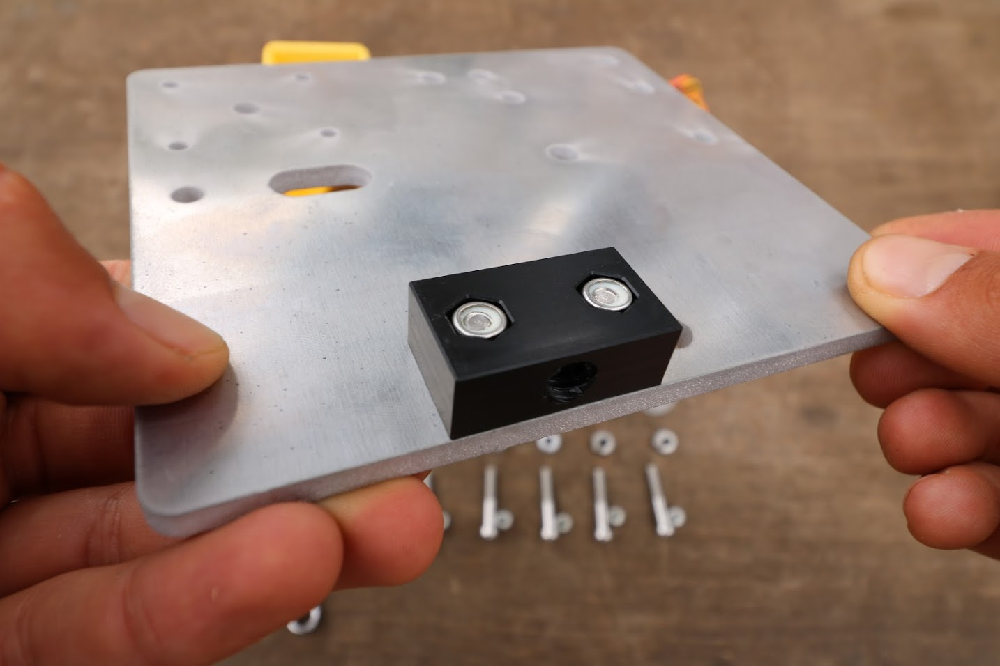

## Step 3: Attach the Stepper Motor
Use four **M3x10mm screws** to attach the **stepper motor** and **motor housing** to the **cross-slide plate**. Make sure the motor and housing are on the same side of the cross-slide plate as the delrin leadscrew block, and that the motor's wiring and the motor housing's open side are facing down towards the delrin leadscrew block.

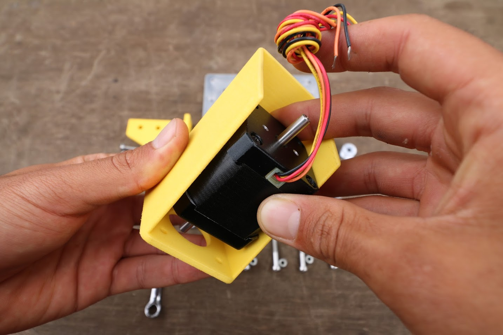

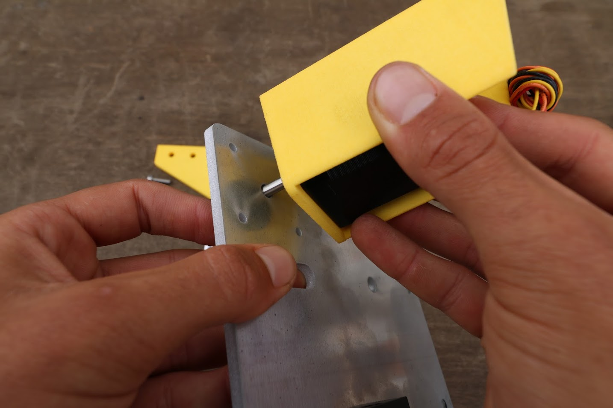

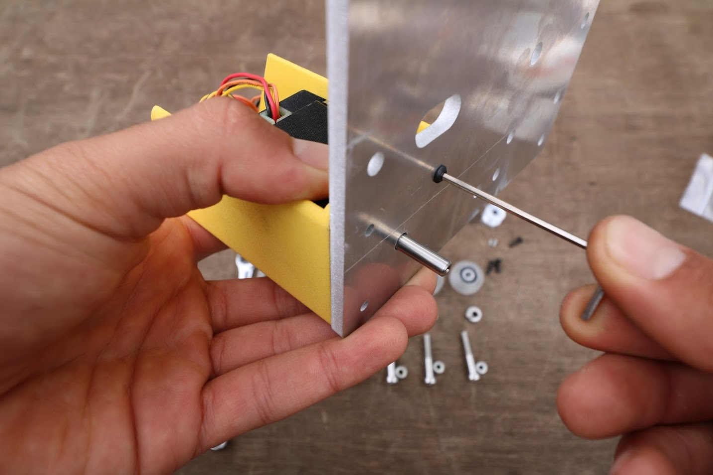

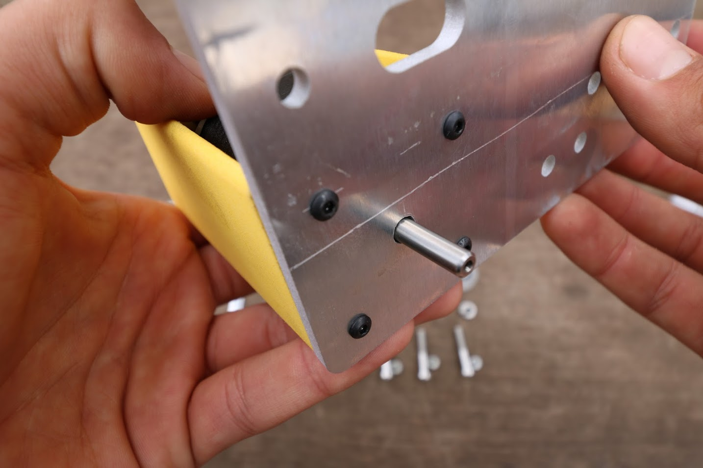

Slide a **GT2 pulley** onto the **stepper motor** shaft.

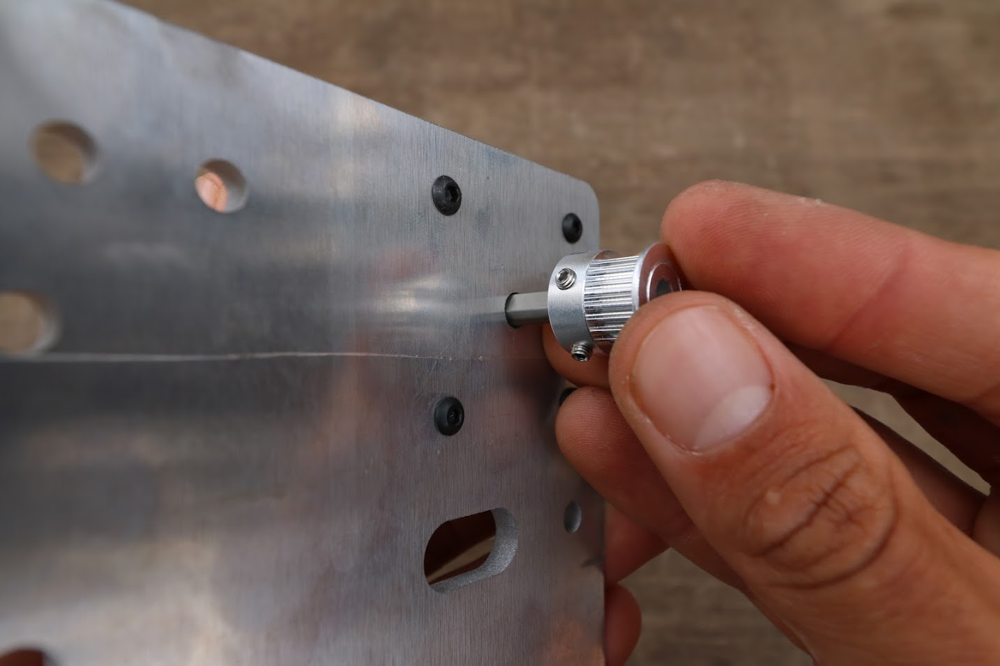

Make sure that one of the setscrews is lined up with the flat spot of the shaft and then tighten the setscrews with the **2mm driver**.

.JPG)

## Step 4: Add on the Z-Axis V-Wheels
Add a **V-wheel** with an **eccentric 6mm spacer** to the hole nearest the middle of the **cross-slide plate**. The V-wheel should be on the same side of the plate as the other components and secured with a **washer** and an **M5 locknut** on the other side.

.JPG)

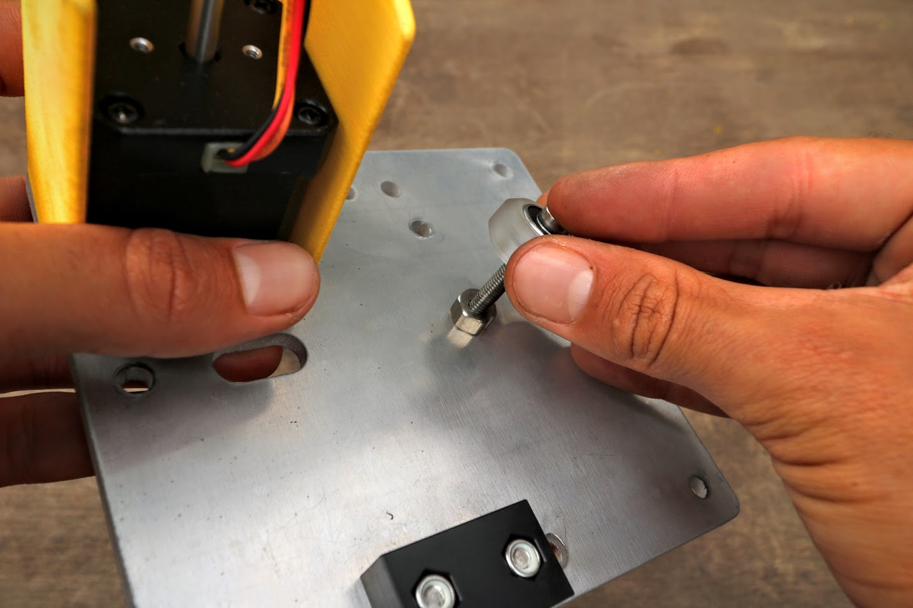

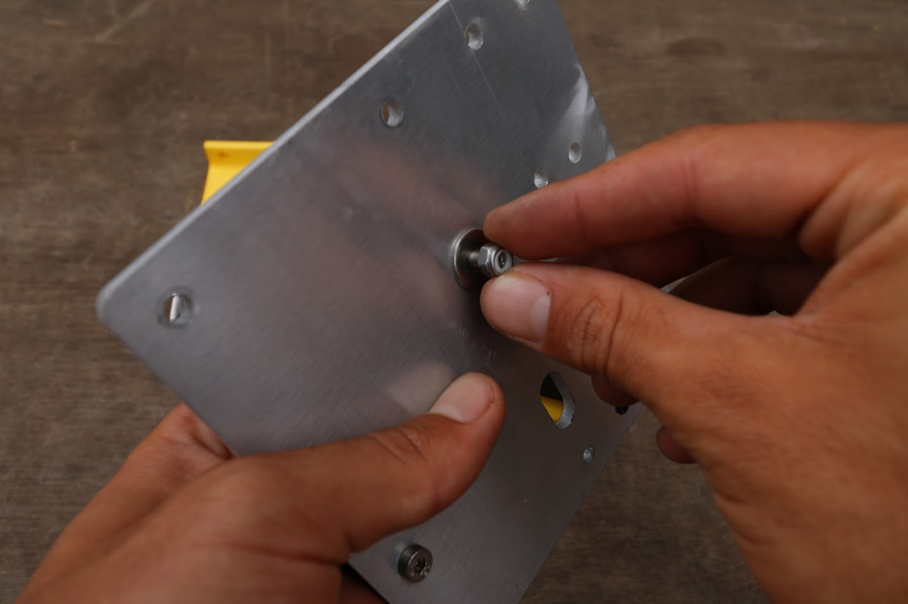

Using **M5x30mm screws**, attach two **V-wheels** with **normal 6mm spacers** to the corner holes of the **cross-slide plate**. The V-wheels should be on the same side of the plate as the motor and the delrin leadscrew block. Secure these wheels with a **washer** and an **M5 locknut** on the other side of the plate.

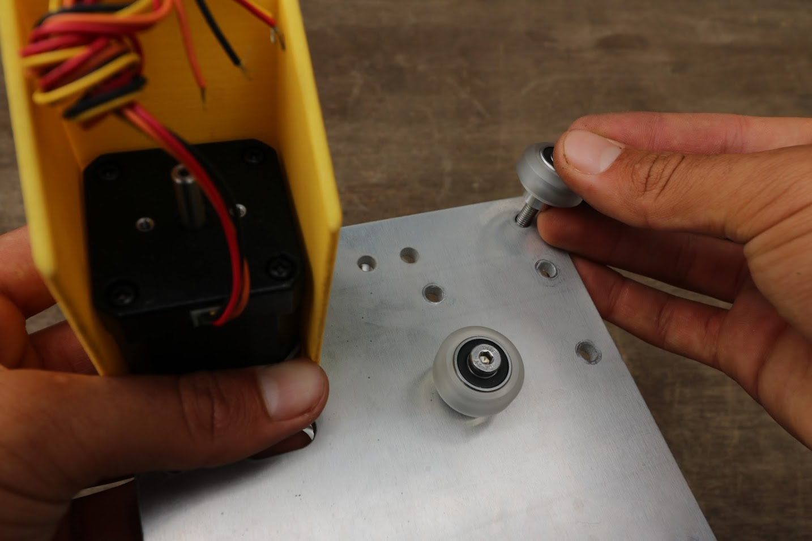

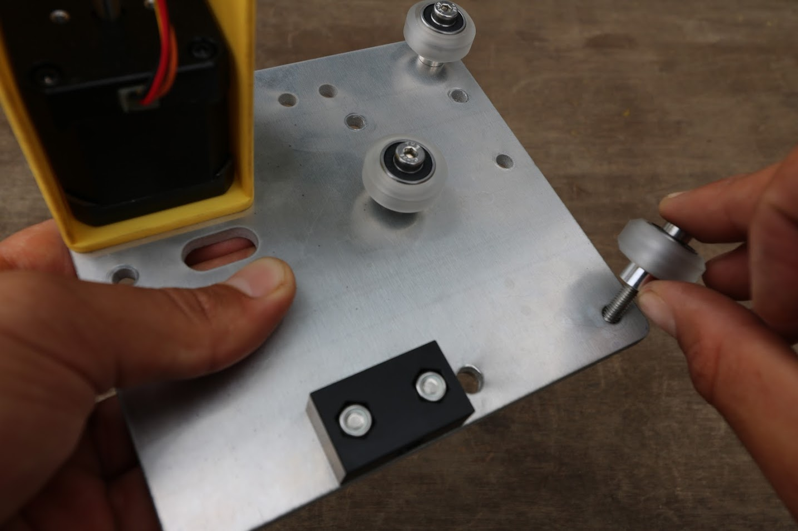

## Step 5: Add the Gantry V-Wheels
Flip the cross-slide over so that all of the components you have added so far are facing away from you.

Add a **V-wheel** with an **eccentric 6mm spacer** to the hole in the middle of the bottom edge of the **cross-slide plate**, nearest the **delrin leadscrew block**

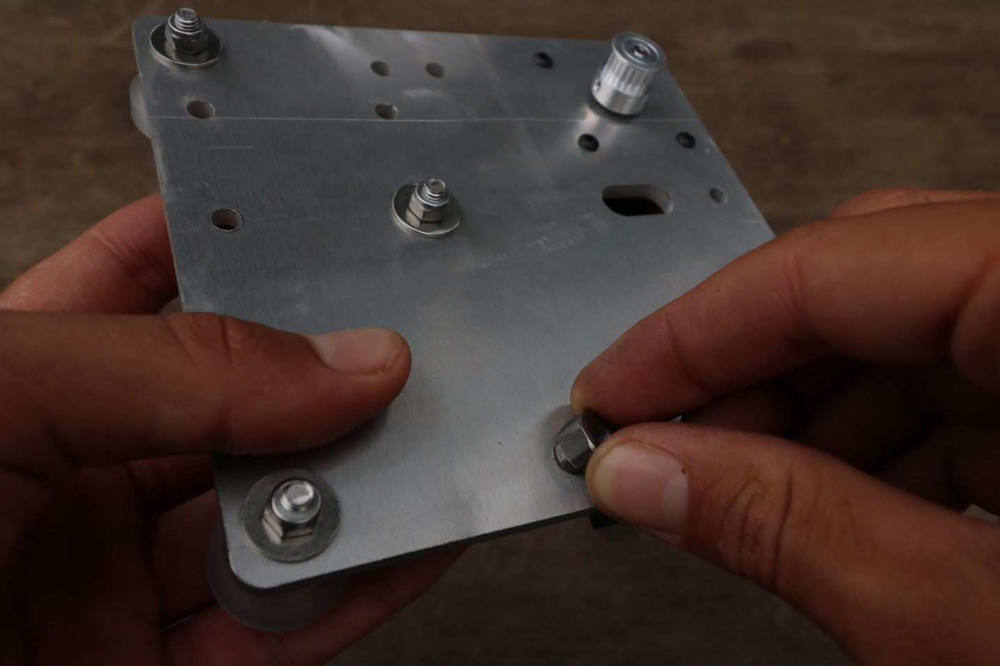

Using **M5x30mm screws**, **M5 washers**, and **M5 locknuts**, attach two **V-wheels** with **normal 6mm spacers** to the holes in the middle of the left and right edges of the **cross-slide plate**.

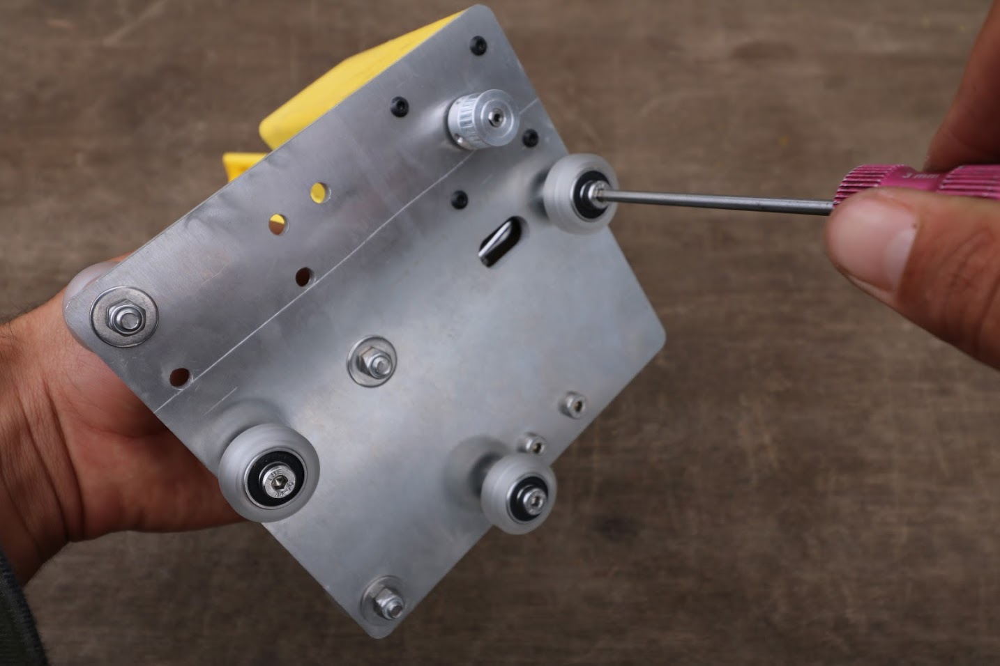

_Note: this picture does not show the other components attached yet. The other components should be facing away from you._

.

## Step 6: Add the Cable Carrier Mounting Bracket
Use two **M5x16mm screws** and **M5 locknuts** to secure the 3D printed **cable carrier mounting bracket** to the **cross-slide plate**. The bracket should be on the opposite side of the plate as the motor. The bracket should be oriented such that the bracket part is below the mounting screws.

.JPG)



# Troubleshooting and Maintenance



## Inspect the delrin leadscrew block
Over time, it is possible for the delrin leadscrew block to wear down. This can introduce play into the system that decreases z-axis precision, which can cause issues with the mounting and dismounting of tools.



# Change Log

* Cross-slide plate is larger and has more V-wheels to accommodate the larger gantry main beam and provide a more rigid connection with the Z-axis extrusion and the gantry main beam

# Room for Improvement

* It can be difficult to fit the rotary encoder and motor cables and connectors through the slot in the plate. This slot will be enlarged.
* The long cable carrier mount should have a gusset to prevent drooping in the hot sun. The orientation should be flipped so that a gusset can be placed underneath just like the short cable carrier and driveshaft mounts and supports.
* The gantry main plate holes for eccentric spacers are slightly too small. This means that a hammer is required to fit the eccentric spacer into the hole. Increasing the diameter of the hole slightly will allow the spacers to fit in without tools.
