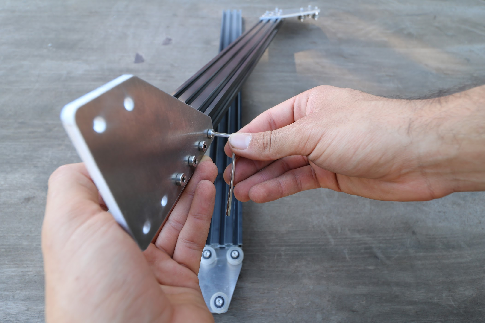
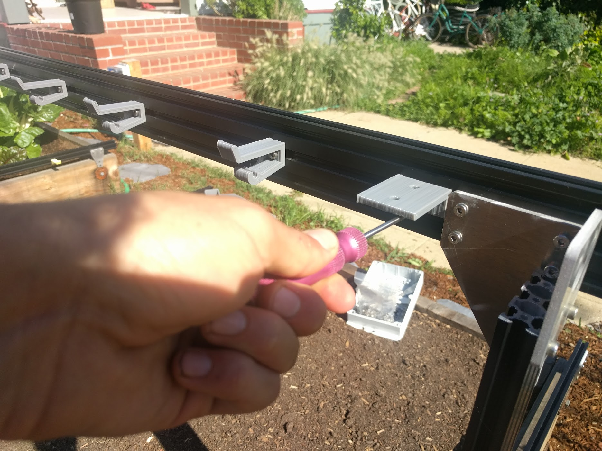
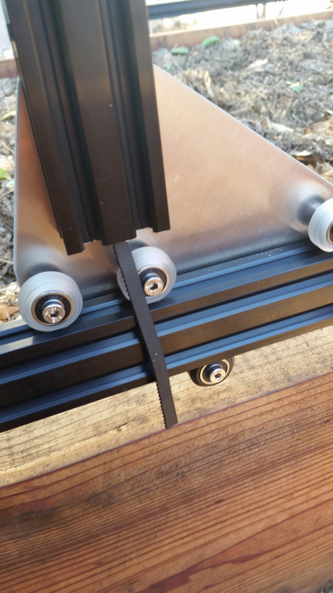
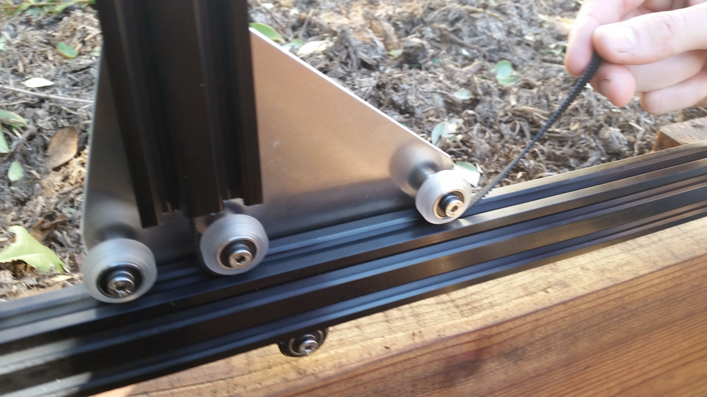
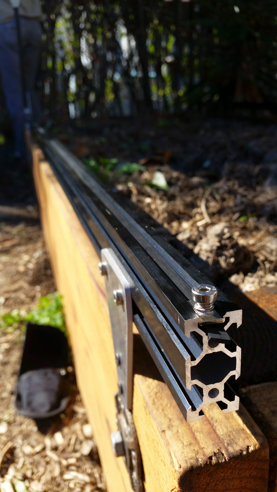
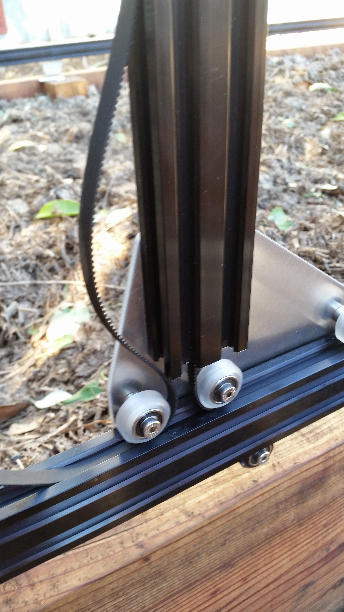
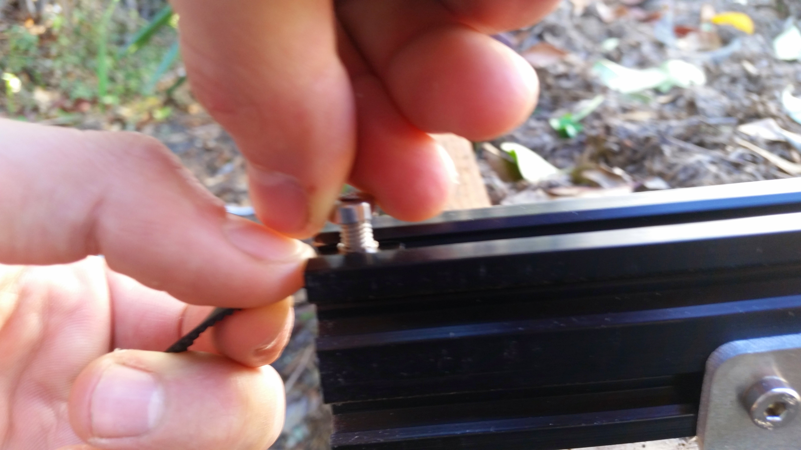

* toc
{:toc}

<iframe width="100%" height="480" src="https://sketchfab.com/models/2375ad3050104c568307afc1db73d3e2/embed?ui_controls=0&amp;ui_infos=0&amp;ui_related=0" frameborder="0" allowfullscreen mozallowfullscreen="true" webkitallowfullscreen="true" onmousewheel=""></iframe>



# Assembly Instructions



## Step 1: Gather the Parts and Tools

Gather all the parts from the table below and lay them out in a logical manner. To complete the assembly, you will also need the following tools:
* 3mm allen (hex) wrench
* 8mm wrench
* 10mm wrench

|Qty.                          |Component                     |
|------------------------------|------------------------------|
|1                             |Gantry Main Beam (20mm x 60mm x 1.5m aluminum extrusion)
|2                             |Gantry Corner Plates
|2                             |Gantry Columns (20mm x 60mm x 0.5m aluminum extrusion)
|2                             |Gantry Main Plates
|8                             |Complete V-Wheels [one polycarbonate wheel, two stainless steel rubber sealed ball bearings (16mm OD, 5mm ID, 5mm thick, trade name: S625-2RS), and one precision shim (10mm OD x 5mm Bore x 1mm thickness)]
|6                             |M5 x 6mm Spacers
|2                             |M5 x 6mm Eccentric Spacers
|8                             |M5 x 30mm Screws
|12                            |M5 Locknuts
|1                             |Gantry Motor Mount Plate
|1                             |NEMA 17 Stepper Motor
|1                             |NEMA 17 Cable (0.5m length)
|1                             |Rotary Encoder
|1                             |Rotary Encoder Cable (0.5m length)
|1                             |Gantry Motor Housing
|4                             |M3 x 10mm Screws
|2                             |20 tooth GT2 Pulley
|4                             |M3 x 5mm Setscrew
|1                             |5mm to 5mm Flex Coupling
|2                             |M4 Setscrews
|1                             |5mm x 1.5m Driveshaft
|6                             |Driveshaft and Cable Carrier Brackets
|1                             |Drive Shaft Bearing [Stainless steel, rubber sealed, 16mm OD, 5mm ID, 5mm thickness. (S625-2RS)]
|2                             |Drive Shaft Lock Collars (5mm ID)
|1                             |Drive Shaft Bearing Plate
|34                            |M5 x 10mm Screws
|30                            |Tee Nuts
|1                             |15mm x 40mm Cable Carrier (1.5m length)
|2                             |Cable Carrier Mounting Brackets
|1                             |1.6m GT2 Timing Belt

## Step 2: Assemble the gantry plates
Before we start assembly, know that each completed gantry plate will have six wheel assemblies attached to it that allow it to slide along the tracks. The four wheels that ride on the top of the tracks will be attached to the plates with *normal* spacers. The two wheels that ride underneath the tracks will be attached to the plates with *eccentric* spacers. The eccentric spacers will be used to finely adjust the spacing between the top and the bottom wheels such that the gantry will roll smoothly and snuggly along the tracks.



Insert an **M5 x 30mm screw** through a **V-wheel** and a **M5 *normal* 6mm spacer**. Then insert this into the **gantry plate** as shown.

On the opposite side of the **gantry plate**, add an **M5 washer** and an **M5 locknut** to the **M5 x 30mm screw**. Tighten the wheel assembly using the **3mm hex wrench** and the **8mm wrench**.

You should now have one wheel assembly attached to the gantry plate.

Repeat the above process for the remaining three V-wheels with *normal* spacers. All four of these wheels should be positioned on the plate in a straight line.

Insert an **M5 *eccentric* 6mm spacer** into the **gantry plate**. Then insert an **M5 x 30mm screw** with a **V-wheel** through the spacer.



Add an **M5 washer** and an **M5 locknut** and tighten.

Repeat the above steps for the remaining V-wheel attached with the *eccentric* spacer. You should end up with one completed gantry plate assembly.



Repeat the above steps for the second gantry plate assembly. You should end up with two gantry plate assemblies that are mirror images of each other.

## Step 3: Adjust the V-wheel spacing

The eccentric spacers on the lower wheels of each gantry plate assembly are used for making fine adjustments to the spacing between the two lower wheels and the four upper wheels. Adjusting this spacing is the key to having your gantry move smoothly and wobble-free across the tracks.

If the spacing is too little, then the gantry will not fit onto the tracks at all. If the spacing is too great, then the gantry will be wobbly and loose. Let's adjust our eccentric spacing to be just right.

### Fit test
First, see if your gantry plate will easily slide onto the tracks. It will very likely either be too loose and wobble, or too tight and not fit at all.



### Adjusting the eccentric spacer
1. Remove the gantry plate from the tracks.
2. Using a **10mm wrench**, turn the **eccentric spacer** about 1/32 of a turn. Depending on the direction you turn the spacer, and the current orientation of the spacer, the spacing between the upper and lower V-wheels will either increase or decrease. Your goal is to adjust the spacer in the direction you need. The notch in the side of the eccentric spacer indicates the shortest distance, so moving the notch towards the upper wheels will decrease the spacing between the wheels.
3. Once you have adjusted the spacer 1/32 of a turn, do another fit test.
4. Continue the steps above for both eccentric spacers until your gantry plate glides smoothly and wobble free across your tracks.
5. Then complete the steps above for the second gantry plate.

{%
include callout.html
type="success"
title="The perfect fit"
content="The perfect fit is subjective and you'll need to play around to get it just right. Here is our best tip: Adjust your wheel spacing so that it is as large as possible without inducing wobbling or rattling. This will ensure you are not over tightening your wheels and risking damage.

You would rather have a wobbly wheel that you can tighten than damaged components.

Don't expect your Gantry to roll like a ball down a hill. A well fitted gantry will have a little bit of friction. Again, just play around with the spacing and use your best judgement."
%}

## Step 4: Attach the gantry columns

For this step you will need:
* The two gantry plate assemblies
* Two 20mm x 60mm x 500mm aluminum extrusions
* 12 M5 x 10mm screws
* 12 tee nuts
* A 3mm allen wrench

Insert six **M5 x 10mm screws** into the **gantry plate** and loosely attach **tee nuts** onto the other side. The tee nuts should reside on the same side of the plate as the V-wheels.



Slide the **gantry column** onto the **gantry plate assembly**.



The bottom of the extrusion should be positioned just above the V-wheels.

Tighten the **M5 x 10mm screws** using a **3mm allen wrench**.

Repeat the above steps for the second gantry plate and aluminum extrusion.

## Step 5: Attach the gantry corner brackets

For this step you will need:
* The two gantry plate/column assemblies
* Two gantry corner plates
* Eight M5 x 10mm screws
* Eight tee nuts
* A 3mm allen wrench

Lightly screw together four **M5 x 10mm screws** and **tee nuts** on the long side of the **gantry corner plate**.



Slide the **gantry corner plate** onto the **gantry column**. The tee nuts should slide into the 20mm side of the column on the side that the gantry plate protrudes. Furthermore, the protrusion of the corner plate should be on the same side of the column as the gantry plate. Inspect the photos closely for reference.

Tighten the **M5 x 10mm screws** with the **3mm allen wrench**.



Repeat the above steps for the second corner bracket and column. You should end up with two assemblies that are mirror images of each other. Inspect these photos closely to ensure your corner brackets are attached to the columns in the correct orientation.

## Step 6: Assemble the main beam



For this step you will need:
* Two 20mm x 60mm x 1500mm aluminum extrusions
* One gantry beam connector plate
* 18 M5 x 10mm
* 18 tee nuts
* A 3mm allen wrench

Loosely attach nine **M5 x 10mm screws** and **tee nuts** to the **gantry connector plate**.



Slide one of the **gantry main beams** onto the **gantry connector plate** and then tighten the **M5 x 10mm screws** with the **3mm allen wrench**.



Loosely attach the other nine **M5 x 10mm screws** and **tee nuts** to the **gantry connector plate**.



Slide the second **gantry main beam** onto the **gantry connector plate**.





Tighten the **M5 x 10mm screws**.



## Step 7: Attach the main beam to the columns

Slide the **gantry columns** onto the **tracks**.

Rest the **gantry main beam** on top of the **gantry columns**. For Genesis XL kits, the connector plate should be facing away from the gantry corner brackets.



Slide four tee nuts onto the **back side** of the gantry main beam. Two tee nuts should be in the middle slot and two in the lower slot. Try to align the tee nuts with the holes in the corner bracket.

Lift up the main beam and position it onto the front side of the corner bracket. Align the tee nuts with the holes in the corner bracket and then insert and tighten four M5 x 10mm screws.



Repeat the above steps to attach the gantry main beam to the second corner bracket. Note: Genesis XL kits require an additional five tee nuts placed in the middle slot of the extrusion for the additional cable carrier/driveshaft support brackets. Standard kits do not require anymore tee nuts in the middle slot.

## Step 8: Attach the gantry motor

For this step you will need:
* One NEMA 17 stepper motor
* One horizontal motor housing
* The gantry motor mount plate
* Four M3 x 16mm screws
* Two M5 x 10mm screws
* Two tee nuts
* A 2mm allen wrench
* A 3 mm allen wrench

Slide the motor into the motor housing, ensuring that the longer shaft of the motor is coming out of the housing and that the motor's wires are facing down through the open end of the housing.

Slide the gantry motor mount plate onto the shaft and fit it flush against the motor housing. The M5 mounting holes of the plate should be facing the same direction as the motor's wiring.

Use the 2mm allen wrench and four M3x16mm screws to attach the stepper motor and motor housing to the motor mount plate.

Lightly screw two M5 x 10mm screws and tee nuts onto the motor mount plate. The tee nuts should be on the side of the plate opposite the motor.

Slide the motor assembly onto the gantry column where you plan on mounting your electronics box. The motor shaft should be facing towards the other side of the gantry.

Use the 3mm allen wrench to tighten the screws.

Slide a GT2 pulley onto the motor and tighten it using the two M3 setscrews and a 1.5mm allen wrench.

## Step 9: Attach the driveshaft support bearing
Lightly screw two M5 x 10mm screws and tee nuts onto the driveshaft support bearing bracket.

## Step 10: Install the driveshaft and cable carrier supports
Insert an **M5 x 10mm screw** into a **driveshaft and cable carrier support**, and then lightly screw an **M5 tee nut** onto the screw.

Place the assembly into the middle slot on the back side of the **gantry main beam** and use the **3mm driver** to tighten the screw. Repeat the process for all six supports.





## Step 11: Install the short cable carrier mounts
Insert two **M5 x 10mm screws** into a **short cable carrier mount** and lightly screw on two **M5 tee nuts**.

Place the assembly into the middle slot on the back side of the **gantry main beam** and tighten the two screws with the **3mm driver**. The mount should be butted up the **gantry corner bracket**.

Repeat the process for another short cable carrier mount, and add it to the bottom of the left side **gantry column**.



## Step 12: Insert the driveshaft
Slide a 5mm to 5mm flex coupling onto the gantry motor shaft and tighten it using the two M4 setscrews and a 3mm allen wrench.



Slide onto the free end of the driveshaft a 5mm lock collar, then a 5mm x 16mm x 5mm bearing, and then a GT2 pulley. Position the bearing inside the driveshaft bearing plate, and tighten the lock collar and GT2 pulley such they they hold the bearing in place inside the plate.

## Step 13: Add Driveshaft and Cable Carrier Supports

Remember those five extra tee nuts you inserted into the gantry main beam prior to attaching it to the columns? Its time to use those, along with five M5x8mm screws, to attach our five Driveshaft and Cable Carrier Supports to the Gantry main beam.

Spread your supports equally along the Gantry while placing the driveshaft into its holding place within each support. Tighten down the supports.





## Step 14: Feed and Secure the Belts

Feed GT2 timing belt down the center of your gantry column, ensuring the orientation is correct so that the belt teeth will engage the motor pulley properly.

Grab the end of the GT2 belt and feed it under the middle V-wheel of your gantry plate,then forward along the track extrusion, and then under the front V-wheel. The flat side of the belt should be in contact with your V-wheels.





Secure the end of your belt to the front end of your Tracks by using an M5x8mm screw and tee nut.



Take the back half of the belt and feed it over the motor pulley, down the back of the extrusion, under the back V-wheel on the Gantry Plate, and back along the Track extrusions.

Secure the belt at the end of the Tracks. Put a small amount of tension on the belt as you tighten the M5 screw.

Repeat the above steps for the second belt on the other side of the Gantry.

## Step 15: Equalize and Synchronize the Gantry

### Equalizing
An equalized Gantry is one that is exactly perpendicular to the Tracks such that it is not crooked, and so that it is not being torqued. A crooked or torqued Gantry can cause creaking, extra wear on the v-wheels, and introduce a high amount of friction into the system. It also just looks bad.

To equalize the Gantry, move it along the Tracks gently and slowly about 12 inches or 30cm, pushing or pulling **from the middle of the main beam**. This process will remove any torque on the Gantry, and ensure it is not crooked. If you push or pull the Gantry from one of the gantry columns, or anywhere that is not the middle of the main beam, then you will torque the Gantry and make it crooked. Don't do that.

### Synchronizing
Now that the Gantry is equalized, we want to synchronize the movement of each side of the Gantry. This will ensure that when the motor spins, each side of the Gantry moves exactly in sync - meaning that the Gantry will not be torqued or become crooked.

Synchronize the Gantry by tightening the flex coupling onto the driveshaft (that thing we skipped back in Step 6). Now, a rotation of your motor should move both pulleys and therefore both sides of the Gantry exactly the same amount at the same time.



# Troubleshooting and Maintenance



## Re-Equalize and Synchronize the Gantry
It is possible for the gantry to become twisted such that is not perpendicular to the tracks. This is usually caused by an obstruction on one track that stalls that side of the gantry and mis-aligns the system, or a loose belt on one track.

If a belt is loose, follow the maintenance tip above for tightening the Track/Gantry Belts.

If the belts are tight and the gantry is twisted, re-equalize and synchronize the gantry using assembly instruction Step 10 above.



# Change Log

* Main plates have been enlarged to allow for larger columns and more V-wheels
* Columns have been enlarged to a 20 x 60mm extrusions for extra strength and to more fully conceal the timing belts
* Corner brackets have been enlarged to allow more connection points in order to strength and the gantry and make it more rigid, especially to torque coming from the cross-slide and z-axis
* Main beam has been enlarged to a 20 x 60mm extrusion for extra rigidity and for greater resistance against torque from the cross-slide and z-axis
* Driveshaft bearing plate has been modified in shape for aesthetic reasons and added strength
* Modified the gantry main beam connecting plate for XL devices to accommodate the larger main beam extrusions
* Modified the cable carrier and driveshaft support to work with the larger main beam extrusions

# Room for Improvement

* The cross-slide cannot slide onto the gantry main beam without disconnecting the main beam from a gantry corner bracket. This is because the lower cross-slide wheels interfere with the upper screw attaching the gantry corner plate to the gantry column. The gantry corner brackets should be slightly taller to remove the interference while maintaining four screws attaching the plate to the column.
* The gantry main plate holes for eccentric spacers are slightly too small. This means that a hammer is required to fit the eccentric spacer into the hole. Increasing the diameter of the hole slightly will allow the spacers to fit in without tools.
* The driveshaft bearing plate's bearing hole is too small to fit the bearing in without using a hammer. Even then, the bearing is compressed such that it no longer spins smoothly. Increase the diameter of the hole will solve this issue.
