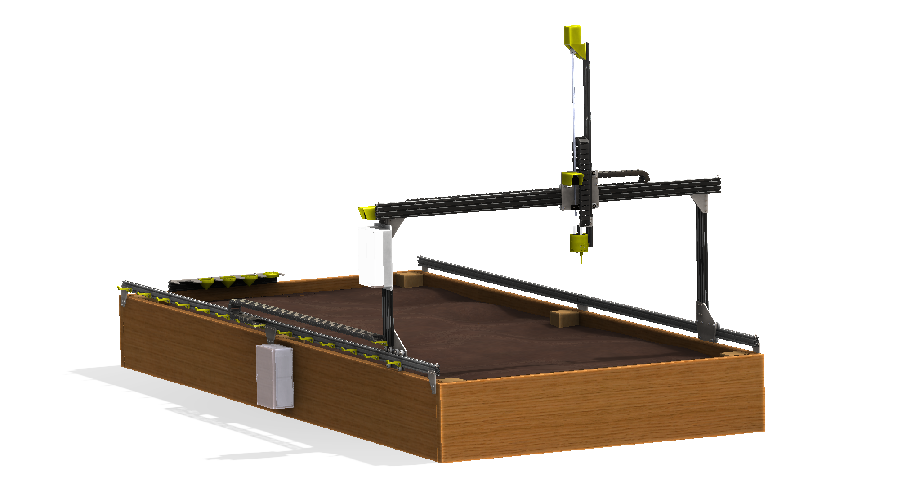
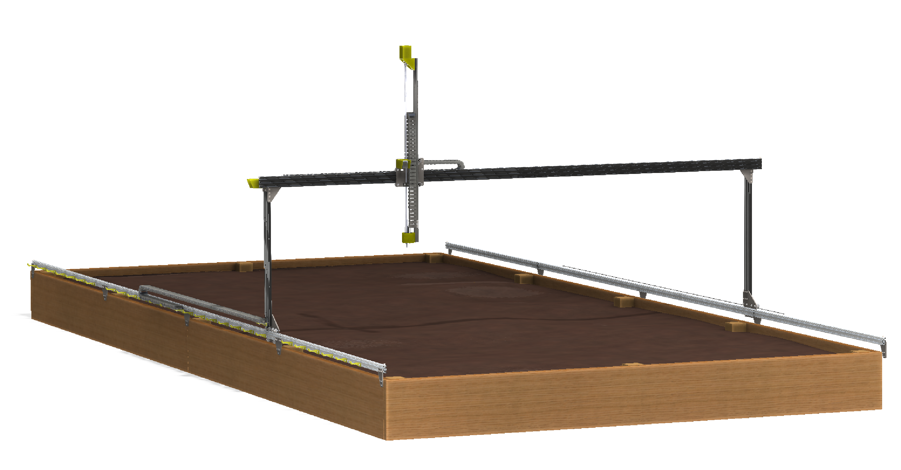
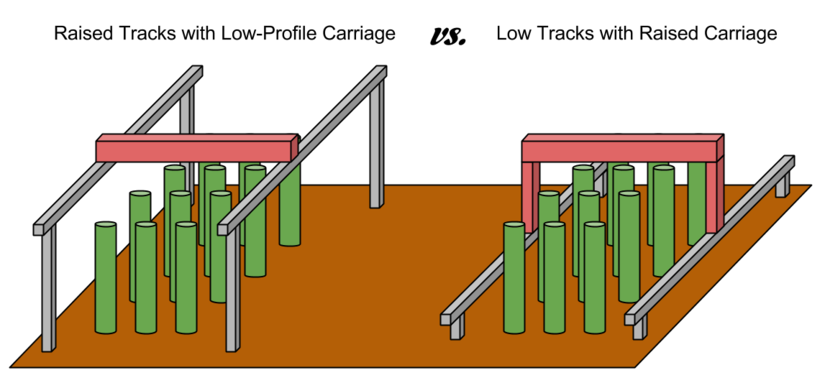

FarmBot Genesis is the first FarmBot to be designed, prototyped, and manufactured. Genesis is designed to be a flexible FarmBot foundation for experimentation, prototyping, and hacking. The driving factors behind the design are simplicity, manufacturability, scalability, and hackability.

Genesis is a small scale FarmBot primarily constructed from V-Slot aluminum extrusions and aluminum plates and brackets. Genesis is driven by NEMA 17 stepper motors, an Arduino Mega with a RAMPS shield, and a Raspberry Pi 2 host computer. These electronics were chosen for their great availability, support, and usage in the DIY 3D printer world. Genesis can vary in size from a planting area as little as 1m2 to greater than 50m2, while accommodating a maximum plant height of about 1m. With modifications to some of the structural component sizes and an alternative X-direction drive system, the Genesis concept could likely scale up to a 1000m2 planting area and a maximum plant height greater than 2m.

_FarmBot Genesis V0.9_

_FarmBot Genesis XL V0.9_



# High Level Architecture

## Tracks
Tracks are one of the components that really differentiate FarmBot technology from traditional free-driving wheeled tractors. The tracks are what allow the system to have great precision in an efficient and simple manner. There are many reasons of why Tracks are superior, a few of which are listed below. You can also read about tracks and precision farming on this blog post.
1. Tracks provide great precision and allow the the FarmBot to return to the same position repeatedly
2. Any type of packing structure of plants can be created and managed
3. Tracks take up less area than paths for tractor wheels and do not compact the soil

## Gantry
The Gantry is the the structural component that bridges the two Tracks and moves in the X-direction via an X-Direction Drive System. Typically, it serves as a linear guide for the Cross-Slide and a base for the Y-Direction Drive System that moves the Cross-Slide across the Gantry in the Y-direction. It can also serve as a base for mounting other tools, electronics, supplies, and/or sensors.

## Cross-Slide
The Cross-Slide moves in the Y-Direction across the Gantry. This motion provides the second major degree of freedom for FarmBots and allows operations such as planting to be done anywhere in the XY plane. The Cross-Slide is moved using a Y-Direction Drive System and functions as the base for the Tool Mount and Z-Direction Drive System.

## Z-Axis
The Z-axis attaches to the Cross-Slide and provides the FarmBot with Z-Direction movement. It serves as the base for attaching the Universal Tool Mount and other Tools.

## Raised Tracks vs Low Tracks
For FarmBots to properly grow taller plants, the Gantry, Cross-Slide, Z-Axis, and Tools must have adequate vertical clearance from the plants. This can generally be accomplished in two ways:

1. Using raised tracks and a low-profile gantry
2. Using low tracks with a tall gantry

In general, using low tracks with a tall gantry is the better design, especially for larger applications because it saves on material cost, is lest of an eyesore, blocks less sunlight, and would be easier to maintenance. However, in the case of a FarmBot being installed in a greenhouse or other structure, utilizing the existing walls to support the tracks higher may be a better solution.

# What's New in V0.9

With V0.8, we built an 'XL' prototype that was 3m x 6m in size with essentially the same hardware as the standard 1.5m x 3m device. We think it is very desirable to be able to scale FarmBot Genesis up to this size and even longer in length. However, initial prototyping of the XL device proved the V0.8 design inadequate for reliable operation at such scale.

V0.9 hardware includes larger track, gantry, and cross-slide plates; larger gantry extrusions; and more V-wheels. All of these changes add to the overall rigidity of the system, and particularly the track-to-gantry, gantry-to-cross-slide, and cross-slide-to-z-axis interfaces.

## Change Log
  * Track plates are larger to better support and keep aligned the track extrusions
  * Gantry plates are larger and include more V-wheels to provide a more rigid connection to the tracks
  * Gantry columns are now 20x60mm extrusions to fully enclose the belts and provide more rigidity
  * Gantry corner brackets are larger to provide a more rigid connection from the gantry columns to the gantry main beam
  * Gantry main beam is now 20x60mm to provide more rigidity, especially for XL devices
  * Cross-Slide plate is larger and has more V-wheels to accommodate the larger gantry main beam and provide a more rigid connection with the Z-axis extrusion and the gantry main beam
  * Addition of 3D printable seed bays that fit in the tool bay
  * Seed Injector tool tip extended to reach into the seed bins
  * Rotated the UTM's pin and liquid line layout for aesthetic purposes, as well as all the tool's layouts accordingly
  * Changed the UTM electrical connection to use zip-ties for a more compact, affordable, and easier to install and maintain solution
  * Moved to using all drop-in stainless steel nuts instead of slide-in steel tee nuts
  * Introduced the first weed suppressor tool

# Past Versions



## [V0.9](https://genesis.farm.bot/docs/v0.9)
Major changes: larger plates, more V-wheels, larger gantry extrusions for added rigidity
## [V0.8](https://genesis.farm.bot/docs/v0.8)
Major changes: all corrosion resistant design; upgrade to 5mm thick plates; improvements to the UTM, cable carrier brackets, and electronics enclosure
## [V0.7](https://genesis.farm.bot/docs/v0.7)
Major changes: removal of endstops, stronger z-axis motor mount, added z-axis cable carrier, track plates and gantry corner plates redesign, upgraded universal tool mount to support 6 liquid lines and 12 electrical connections, quick access electronics enclosure, larger cable carriers
## [V0.6](https://genesis.farm.bot/docs/v0.6)
Major changes: reliability improvements to the universal tool mount
## [V0.5](https://genesis.farm.bot/docs/v0.5)
Major changes: rotary encoders on motors, integrated water, vacuum, and liquid amendments into universal tool mount, part simplification
## [V0.4](https://genesis.farm.bot/docs/v0.4)
Major changes: electronics enclosures/housings, cable carrier cable management, magnetic universal tool mount design
## [V0.3](https://genesis.farm.bot/docs/v0.3)
Major changes: wire and trolley cable management, part simplification
## [V0.2](https://genesis.farm.bot/docs/v0.2)
Major changes: endstop integration, custom brackets and plates, universal tool mount
## [V0.1](https://genesis.farm.bot/docs/v0.1)
Focused on being a quick and easy first prototype, V0.1 was constructed from all off-the-shelf components
