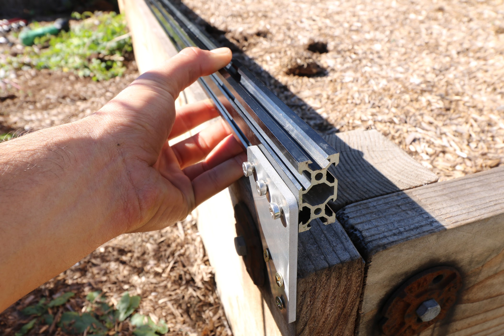
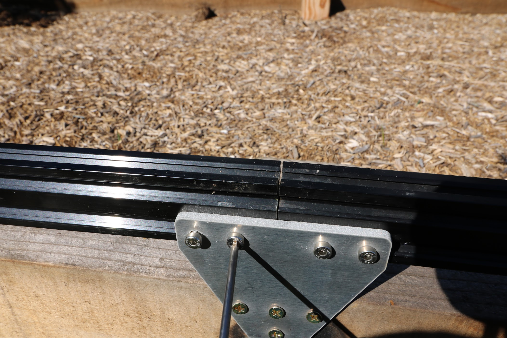

* toc
{:toc}

FarmBot's tracks allow the gantry to move in a precise motion along the x-axis. The tracks are designed to attach to a raised bed or similar [supporting infrastructure](supporting-infrastructure.md). Standard tracks are 3m in length, though one could extend them indefinitely by adding more extrusions and connecting plates.

<iframe width="100%" height="480" src="https://sketchfab.com/models/813d7caf919541beb15721d5ae51b164/embed?ui_controls=0&amp;ui_infos=0&amp;ui_related=0" frameborder="0" allowfullscreen mozallowfullscreen="true" webkitallowfullscreen="true" onmousewheel=""></iframe>

# Assembly Instructions





## Step 1: Gather the Parts and Tools
Gather all the parts from the table below and lay them out in a logical manner. To complete the assembly, you will also need the following tools:
* 3mm allen (hex) wrench
* Number 2 phillips screwdriver *or* electric drill with a Number 2 phillips driver bit

|Qty.                          |Component                     |
|------------------------------|------------------------------|
|4                             |Track Extrusions
|4                             |Track End Plates
|2                             |Track Joining Plates
|20                            |1 inch #2 Phillips Wood Screws
|30                            |M5 x 10mm Screws
|28                            |Tee Nuts
|2                             |M5 Locknuts
|1                             |1m Cable Carrier
|1                             |Cable Carrier Mounting Bracket
|10                            |Cable Carrier Support Brackets
|2                             |5m GT2 Timing Belt

## Step 2: Layout the Track Extrusions
Lay out all of the **track extrusions** in the location that you want to attach them to your supporting infrastructure. Make sure that extrusions are fully butted against each other. This will help you attach the plates in the correct location.



## Step 3: Attach a Track End Plate

Position a **track end plate** as shown below and screw it into the **supporting infrastructure** with three **wood screws**. Ensure that the plate is vertically aligned.



Lightly screw three **M5 x 10mm** screws and **tee nuts** to the **track end plate**. Orient the tee nuts horizontally.

## Step 4: Attach a Track Joining Plate
Position a **track joining plate** such that one half of it will be able to attach to each track extrusion and so that it is the same height as the first **track end plate**. Screw it into the **supporting infrastructure** with four **wood screws**. Ensure that the plate is vertically aligned.

Lightly screw four **M5 x 10mm** screws and **tee nuts** to the **track joining plate**. Orient the tee nuts horizontally.

## Step 5: Attach the first Track Extrusion
Lift the **track extrusion** up and position the lower V-slot onto the **tee nuts** of the **track end plate**.

Lightly tighten one of the **M5 x 10mm screws** using the **3mm hex driver** to prevent the extrusion from falling off, while still allowing it to move loosely.

Lift the other end of the **track extrusion** up and position the lower V-slot onto the **tee nuts** of the **track joining plate**. Verify that the track extrusion is positioned correctly, and then tighten all five of the **M5 x 10mm screws** that hold it in place.

## Step 6: Attach the second Track End Plate and Extrusion
Follow the instructions in Steps 3 and 5 to attach the second **track end plate** and second **track extrusion**.



_See the gap in the track extrusions? You don't want that!_



## Step 7: Add a short cable carrier mount
Insert two **M5 x 10mm screws** into a **short cable carrier mount** and lightly screw on two **M5 tee nuts**.

_Note that this photo was taken from the back-side of FarmBot._

Place the assembly into the lower slot of the left side **tracks**. It should be butted up against the **track joining plate**. Use the **3mm driver** to tighten the screws.

## Step 8: Add cable carrier supports
Position the 11 **cable carrier supports** evenly along the tracks. Keep in mind that the **short cable carrier mount** acts as a support, so there will be 12 total components supporting the cable carrier. There should be six on each **track extrusion**.

Insert an **M5 screw** into the **cable carrier support** and lightly attach an **M5 tee nut**.

 Then use the **3mm driver** to tighten the assembly into the lower slot of the **track extrusion**.

Repeat for all 11 cable carrier supports.



# Troubleshooting and Maintenance

FarmBot's tracks need to be very straight and parallel with each other in order for the gantry to move smoothly across them. With time, your FarmBot's tracks may move and twist due to a variety of factors such as:
* Screws becoming loose
* Thermal expansion and contraction due to large temperature swings
* Deterioration of supporting infrastructure such as wood posts
* Supporting infrastructure shifting due to soil expansion and contraction
* Falling branches, earthquakes, or other cataclysmic events

Misaligned tracks can cause the system to creak and ultimately bind as the gantry attempts to move across the tracks. This can prevent FarmBot from working and even cause damage to other components. If you notice your tracks have become misaligned, work to fix them as soon as possible.



## Clean Track Surfaces

Once a month, inspect your tracks for an accumulation of mud, dirt, and other debris. Because the tracks are so low to the ground, it is common for them to accumulate unwanted materials. This can cause your gantry unnecessary friction when moving across the tracks, ultimately leading it to bind up if the tracks are not cleaned.





## Realigning Track Plates

Over time your track plates may become misaligned due to shifting supporting infrastructure or a rare impact event such as a tree branch falling onto the tracks. Signs of a misaligned track plate include misaligned track extrusions (see below), twisted track extrusions, difficulty in the gantry moving across extrusion joints, and even visual misalignment.



## Realigning Track Extrusions

It is possible for a track extrusion to loosen and then become misaligned with an adjacent extrusion. Even small misalignments can prevent the gantry from smoothly moving across. Inspect for misalignment by running your fingers across track joints.



# Change Log

* Plates were designed to be larger with more connection points for stronger and more rigid connections to the track extrusions

# Room for Improvement

* The track plates are attached to the raised bed with three wood screws. Because the tracks must provide enough clearance between the raised bed and the track extrusions for the gantry's lower wheels, the track plates need to be positioned so high that the upper wood screws have very little material to screw into. The height of the track plates should be increased so that there doesn't need to be a compromise between clearance and wood screw connection.
* Assuming the raised bed infrastructure is straight, the track plates need to be positioned at the same height relative to the raised bed. You could do this with a measuring tape or ruler and marking off the location for each plate, but that is cumbersome because it adds extra assembly steps/instructions and tools. A solution is to design into the track plates a marking for the optimal height of the track plates or two marks for the minimum and maximum height.
